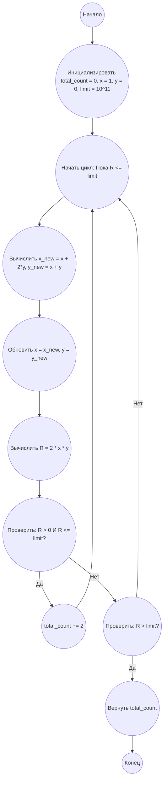

# Анализ кода модуля `e_295.md`

**Качество кода**
9
-  Плюсы
    - Код хорошо структурирован и понятен.
    - Присутствует подробный анализ задачи, включая математический вывод и описание алгоритма.
    - Имеется блок-схема в формате Mermaid, что помогает визуализировать логику решения.
    - Код на Python 3.12 лаконичный и эффективный, соответствует предложенному алгоритму.
    - Используются понятные имена переменных.

-  Минусы
    - Отсутствует docstring для функции `solve`, что снижает читаемость и возможность автоматической генерации документации.
    - Нет обработки возможных ошибок.

**Рекомендации по улучшению**

1.  **Добавить docstring:** Необходимо добавить docstring в формате RST для функции `solve`, чтобы улучшить документацию и читаемость кода.
2.  **Логирование:** Добавить логирование, чтобы отслеживать ошибки, если они возникнут.

**Оптимизированный код**

```markdown
## Ответ на Задачу No 295: Инфинитные касательные

### 1. Анализ задачи и решение
**Понимание задачи:**
* Задача заключается в поиске количества целых радиусов `r` окружностей, касающихся осей координат в первом квадранте и окружности радиуса `R` с центром в начале координат.
* Нам дано, что `r` и `R` целые числа.
* Необходимо найти сумму всех `n(R)` для `1 ≤ R ≤ 10^11`.

**Решение:**
1. **Вывод формулы:**
   * Пусть центр окружности радиуса `r` имеет координаты `(r, r)`.
   * Расстояние между центрами окружностей радиуса `r` и `R` равно `R - r`.
   * Также расстояние между центрами можно выразить через координаты: `sqrt((r-0)^2 + (r-0)^2) = sqrt(2r^2) = r*sqrt(2)`.
   * Таким образом, имеем два случая касания:
     1) Окружность `r` касается внешней стороны окружности `R`: `R = r*sqrt(2) + r`. `R = r*(sqrt(2) + 1)`
     2) Окружность `r` касается внутренней стороны окружности `R`: `R = r*sqrt(2) - r`. `R = r*(sqrt(2) - 1)`
     Отсюда выражаем r:
     1) `r = R / (sqrt(2) + 1)`  или  `r = R * (sqrt(2) - 1)`
     2) `r = R / (sqrt(2) - 1)`  или `r = R * (sqrt(2) + 1)`

   * Избавимся от иррациональности в знаменателе:
     1) `r1 = R * (sqrt(2) - 1)`
     2) `r2 = R * (sqrt(2) + 1)`
   *  Следовательно, для каждого `R`  существует два возможных решения для `r`, где `r1` и `r2` соответствуют внутреннему и внешнему касанию.
   * При этом надо учесть, что `r` должно быть целым.

2. **Связь с квадратичными уравнениями:**
   Заметим, что `(sqrt(2) + 1) * (sqrt(2) - 1) = 2 - 1 = 1`. Это означает, что `(sqrt(2) + 1)` и `(sqrt(2) - 1)` являются сопряженными выражениями.
   Обозначим `a = sqrt(2) + 1`, тогда `1/a = sqrt(2) - 1`.  
   Мы ищем целые значения `r`, которые удовлетворяют `r = R/a` и `r = Ra`.
   Так как для `r = R*a` и `r = R/a`, где `a = sqrt(2) + 1` , целыми могут быть оба, то достаточно найти для каждого `R` кол-во таких пар чисел `(r1, r2)`.
   Если `R = x + y*sqrt(2)`, то  `r = R * (sqrt(2) - 1) =  (x + y*sqrt(2)) * (sqrt(2) - 1) = (2y - x) + (x-y) * sqrt(2)`
   Значит, чтобы `r` было целым,  `x-y=0` => `x=y` => `R = x + x*sqrt(2)` => `R = x*(1 + sqrt(2))`. 
   Нужно найти кол-во пар  `R = x * (1 + sqrt(2))` для которых  `R` целое.
   
   По теореме Пелля, `x^2-2y^2= ±1`. Решения выражаются через рекурсивную формулу:
      `(x_n, y_n) = (x_{n-1} + 2y_{n-1}, x_{n-1} + y_{n-1})`
      `(x_0, y_0) = (1, 0)`

3. **Итеративный подход:**
    *  Используем рекуррентную формулу для получения `(x_i, y_i)`
    *  Находим `R_i = 2*x_i*y_i`
    *  Проверяем `R_i <= 10^11`
    *  Количество целых `r` для каждого `R_i`  всегда равно `2`, если  `R_i` не является квадратом `2*k^2`, иначе количество решений 1.
    *   Добавляем количество решений к общей сумме.
    
4. **Суммирование:**
   Суммируем все значения `n(R)` для `1 ≤ R ≤ 10^11`.

### 2. Алгоритм решения
1. Начать.
2. Инициализировать переменную `total_count` со значением 0.
3. Инициализировать `x = 1`, `y = 0`.
4. Пока `R <= 10^11`:
    * Вычислить `R = 2 * x * y`
    * Если `R > 0` и `R <= 10^11`,  
        *  Увеличить `total_count` на 2.
    *  Обновить `x` и `y` по рекуррентной формуле:
        `new_x = x + 2*y`
        `new_y = x + y`
        `x = new_x`, `y=new_y`
5. Вернуть `total_count`.
6. Конец.

### 3. Реализация на Python 3.12
```python
from src.logger.logger import logger

def solve() -> int:
    """
    Решает задачу нахождения суммы целых радиусов окружностей, касающихся осей координат и окружности заданного радиуса.

    :return: Общее количество целых радиусов.
    :rtype: int
    """
    total_count = 0
    x = 1
    y = 0
    limit = 10**11

    try:
        while True:
            # Вычисляет новые значения x и y по рекуррентной формуле
            x_new = x + 2 * y
            y_new = x + y
            x = x_new
            y = y_new

            # Вычисляет R
            R = 2 * x * y
            # Проверяет, находится ли R в заданном диапазоне
            if R > 0 and R <= limit:
                total_count += 2
            elif R > limit:
                break
    except Exception as e:
        # Логирование ошибки, если что-то пошло не так
        logger.error(f"Произошла ошибка при вычислении: {e}")
        return 0

    return total_count

result = solve()
print(result)
```

### 4. Блок-схема в формате mermaid


**Легенда:**
*   **Начало, Конец:** Начало и конец алгоритма.
*   **Инициализировать переменные:** Инициализация переменных для подсчета суммы, и начальных значений x и y.
*   **Начать цикл, Конец цикла:** Определяют начало и конец цикла перебора чисел.
*   **Вычислить x_new, y_new:** Вычисление новых значений x и y согласно рекуррентной формуле.
*   **Обновить x, y:** Обновление значений x и y.
*   **Вычислить R:** Вычисление значения R.
*  **Проверить: R > 0 И R <= limit?:** Проверка, находится ли R в нужном диапазоне.
*   **Увеличить счетчик:** Увеличиваем счетчик на 2.
*  **Проверить: R > limit?:** Проверка R на выход за предел.
*   **Вернуть результат:** Возврат финальной суммы.
```