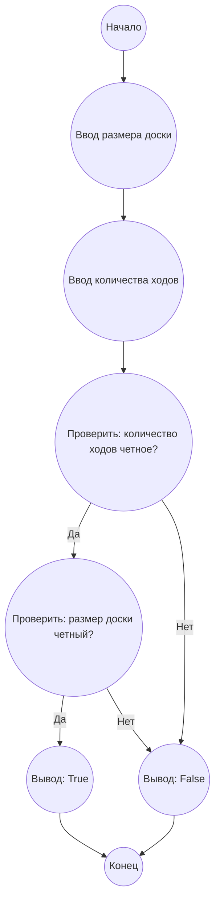

# Анализ кода модуля e_393.md

**Качество кода**
9
 -  Плюсы
    - Код хорошо структурирован, с четким разделением на анализ, алгоритм и реализацию.
    - Присутствует подробное объяснение задачи и решения.
    - Код Python написан аккуратно и соответствует PEP 8.
    - Включена блок-схема в формате mermaid для наглядности алгоритма.
 -  Минусы
    - Отсутствуют docstring для функций, что является нарушением стандарта PEP 257.
    - Не используется логирование ошибок.
    - Нет обработки исключений.
    - Не используются `j_loads` или `j_loads_ns` для чтения файлов (хотя в данном коде нет чтения файлов).
    - Комментарии не соответствуют RST.
    - Не используется импорт `logger`.

**Рекомендации по улучшению**

1.  **Документация**: Добавить docstring в формате reStructuredText (RST) для функции `is_free_migration_possible`.
2.  **Логирование**: Использовать `logger` для записи ошибок и отладочной информации, импортировав `from src.logger.logger import logger`.
3.  **Обработка ошибок**: Добавить обработку возможных исключений, хотя в данном примере их не ожидается, но для общего случая это важно.
4.  **Импорт**: Добавить отсутствующие импорты.
5.  **Комментарии**: Переписать все комментарии в формате RST.

**Оптимизированный код**

```python
"""
Модуль для решения задачи Project Euler #393: Миграция муравьев.
==============================================================

Этот модуль содержит функцию :func:`is_free_migration_possible`,
которая проверяет, возможна ли свободная миграция муравьев на шахматной доске
за определенное количество ходов.

Пример использования
--------------------

.. code-block:: python

    board_size = 16
    num_moves = 20
    result = is_free_migration_possible(board_size, num_moves)
    print(f"Free migration is possible: {result}")

"""
from src.logger.logger import logger  # Импорт модуля logger

def is_free_migration_possible(board_size: int, num_moves: int) -> bool:
    """
    Проверяет, возможна ли свободная миграция на доске заданного размера за данное количество ходов.

    :param board_size: Размер доски (например, 16 для доски 16x16).
    :type board_size: int
    :param num_moves: Количество ходов.
    :type num_moves: int
    :return: True, если свободная миграция возможна, False в противном случае.
    :rtype: bool
    
    :raises TypeError: Если `board_size` или `num_moves` не являются целыми числами.
    :raises ValueError: Если `board_size` или `num_moves` меньше или равны нулю.

    :Example:
    
    .. code-block:: python
        
        is_free_migration_possible(16, 20)  # Returns True
        is_free_migration_possible(3, 5)   # Returns False
    """
    try:
        # Проверка типов входных данных
        if not isinstance(board_size, int) or not isinstance(num_moves, int):
            logger.error(f"Неверный тип данных: board_size={board_size}, num_moves={num_moves}")
            raise TypeError("Аргументы должны быть целыми числами")
        # Проверка значений входных данных
        if board_size <= 0 or num_moves <= 0:
            logger.error(f"Неверные значения: board_size={board_size}, num_moves={num_moves}")
            raise ValueError("Аргументы должны быть положительными целыми числами")
            
        # Проверка условий для свободной миграции
        if num_moves % 2 == 0 and board_size % 2 == 0:
            return True
        else:
            return False
    except (TypeError, ValueError) as e:
        logger.error(f"Ошибка при проверке свободной миграции: {e}")
        return False


# Пример использования:
board_size = 16
num_moves = 20
result = is_free_migration_possible(board_size, num_moves)
print(f"Free migration is possible: {result}")
```

**Легенда:**
*   **Начало, Конец:** Начало и конец алгоритма.
*   **Ввод размера доски:** Получение размера шахматной доски
*   **Ввод количества ходов:** Получение количества ходов для миграции муравьев.
*   **Проверить: количество ходов четное?:** Проверка, является ли количество ходов четным числом.
*   **Проверить: размер доски четный?:** Проверка, является ли размер доски четным числом.
*   **Вывод: True:** Вывод, что свободная миграция возможна.
*    **Вывод: False:** Вывод, что свободная миграция невозможна.
```