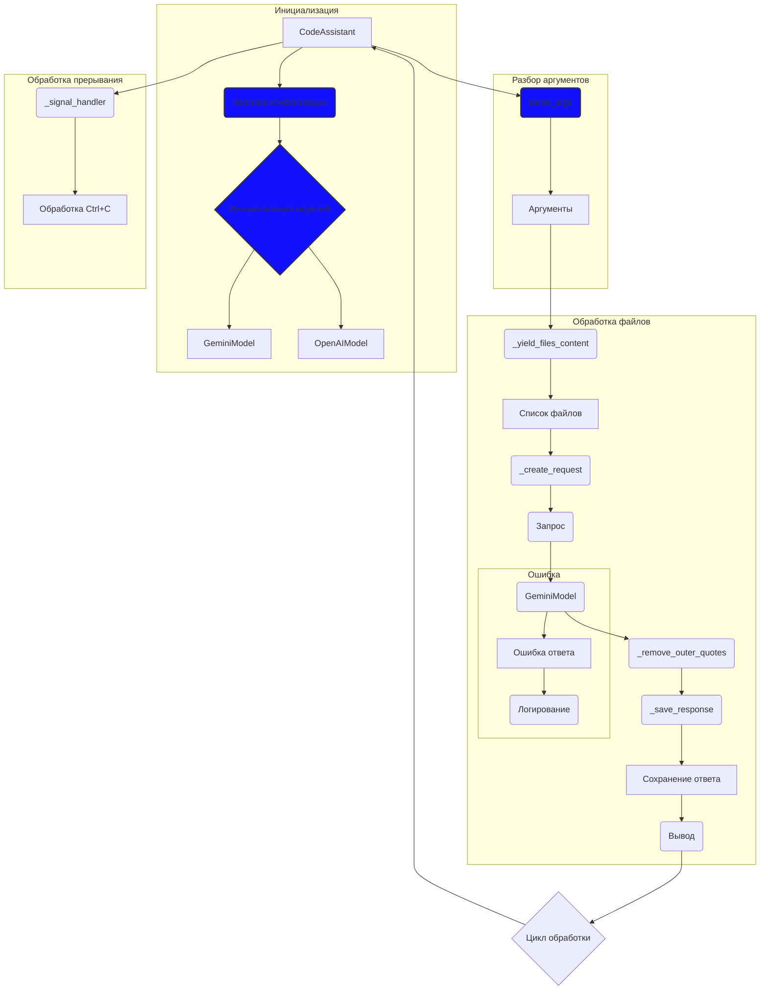

# Анализ кода модуля `code_assistant.mmd`

**Качество кода**
7
-  Плюсы
    - Код представлен в виде диаграммы Mermaid, что позволяет наглядно представить поток выполнения программы.
    -  Диаграмма достаточно подробная и отражает основные этапы работы кода, включая инициализацию, разбор аргументов, обработку файлов и обработку прерываний.
-  Минусы
    -  Отсутствует описание назначения каждого блока кода, что усложняет понимание.
    -  Не указаны конкретные классы и функции, используемые в коде, что снижает информативность диаграммы.
    -  Диаграмма не отображает структуру данных, с которыми работает код.
    -  Не указаны зависимости между модулями.
    -  Не отображены возможные варианты обработки ошибок (кроме ошибки ответа).

**Рекомендации по улучшению**

1.  **Добавить описание блоков**:
    -   Добавить текстовые пояснения к каждому блоку на диаграмме, описывающие его назначение и выполняемые операции.
2.  **Указать конкретные классы и функции**:
    -   Вместо общих названий, таких как `GeminiModel`, указать конкретные классы, используемые в коде (например, `GeminiAPIClient`, `OpenAIAPIClient`).
    -   Указать, какие функции выполняют конкретные операции (например, `_yield_files_content` - `функция для чтения файлов`, `_create_request` - `функция формирования запроса`).
3.  **Отобразить структуру данных**:
    -   Показать, как данные (например, аргументы, список файлов, запрос, ответ) передаются между блоками.
4.  **Указать зависимости между модулями**:
    -   Добавить на диаграмму информацию о том, какие модули зависят от каких.
5.  **Отобразить обработку ошибок**:
    -   Показать на диаграмме возможные пути обработки ошибок и исключений в различных частях кода.
6. **Формат комментариев**:
   -   Переписать комментарии в формате RST.

**Оптимизированный код**

```markdown
# Анализ кода модуля `code_assistant.mmd`

**Качество кода**
7
-  Плюсы
    - Код представлен в виде диаграммы Mermaid, что позволяет наглядно представить поток выполнения программы.
    -  Диаграмма достаточно подробная и отражает основные этапы работы кода, включая инициализацию, разбор аргументов, обработку файлов и обработку прерываний.
-  Минусы
    -  Отсутствует описание назначения каждого блока кода, что усложняет понимание.
    -  Не указаны конкретные классы и функции, используемые в коде, что снижает информативность диаграммы.
    -  Диаграмма не отображает структуру данных, с которыми работает код.
    -  Не указаны зависимости между модулями.
    -  Не отображены возможные варианты обработки ошибок (кроме ошибки ответа).

**Рекомендации по улучшению**

1.  **Добавить описание блоков**:
    -   Добавить текстовые пояснения к каждому блоку на диаграмме, описывающие его назначение и выполняемые операции.
2.  **Указать конкретные классы и функции**:
    -   Вместо общих названий, таких как `GeminiModel`, указать конкретные классы, используемые в коде (например, `GeminiAPIClient`, `OpenAIAPIClient`).
    -   Указать, какие функции выполняют конкретные операции (например, `_yield_files_content` - `функция для чтения файлов`, `_create_request` - `функция формирования запроса`).
3.  **Отобразить структуру данных**:
    -   Показать, как данные (например, аргументы, список файлов, запрос, ответ) передаются между блоками.
4.  **Указать зависимости между модулями**:
    -   Добавить на диаграмму информацию о том, какие модули зависят от каких.
5.  **Отобразить обработку ошибок**:
    -   Показать на диаграмме возможные пути обработки ошибок и исключений в различных частях кода.
6. **Формат комментариев**:
   -   Переписать комментарии в формате RST.

```
