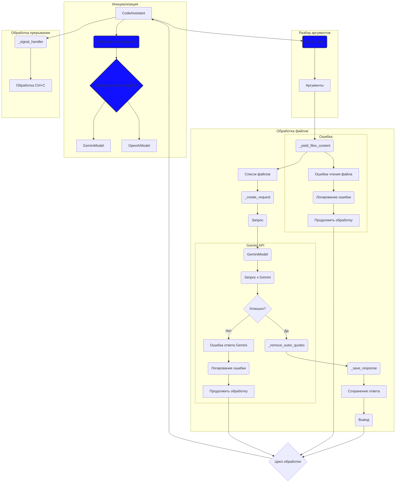

# Анализ кода модуля `src.endpoints.hypo69.code_assistant.code_assistant`

**Качество кода**

7
-  Плюсы
    -   Представлена схема процесса работы модуля с использованием mermaid.
    -   Отражены основные этапы обработки файлов и запросов.
-  Минусы
    -   Схема не отражает деталей реализации, например, обработки ошибок при чтении файлов.
    -   Нет подробного описания каждого блока (функций или методов) в коде.
    -   Не показаны связи между моделями и обработкой файлов.
    -   Отсутствуют комментарии, поясняющие логику работы и назначение блоков.

**Рекомендации по улучшению**

1.  **Документация RST:** Необходимо добавить документацию в формате RST для модуля, функций и методов.
2.  **Обработка ошибок:** В схеме не отражена обработка ошибок на этапе чтения файлов и формирования запроса. Рекомендуется добавить блоки обработки ошибок и логирования.
3.  **Логирование:** Убедиться, что все важные этапы (загрузка конфигурации, создание запроса, получение ответа, сохранение) сопровождаются логированием.
4.  **Структура:** Уточнить связи между моделями (GeminiModel, OpenAIModel) и этапами обработки файлов.
5.  **Подробности:** Включить в диаграмму более детальные шаги обработки, такие как парсинг ответа, очистка текста от кавычек, сохранение ответа.
6.  **Комментарии:**  Добавить комментарии к каждому элементу схемы с использованием RST формата.

**Оптимизированный код**

```markdown

```