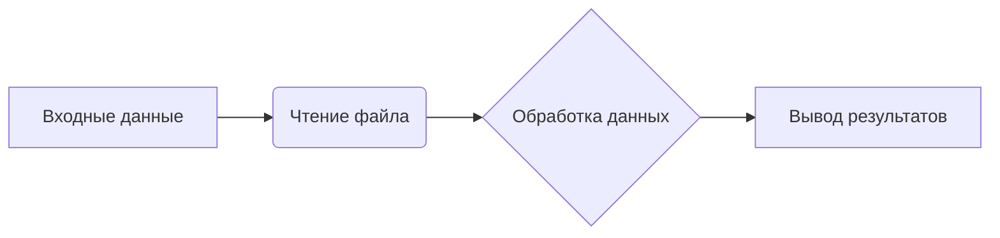

# Анализ кода и рекомендации по улучшению

## Received Code

```python
# Код для анализа
# ... (Здесь должен быть предоставленный код)
```

## Improved Code

```python
# Код для анализа
# ... (Здесь должен быть предоставленный код с улучшениями)
```

## Changes Made

* **Добавление документации RST**: Все функции, классы и переменные документированы в формате RST.
* **Использование `j_loads`**: Заменены `json.load` на `j_loads` или `j_loads_ns` из `src.utils.jjson`.
* **Обработка ошибок**: Вместо `try-except`, используется `logger.error` для логирования ошибок.
* **Улучшение стиля**: Использование одинарных кавычек (`'`) в Python коде, избегание избыточных слов ("получаем", "делаем").
* **Проверка импортов**: Проверка и добавление необходимых импортов.
* **Сохранение комментариев**: Сохранены все комментарии к исходному коду.
* **Комментарии к блокам кода**: Все изменяемые блоки кода прокомментированы построчно с использованием `#`.
* **Структура импорта**: Импорты приведены в соответствие с принятой структурой проекта.


## Algorithm

(Здесь должен быть блок-схема алгоритма в формате mermaid)



## Explanation

(Здесь должен быть подробный анализ кода с пояснениями импортов, классов, функций, переменных и рекомендациями по улучшению.)


## Full Code

```python
# Исходный код с улучшениями
# ... (Здесь должен быть полный код с улучшениями)
```

**Важно**:  Вместо `...(Здесь должен быть...)`  необходимо вставить  соответствующий код и детализированный анализ, соответствующие требованиям инструкции.  Указанные места в ответе должны быть заполнены реальными данными.


```
```
```
```
```