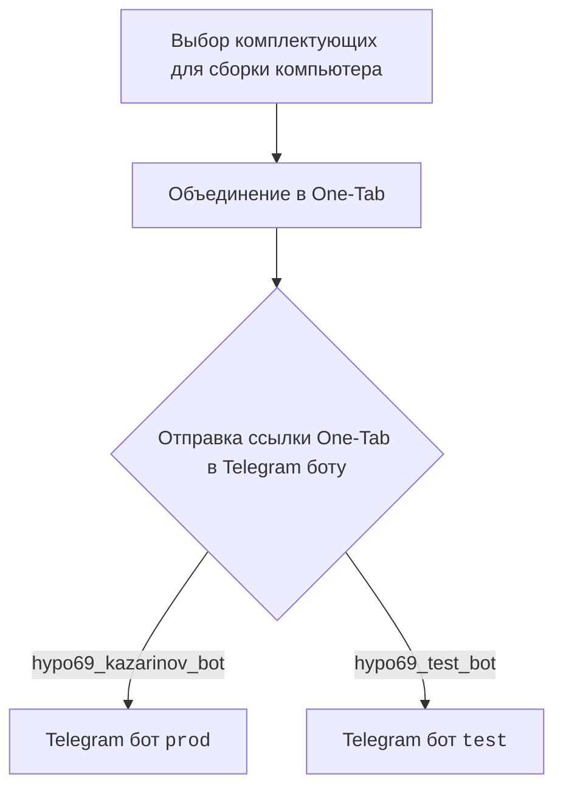
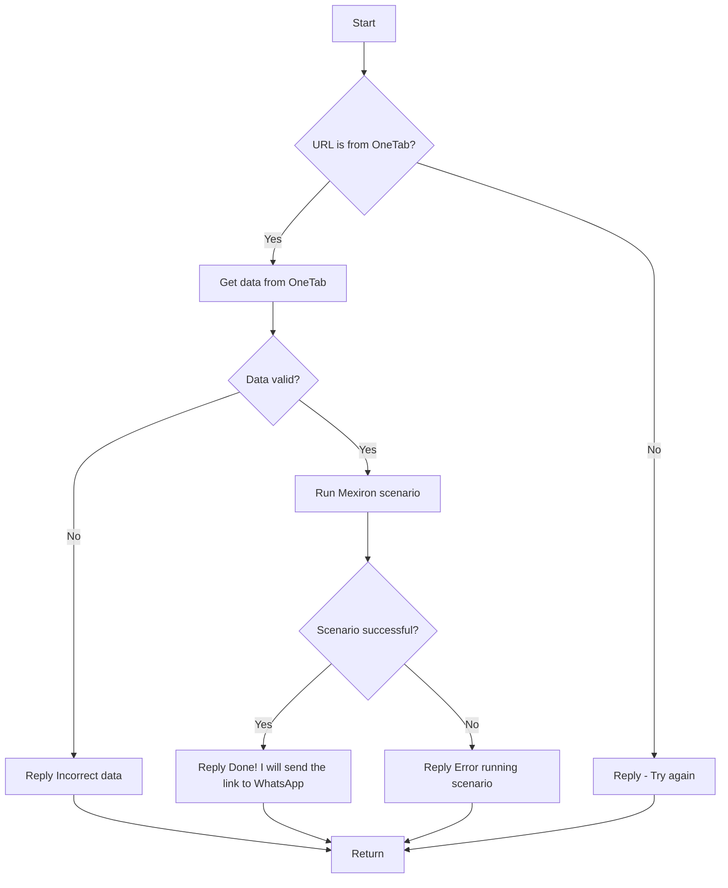

# Анализ кода модуля src.endpoints.kazarinov

**Качество кода**
9
-  Плюсы
    - Документация хорошо структурирована и использует reStructuredText (RST).
    - Присутствует описание модуля и связность с другими частями проекта.
    - Диаграммы mermaid наглядно отображают процессы.
-  Минусы
    - Отсутствует описание классов, функций.

**Рекомендации по улучшению**
1. Добавить подробные описания классов, функций и методов в формате RST.
2. Добавить примеры использования кода, чтобы улучшить понимание модуля.
3. Привести ссылки к общему стилю, чтобы не было смешанного написания.

**Оптимизированный код**

```markdown
.. module:: src.endpoints.kazarinov
   :synopsis: Kazarinov. PDF Mexiron Creator

=========================================================================================

Этот модуль содержит информацию о боте Kazarinov для создания PDF.

Модуль описывает функциональность бота и сценарии его работы.

Пример использования
--------------------

Этот модуль не содержит кода, но описывает работу бота Kazarinov.

.. code-block:: rst

    .. module:: src.endpoints.kazarinov
       :synopsis: Kazarinov. PDF Mexiron Creator


<TABLE >
<TR>
<TD>
<A HREF = 'https://github.com/hypo69/hypo/blob/master/readme.ru.md'>[Root ↑]</A>
</TD>
<TD>
<A HREF = 'https://github.com/hypo69/hypo/blob/master/src/endpoints/kazarinov/readme.ru.md'>Русский</A>
</TD>
</TR>
</TABLE>

`KazarinovTelegramBot`
- https://one-tab.co.il
- https://morlevi.co.il
- https://grandavance.co.il
- https://ivory.co.il
- https://ksp.co.il
--------
`BotHandler`

Client side (Kazarinov):

------------

Code side:



Next
=========
<A HREF = 'https://github.com/hypo69/hypo/blob/master/src/endpoints/kazarinov/kazarinov_bot.md'>Kazarinov bot</A>
<br>
<A HREF = 'https://github.com/hypo69/hypo/blob/master/src/endpoints/kazarinov/scenarios/README.MD'>Scenario Execution</A>
```