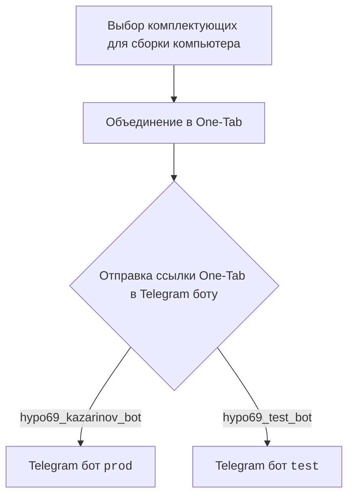
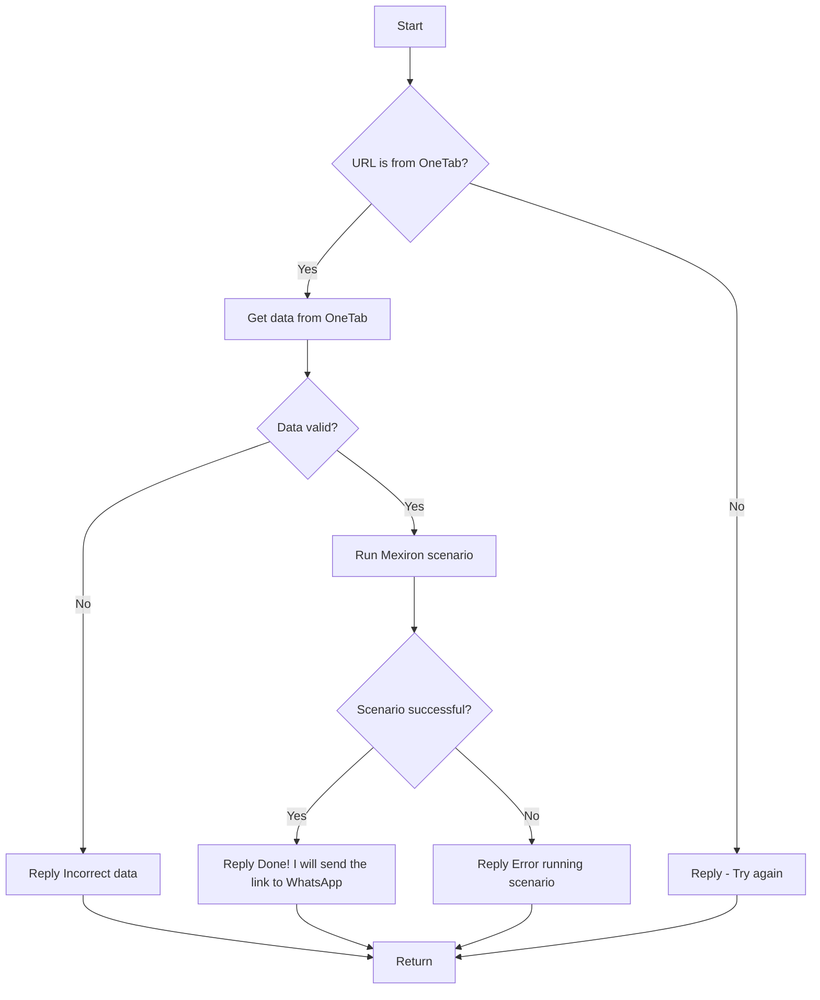

# Анализ кода модуля `src.endpoints.kazarinov`

**Качество кода**
7
- Плюсы
    - Документ содержит описание модуля.
    - Присутствует наглядное описание процесса работы с ботом в формате mermaid.
    - Есть описание логики работы бота.
    - Приведены ссылки на другие связанные документы.
- Минусы
    - Отсутствует описание модуля в формате docstring python.
    - Нет примеров использования.
    - Нет описания переменных.

**Рекомендации по улучшению**

1. Добавить описание модуля в формате docstring python в начале файла.
2. Добавить примеры использования и описание переменных.
3. Использовать единый стиль форматирования кода.
4. Преобразовать mermaid диаграммы в изображения.
5. Сделать ссылки относительными.

**Оптимизированный код**

```markdown
"""
Модуль для работы с Telegram ботом Kazarinov.
=========================================================================================

Этот модуль содержит информацию о работе Telegram бота, который взаимодействует с One-Tab,
собирает данные и запускает сценарии Mexiron.

Пример использования
--------------------

Пример общей схемы работы бота:

.. image:: images/kazarinov_bot_flow.png
    :alt: Схема работы бота Kazarinov
    :align: center

Client side (Kazarinov):

.. image:: images/kazarinov_bot_client_flow.png
    :alt: Client side workflow
    :align: center

Code side:

.. image:: images/kazarinov_bot_code_flow.png
    :alt: Code side workflow
    :align: center


"""
<TABLE >
<TR>
<TD>
<A HREF = '../../../../readme.ru.md'>[Root ↑]</A>
</TD>
<TD>
<A HREF = 'readme.ru.md'>Русский</A>
</TD>
</TR>
</TABLE>

`KazarinovTelegramBot`
- https://one-tab.co.il
- https://morlevi.co.il
- https://grandavance.co.il
- https://ivory.co.il
- https://ksp.co.il
--------
`BotHandler`

Client side (Kazarinov):


------------

Code side:



Next
=========
<A HREF = 'kazarinov_bot.md'>Kazarinov bot</A>
<br>
<A HREF = 'scenarios/README.MD'>Scenario Execution</A>
```