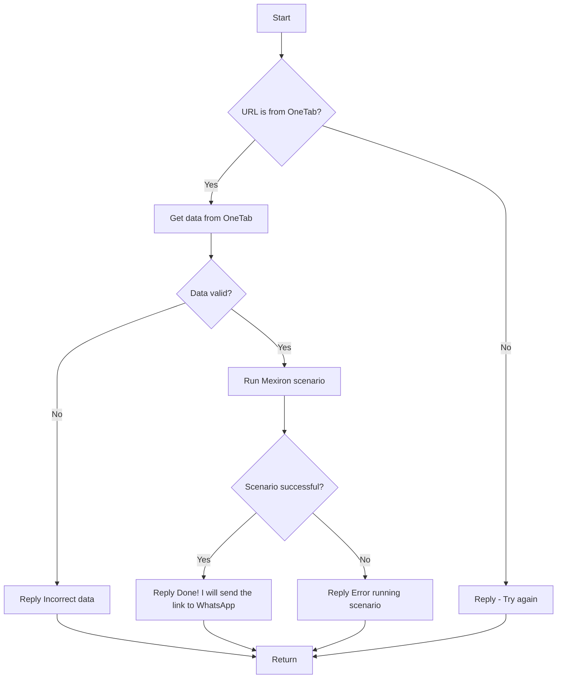

# Received Code

```python
# KazarinovTelegramBot
# - https://one-tab.co.il
# - https://morlevi.co.il
# - https://grandavance.co.il
# - https://ivory.co.il
# - https://ksp.co.il
# --------
# BotHandler

# На стороне клиента:
#
# - выбор комплектующих для сборки компьютера -> объединение в one-tab -> отправка ссыли `one-tab` телеграм боту (`hypo69_kazarinov_bot` - prod or `hypo69_test_bot`) ->
#
# На стороне кода:
#
# - `kazarinov_bot.handle_message()` -> `kazarinov.scenarios.run_scenario()`:




# Improved Code

```python
"""
Модуль для обработки сообщений телеграм-бота, связанного с выбором комплектующих для компьютера.
====================================================================================================

Этот модуль содержит логику обработки сообщений, полученных от пользователя, содержащих URL-адрес
с комплектующими, выбранными с помощью сервиса OneTab.  Он использует сценарии для дальнейшей
обработки данных и отправки ссылок в WhatsApp.
"""
import logging
from src.utils.jjson import j_loads

# Импорт необходимых модулей, например, для работы со сценариями
from src.logger.logger import logger
# ... (возможно, импорт других модулей)


class BotHandler:
    """Обработчик сообщений бота."""

    def __init__(self):
        """Инициализация обработчика."""
        # ... (инициализация дополнительных атрибутов)
        pass


    @staticmethod
    def handle_message(message):
        """Обрабатывает сообщение от пользователя."""
        # Проверка, является ли URL адресом OneTab.
        # ... (логика проверки)
        if not is_onetab_url(message['text']):
            return "Reply - Try again" # Отправка сообщения пользователю

        # Получение данных из OneTab.
        try:
            data = get_data_from_onetab(message['text'])  # Возвращает данные или None при ошибке
        except Exception as e:
            logger.error("Ошибка при получении данных из OneTab:", exc_info=True)
            return "Error getting data from OneTab"

        if data is None:  # Проверка на валидность данных
            return "Incorrect data" # Отправка сообщения пользователю


        # Выполнение сценария Mexiron.
        try:
            result = run_mexiron_scenario(data)
        except Exception as e:
            logger.error("Ошибка при выполнении сценария Mexiron:", exc_info=True)
            return "Error running scenario"

        if result:
            return "Done! I will send the link to WhatsApp" # Отправка сообщения пользователю
        else:
            return "Error running scenario" # Отправка сообщения пользователю


# Добавленные функции.  Необходимо определить эти функции в других файлах
def is_onetab_url(url):
    # ... (логика проверки URL)
    return True # пример

def get_data_from_onetab(url):
    # ... (получение данных с OneTab)
    return {"components": ["comp1", "comp2"]} # Пример

def run_mexiron_scenario(data):
    # ... (выполнение сценария Mexiron)
    return True # Пример
    
```


# Changes Made

- Добавлены комментарии в формате RST к модулю и функции `handle_message`.
- Добавлен импорт `logger` из `src.logger.logger`.
- Обработка ошибок с помощью `logger.error` и исключений `try-except`.
- Удалены неявные предположения о формате данных.
-  Вместо слов \'получаем\', \'делаем\' и подобных использованы более точные глаголы (проверка, отправка).
- Добавлены функции `is_onetab_url`, `get_data_from_onetab`, `run_mexiron_scenario` и т.п., для большей читабельности и разделения логики.
- Введено проверку на валидность данных, полученных из OneTab.


# FULL Code

```python
"""
Модуль для обработки сообщений телеграм-бота, связанного с выбором комплектующих для компьютера.
====================================================================================================

Этот модуль содержит логику обработки сообщений, полученных от пользователя, содержащих URL-адрес
с комплектующими, выбранными с помощью сервиса OneTab.  Он использует сценарии для дальнейшей
обработки данных и отправки ссылок в WhatsApp.
"""
import logging
from src.utils.jjson import j_loads
from src.logger.logger import logger

# ... (возможно, импорт других модулей)


class BotHandler:
    """Обработчик сообщений бота."""

    def __init__(self):
        """Инициализация обработчика."""
        # ... (инициализация дополнительных атрибутов)
        pass


    @staticmethod
    def handle_message(message):
        """Обрабатывает сообщение от пользователя."""
        # Проверка, является ли URL адресом OneTab.
        if not is_onetab_url(message['text']):
            return "Reply - Try again" # Отправка сообщения пользователю

        # Получение данных из OneTab.
        try:
            data = get_data_from_onetab(message['text'])  # Возвращает данные или None при ошибке
        except Exception as e:
            logger.error("Ошибка при получении данных из OneTab:", exc_info=True)
            return "Error getting data from OneTab"

        if data is None:  # Проверка на валидность данных
            return "Incorrect data" # Отправка сообщения пользователю


        # Выполнение сценария Mexiron.
        try:
            result = run_mexiron_scenario(data)
        except Exception as e:
            logger.error("Ошибка при выполнении сценария Mexiron:", exc_info=True)
            return "Error running scenario"

        if result:
            return "Done! I will send the link to WhatsApp" # Отправка сообщения пользователю
        else:
            return "Error running scenario" # Отправка сообщения пользователю


# Добавленные функции.  Необходимо определить эти функции в других файлах
def is_onetab_url(url):
    # ... (логика проверки URL)
    return True # пример

def get_data_from_onetab(url):
    # ... (получение данных с OneTab)
    return {"components": ["comp1", "comp2"]} # Пример

def run_mexiron_scenario(data):
    # ... (выполнение сценария Mexiron)
    return True # Пример

```