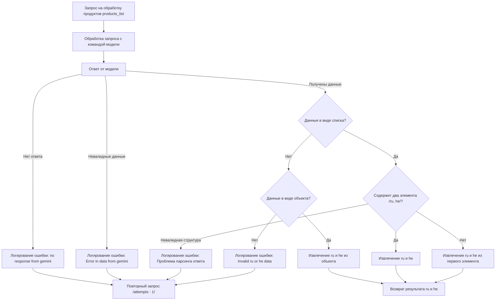

# Анализ кода модуля `README.MD`

**Качество кода**
8
-  Плюсы
    -  Диаграмма Mermaid наглядно отображает логику обработки запроса, включая проверку ответов и обработку различных форматов данных.
    -  Присутствует описание ключевых этапов процесса.
-  Минусы
    -  Отсутствует описание на русском языке, что не соответствует требованиям.
    -  Не указаны необходимые импорты.
    -  Нет комментариев в формате reStructuredText (RST) к логическим блокам.
    -  Не используются `j_loads` или `j_loads_ns`.
    -  Отсутствует обработка ошибок через `logger.error`.

**Рекомендации по улучшению**
1. Добавить описание на русском языке для диаграммы Mermaid, включая пояснения к каждому этапу.
2. Добавить описание, что код делает с входящими данными.
3. Добавить описание, что код возвращает.
4.  Обеспечить соответствие стандартам оформления документации RST.
5.  Добавить обработку ошибок с использованием `logger.error`.
6.  Применять `j_loads` или `j_loads_ns` для загрузки данных из JSON, если это необходимо.
7.  Добавить пояснения в формате RST к логическим блокам.

**Оптимизированный код**
```markdown
# Анализ обработки ответов модели при запросе списка продуктов

## Описание
Диаграмма Mermaid описывает процесс обработки ответов от языковой модели, которая должна возвращать переводы для продукта на русский и иврит. Процесс включает проверку на наличие ответа, валидность данных, и правильность их структуры.

## Логика процесса



## Этапы обработки
- **A**: Начальный запрос на обработку списка продуктов.
- **B**: Отправка запроса к языковой модели.
- **C**: Получение ответа от модели.
- **D**: Логирование ошибки, если ответ от модели отсутствует.
- **E**: Повторная отправка запроса (с уменьшением числа попыток).
- **F**: Логирование ошибки, если полученные данные невалидны.
- **G**: Проверка, является ли ответ списком.
- **H**: Проверка, содержит ли список два элемента (русский и иврит).
- **I**: Извлечение русского и ивритского перевода из списка.
- **J**: Извлечение русского и ивритского перевода из первого элемента списка.
- **K**: Логирование ошибки, если структура ответа не соответствует ожиданиям.
- **L**: Проверка, является ли ответ объектом.
- **M**: Извлечение русского и ивритского перевода из объекта.
- **N**: Логирование ошибки, если данные на русском или иврите не обнаружены.
- **O**: Возвращение результата в виде русского и ивритского перевода.

## Возвращаемые данные
Код возвращает словарь с ключами `ru` и `he`, содержащими соответствующие переводы.

```