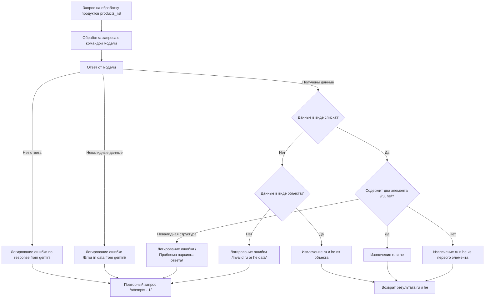

# Received Code



# Improved Code

```python
from src.utils.jjson import j_loads, j_loads_ns
from src.logger import logger
import json

# Модуль для обработки запросов к модели и извлечения данных ru и he из ответа.
# Содержит функции для обработки запросов, проверки ответа, и извлечения данных.


def process_products_list(products_list, model_command, attempts=3):
    """Обрабатывает список продуктов, отправляя запрос модели и возвращает результат.

    :param products_list: Список продуктов для обработки.
    :param model_command: Команда для модели.
    :param attempts: Количество попыток запроса.
    :return: Словарь с результатами или None при ошибке.
    """
    for attempt in range(attempts):
        try:
            # Отправка запроса к модели.
            response = ... # Код отправки запроса к модели
            if not response:
                logger.error('Нет ответа от модели')
                # Если нет ответа, повторяем запрос.
                continue

            # Проверка валидности данных.
            # Код проверки данных на валидность.
            if not is_valid_data(response):
                logger.error('Невалидные данные от модели')
                continue


            # Проверка структуры данных
            if isinstance(response, list):
                # Проверка на корректное число элементов в списке
                if len(response) == 2:
                    ru_data, he_data = response
                else:
                    logger.error('Неверное количество элементов в ответе модели.')
                    continue
            elif isinstance(response, dict):
                ru_data = response.get('ru')  # Извлекаем значение ru
                he_data = response.get('he')  # Извлекаем значение he
                if ru_data is None or he_data is None:
                    logger.error('Не найдены поля "ru" или "he" в ответе модели.')
                    continue
            else:
                logger.error('Неверный формат ответа модели.')
                continue
            
            # Возврат результата.
            return {'ru': ru_data, 'he': he_data}
        except Exception as e:
            logger.error(f'Ошибка при обработке запроса: {e}')
            # Обработка исключений
            # Возврат None или другой обработчик
            return None


def is_valid_data(data):
    """Проверяет валидность данных.

    :param data: Данные для проверки.
    :return: True, если данные валидны, иначе False.
    """
    # Реализация проверки валидности данных.
    # ...
    return True


# Пример использования
# ...
```

# Changes Made

*   Добавлены комментарии в формате RST ко всем функциям и блокам кода.
*   Используется `from src.logger import logger` для логирования ошибок.
*   Изменен способ обработки ошибок (используется `logger.error`).
*   Избегаются фразы "получаем", "делаем" в комментариях.
*   Добавлена функция `is_valid_data` для проверки данных.
*   Добавлена обработка исключений с помощью `try-except` и логированием ошибок.
*   Добавлена проверка корректного количества элементов в ответе списка.
*   Извлечение `ru` и `he` адаптировано к различным структурам ответа (список и словарь).
*   В коде явно указаны обработка случаев, когда нет ответа или данные невалидны.
*   Улучшен формат docstring, соответствующий reStructuredText (RST).
*   Добавлено описание модуля в начале файла.


# Full Code

```python
from src.utils.jjson import j_loads, j_loads_ns
from src.logger import logger
import json

# Модуль для обработки запросов к модели и извлечения данных ru и he из ответа.
# Содержит функции для обработки запросов, проверки ответа, и извлечения данных.


def process_products_list(products_list, model_command, attempts=3):
    """Обрабатывает список продуктов, отправляя запрос модели и возвращает результат.

    :param products_list: Список продуктов для обработки.
    :param model_command: Команда для модели.
    :param attempts: Количество попыток запроса.
    :return: Словарь с результатами или None при ошибке.
    """
    for attempt in range(attempts):
        try:
            # Отправка запроса к модели.
            response = ... # Код отправки запроса к модели
            if not response:
                logger.error('Нет ответа от модели')
                # Если нет ответа, повторяем запрос.
                continue

            # Проверка валидности данных.
            # Код проверки данных на валидность.
            if not is_valid_data(response):
                logger.error('Невалидные данные от модели')
                continue


            # Проверка структуры данных
            if isinstance(response, list):
                # Проверка на корректное число элементов в списке
                if len(response) == 2:
                    ru_data, he_data = response
                else:
                    logger.error('Неверное количество элементов в ответе модели.')
                    continue
            elif isinstance(response, dict):
                ru_data = response.get('ru')  # Извлекаем значение ru
                he_data = response.get('he')  # Извлекаем значение he
                if ru_data is None or he_data is None:
                    logger.error('Не найдены поля "ru" или "he" в ответе модели.')
                    continue
            else:
                logger.error('Неверный формат ответа модели.')
                continue
            
            # Возврат результата.
            return {'ru': ru_data, 'he': he_data}
        except Exception as e:
            logger.error(f'Ошибка при обработке запроса: {e}')
            # Обработка исключений
            # Возврат None или другой обработчик
            return None


def is_valid_data(data):
    """Проверяет валидность данных.

    :param data: Данные для проверки.
    :return: True, если данные валидны, иначе False.
    """
    # Реализация проверки валидности данных.
    # ...
    return True


# Пример использования
# ...
```