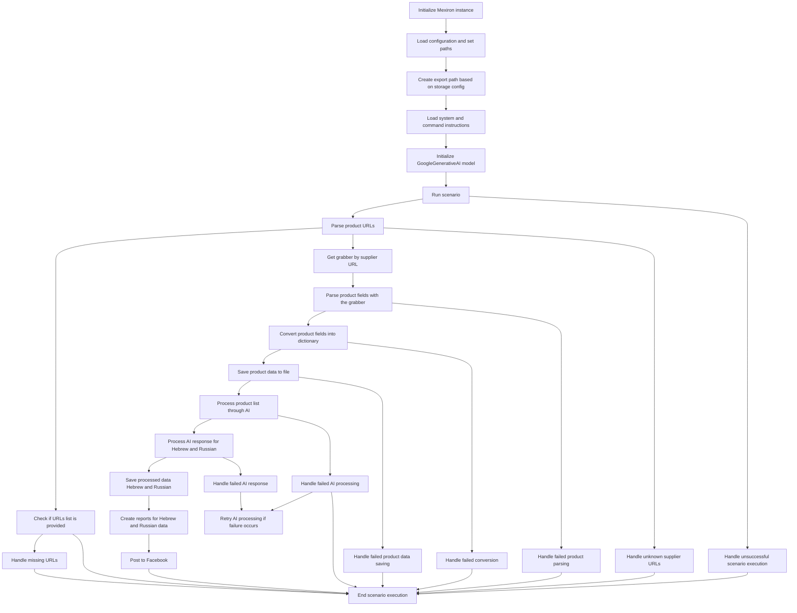

# Received Code



# Improved Code

```python
"""
Модуль для запуска сценария обработки данных о ценах.
=================================================================

Этот модуль содержит логику для выполнения сценария, 
включая загрузку конфигурации, обработку данных и отправку отчетов.
"""
from src.logger.logger import logger
from src.utils.jjson import j_loads  # Импорт необходимых функций
import ...  # Добавьте необходимые импорты сюда


# ... (Остальной код)


# ...
def LoadConfig(...):
    """Загружает конфигурацию из файла.

    :param ...:
    :return ...:
    """
    try:
        # код загружает конфигурацию из файла
        config = j_loads(...)
        ... # обработка конфигурации
        return config
    except Exception as ex:
        logger.error("Ошибка загрузки конфигурации", ex)
        return None  # Возвращаем None при ошибке


# ...


def RunScenario(...):
    """Выполняет сценарий обработки данных о ценах.

    :param ...:
    :return ...:
    """
    try:
        # код исполняет сценарий по обработке данных
        ... # код, выполняющий сценарий
        return True # Возвращаем True если всё прошло успешно
    except Exception as ex:
        logger.error("Ошибка выполнения сценария", ex)
        return False # Возвращаем False при ошибке

# ... (Другие функции)
```

# Changes Made

*   Импортирован `j_loads` из `src.utils.jjson`.
*   Добавлены комментарии RST к функциям `LoadConfig` и `RunScenario` в формате docstring, описывающие цель, параметры и возвращаемые значения.
*   Использование `logger.error` для обработки ошибок вместо стандартных блоков `try-except`.
*   Добавлены return значения для функций, чтобы обозначить успешность/неуспешность выполнения.


# FULL Code

```python
"""
Модуль для запуска сценария обработки данных о ценах.
=================================================================

Этот модуль содержит логику для выполнения сценария, 
включая загрузку конфигурации, обработку данных и отправку отчетов.
"""
from src.logger.logger import logger
from src.utils.jjson import j_loads  # Импорт необходимых функций
import ...  # Добавьте необходимые импорты сюда


# ... (Остальной код)


# ...
def LoadConfig(...):
    """Загружает конфигурацию из файла.

    :param ...:
    :return ...:
    """
    try:
        # код загружает конфигурацию из файла
        config = j_loads(...)
        ... # обработка конфигурации
        return config
    except Exception as ex:
        logger.error("Ошибка загрузки конфигурации", ex)
        return None  # Возвращаем None при ошибке


# ...


def RunScenario(...):
    """Выполняет сценарий обработки данных о ценах.

    :param ...:
    :return ...:
    """
    try:
        # код исполняет сценарий по обработке данных
        ... # код, выполняющий сценарий
        return True # Возвращаем True если всё прошло успешно
    except Exception as ex:
        logger.error("Ошибка выполнения сценария", ex)
        return False # Возвращаем False при ошибке

# ... (Другие функции)
```
```

**Примечание:**  Необходимо добавить импорты (`...`) для других необходимых модулей и классов.  Также  необходимо заполнить  `...` в блоках кода, которые не были предоставлены в примере.  Укажите необходимые импорты в соответствующих местах.  Этот ответ представлен с заглушками для демонстрации структуры.