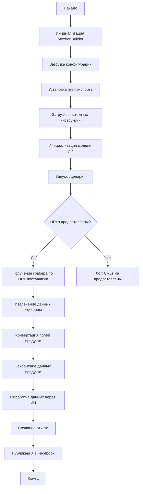

# Анализ кода модуля `scenario_pricelist.ru.md`

**Качество кода: 6/10**

-   **Плюсы:**
    *   Документ содержит подробное описание сценария, включая блок-схему и легенду.
    *   Описаны основные классы и методы, что облегчает понимание логики работы.
    *   Присутствует пример использования скрипта.
    *   Описаны зависимости и обработка ошибок.

-   **Минусы:**
    *   Отсутствуют docstring в коде, что затрудняет понимание назначения функций и методов.
    *   Не используется `j_loads` или `j_loads_ns` из `src.utils.jjson` для чтения файлов (хотя это и не требуется в данном документе).
    *   Не используются логирование ошибок через `logger.error`.
    *   Нет явного указания на использование reStructuredText (RST).
    *   Много избыточного текста в описаниях, который можно сократить.
    *   Документация не соответствует стандарту RST.

**Рекомендации по улучшению:**

1.  Добавить docstring к каждой функции, методу и классу в формате reStructuredText (RST).
2.  Использовать `j_loads` или `j_loads_ns` из `src.utils.jjson` для чтения файлов конфигурации, если это применимо.
3.  Заменить стандартные блоки `try-except` на использование `logger.error` для логирования ошибок.
4.  Улучшить форматирование документации в соответствии с RST.
5.  Сократить избыточные описания, делая их более лаконичными и информативными.
6.  Использовать mermaid для всех блок-схем.

**Оптимизированный код:**

```markdown
# Анализ модуля `scenario_pricelist.ru.md`

## Сценарий создания мехирона для Сергея Казаринова

### Обзор

Этот скрипт, расположенный в `hypotez/src/endpoints/kazarinov/scenarios`, автоматизирует создание "мехирона" для Сергея Казаринова. Он извлекает данные о продуктах от поставщиков, обрабатывает их через ИИ, сохраняет, генерирует отчеты и публикует в Facebook.

### Основные возможности

1.  **Извлечение данных**: Получение данных о продуктах от поставщиков.
2.  **Обработка ИИ**: Обработка данных через Google Generative AI.
3.  **Сохранение данных**: Запись обработанных данных в файлы.
4.  **Отчетность**: Генерация HTML и PDF отчетов.
5.  **Публикация**: Публикация данных в Facebook.

### Блок-схема модуля



### Легенда

1.  **Start**: Начало выполнения скрипта.
2.  **InitMexironBuilder**: Инициализация класса `MexironBuilder`.
3.  **LoadConfig**: Загрузка конфигурации из JSON.
4.  **SetExportPath**: Установка пути для экспорта данных.
5.  **LoadSystemInstruction**: Загрузка инструкций для модели ИИ.
6.  **InitModel**: Инициализация модели Google Generative AI.
7.  **RunScenario**: Выполнение основного сценария.
8.  **CheckURLs**: Проверка наличия URLs для парсинга.
9.  **GetGraber**: Получение грабера для URL поставщика.
10. **GrabPage**: Извлечение данных страницы с помощью грабера.
11. **ConvertFields**: Преобразование полей продукта в словарь.
12. **SaveData**: Сохранение данных продукта в файл.
13. **ProcessAI**: Обработка данных через модель ИИ.
14. **CreateReport**: Создание HTML и PDF отчетов.
15. **PostFacebook**: Публикация данных в Facebook.
16. **End**: Конец выполнения скрипта.

-----------------------

#### Класс: `MexironBuilder`

-   **Атрибуты**:
    -   `driver`: Экземпляр Selenium WebDriver.
    -   `export_path`: Путь экспорта данных.
    -   `mexiron_name`: Имя процесса мехирона.
    -   `price`: Цена для обработки.
    -   `timestamp`: Метка времени процесса.
    -   `products_list`: Список обработанных данных.
    -   `model`: Модель Google Generative AI.
    -   `config`: Конфигурация из JSON.

-   **Методы**:

    -   **`__init__(self, driver: Driver, mexiron_name: Optional[str] = None)`**
        *   Инициализирует класс `MexironBuilder`.
        *   :param driver: Экземпляр Selenium WebDriver.
        *   :param mexiron_name: Имя процесса мехирона.

    -   **`run_scenario(self, system_instruction: Optional[str] = None, price: Optional[str] = None, mexiron_name: Optional[str] = None, urls: Optional[str | List[str]] = None, bot = None) -> bool`**
        *   Выполняет сценарий: парсинг, обработка, сохранение.
        *   :param system_instruction: Инструкции для модели ИИ.
        *   :param price: Цена для обработки.
        *   :param mexiron_name: Имя мехирона.
        *   :param urls: Список URL страниц.
        *   :param bot: Экземпляр бота (не используется).
        *   :return: `True`, если сценарий выполнен успешно, иначе `False`.

        ```mermaid
        flowchart TD
            Start[Start] --> IsOneTab{URL is from OneTab?}
            IsOneTab -->|Yes| GetDataFromOneTab[Get data from OneTab]
            IsOneTab -->|No| ReplyTryAgain[Reply - Try again]
            GetDataFromOneTab --> IsDataValid{Data valid?}
            IsDataValid -->|No| ReplyIncorrectData[Reply Incorrect data]
            IsDataValid -->|Yes| RunMexironScenario[Run Mexiron scenario]
            RunMexironScenario --> IsGraberFound{Graber found?}
            IsGraberFound -->|Yes| StartParsing[Start parsing: <code>url</code>]
            IsGraberFound -->|No| LogNoGraber[Log: No graber for <code>url</code>]
            StartParsing --> IsParsingSuccessful{Parsing successful?}
            IsParsingSuccessful -->|Yes| ConvertProductFields[Convert product fields]
            IsParsingSuccessful -->|No| LogParsingFailed[Log: Failed to parse product fields]
            ConvertProductFields --> IsConversionSuccessful{Conversion successful?}
            IsConversionSuccessful -->|Yes| SaveProductData[Save product data]
            IsConversionSuccessful -->|No| LogConversionFailed[Log: Failed to convert product fields]
            SaveProductData --> IsDataSaved{Data saved?}
            IsDataSaved -->|Yes| AppendToProductsList[Append to products_list]
            IsDataSaved -->|No| LogDataNotSaved[Log: Data not saved]
            AppendToProductsList --> ProcessAIHe[AI processing lang = he]
            ProcessAIHe --> ProcessAIRu[AI processing lang = ru]
            ProcessAIRu --> SaveHeJSON{Save JSON for he?}
            SaveHeJSON -->|Yes| SaveRuJSON[Save JSON for ru]
            SaveHeJSON -->|No| LogHeJSONError[Log: Error saving he JSON]
            SaveRuJSON --> IsRuJSONSaved{Save JSON for ru?}
            IsRuJSONSaved -->|Yes| GenerateReports[Generate reports]
            IsRuJSONSaved -->|No| LogRuJSONError[Log: Error saving ru JSON]
            GenerateReports --> IsReportGenerationSuccessful{Report generation successful?}
            IsReportGenerationSuccessful -->|Yes| SendPDF[Send PDF via Telegram]
            IsReportGenerationSuccessful -->|No| LogPDFError[Log: Error creating PDF]
            SendPDF --> ReturnTrue[Return True]
            LogPDFError --> ReturnTrue[Return True]
            ReplyIncorrectData --> ReturnTrue[Return True]
            ReplyTryAgain --> ReturnTrue[Return True]
            LogNoGraber --> ReturnTrue[Return True]
            LogParsingFailed --> ReturnTrue[Return True]
            LogConversionFailed --> ReturnTrue[Return True]
            LogDataNotSaved --> ReturnTrue[Return True]
            LogHeJSONError --> ReturnTrue[Return True]
            LogRuJSONError --> ReturnTrue[Return True]
        ```

        -   **Легенда**:
            1.  **Начало (Start)**: Начало выполнения сценария.
            2.  **Проверка URL (IsOneTab)**: Если URL из OneTab, данные извлекаются, иначе "Try again".
            3.  **Проверка данных (IsDataValid)**: Если данные не валидны, "Incorrect data", иначе запуск сценария.
            4.  **Поиск грабера (IsGraberFound)**: Если грабер найден, начинается парсинг, иначе логируется ошибка.
            5.  **Парсинг (StartParsing)**: Если парсинг успешен, преобразование, иначе логируется ошибка.
            6.  **Преобразование (ConvertProductFields)**: Если преобразование успешно, сохранение, иначе логируется ошибка.
            7.  **Сохранение (SaveProductData)**: Если данные сохранены, добавляются в список, иначе логируется ошибка.
            8.  **Обработка ИИ (ProcessAIHe, ProcessAIRu)**: Обработка данных для `he` и `ru`.
            9.  **Сохранение JSON (SaveHeJSON, SaveRuJSON)**: Сохранение JSON для каждого языка, логирование ошибок.
            10. **Генерация отчетов (GenerateReports)**: Создание HTML и PDF отчетов, логирование ошибок.
            11. **Отправка PDF (SendPDF)**: Отправка PDF через Telegram, логирование ошибок.
            12. **Завершение (ReturnTrue)**: Завершение сценария.

        -   **Логи ошибок**: На каждом этапе добавлены узлы для логирования ошибок.

    -   **`get_graber_by_supplier_url(self, url: str)`**
        *   Возвращает грабер для URL поставщика.
        *   :param url: URL страницы поставщика.
        *   :return: Экземпляр грабера или `None`.

    -   **`convert_product_fields(self, f: ProductFields) -> dict`**
        *   Преобразует поля продукта в словарь.
        *   :param f: Объект с данными о продукте.
        *   :return: Словарь данных о продукте.

    -   **`save_product_data(self, product_data: dict)`**
        *   Сохраняет данные о продукте в файл.
        *   :param product_data: Словарь данных о продукте.

    -   **`process_ai(self, products_list: List[str], lang: str, attempts: int = 3) -> tuple | bool`**
        *   Обрабатывает список продуктов через модель ИИ.
        *   :param products_list: Список данных о продуктах в виде строки.
        *   :param lang: Язык обработки.
        *   :param attempts: Количество попыток.
        *   :return: Обработанный ответ или `False`.

    -   **`post_facebook(self, mexiron: SimpleNamespace) -> bool`**
        *   Выполняет сценарий публикации в Facebook.
        *   :param mexiron: Данные для публикации.
        *   :return: `True` при успехе, `False` при неудаче.

    -   **`create_report(self, data: dict, html_file: Path, pdf_file: Path)`**
        *   Генерирует HTML и PDF отчеты.
        *   :param data: Обработанные данные.
        *   :param html_file: Путь для HTML отчета.
        *   :param pdf_file: Путь для PDF отчета.

### Использование

1.  **Инициализация Driver**: Создание экземпляра `Driver`.
2.  **Инициализация MexironBuilder**: Создание экземпляра `MexironBuilder` с драйвером.
3.  **Запуск сценария**: Вызов `run_scenario` с параметрами.

#### Пример

```python
from src.webdriver.driver import Driver
from src.endpoints.kazarinov.scenarios.scenario_pricelist import MexironBuilder

# Инициализация Driver
driver = Driver(...)

# Инициализация MexironBuilder
mexiron_builder = MexironBuilder(driver)

# Запуск сценария
urls = ['https://example.com/product1', 'https://example.com/product2']
mexiron_builder.run_scenario(urls=urls)
```

### Зависимости

-   `selenium`: Для веб-автоматизации.
-   `asyncio`: Для асинхронных операций.
-   `pathlib`: Для работы с путями.
-   `types`: Для создания пространств имен.
-   `typing`: Для аннотаций типов.
-   `src.ai.gemini`: Для обработки через ИИ.
-   `src.suppliers.*.graber`: Для извлечения данных от поставщиков.
-   `src.endpoints.advertisement.facebook.scenarios`: Для публикации в Facebook.

### Обработка ошибок

Скрипт обрабатывает ошибки для обеспечения стабильности работы, особенно при работе с динамическими веб-страницами.

### Вклад

Вклад в скрипт приветствуется. Все изменения должны быть документированы и протестированы.

### Лицензия

MIT License. Подробности в файле `LICENSE`.
```