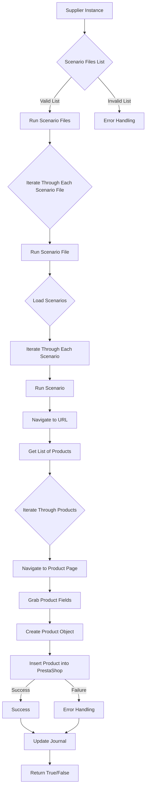

# Анализ кода модуля `src.scenario`

**Качество кода**
   8
-  Плюсы
     - Хорошая структуризация модуля с описанием основных функций и компонентов.
     - Четкое разделение ответственности между функциями.
     - Наличие Mermaid-диаграммы, демонстрирующей последовательность выполнения сценариев.
     - Подробное описание параметров, возвращаемых значений и возможных исключений для каждой функции.
     - Наличие примера JSON-сценария.
-  Минусы
    -  Отсутствуют импорты необходимых модулей в коде.
    -  Не используется `j_loads` или `j_loads_ns` из `src.utils.jjson` для чтения файлов.
    -  Не используется `logger` из `src.logger`.
    -  Нет обработки ошибок с использованием `logger.error`.
    -  Отсутствует документация в формате docstring для функций.

**Рекомендации по улучшению**

1.  **Импорты**: Добавить все необходимые импорты в начале файла.
2.  **Чтение JSON**: Использовать `j_loads` или `j_loads_ns` из `src.utils.jjson` для загрузки JSON-файлов.
3.  **Логирование**: Использовать `logger` из `src.logger` для логирования ошибок и другой информации.
4.  **Обработка ошибок**: Заменить общие блоки `try-except` на обработку ошибок с `logger.error`.
5.  **Документация**: Добавить docstring в формате reStructuredText (RST) для каждой функции.
6.  **Форматирование кода**: Использовать одинарные кавычки для строк в Python коде.

**Оптимизированный код**
```markdown
# Module `src.scenario`
"""
Модуль для автоматизации взаимодействия с поставщиками на основе сценариев, описанных в JSON-файлах.
=====================================================================================================

Этот модуль предназначен для упрощения процесса извлечения и обработки данных о продуктах с веб-сайтов поставщиков
и синхронизации этой информации с базой данных (например, PrestaShop).
Модуль включает в себя функциональность для чтения сценариев, взаимодействия с веб-сайтами, обработки данных,
ведения журнала выполнения и организации всего рабочего процесса.

Пример использования
--------------------

Пример запуска обработки файлов сценариев:

.. code-block:: python

    from src.scenario import main
    main()
"""

## Overview

The `src.scenario` module is designed to automate interactions with suppliers using scenarios described in JSON files. It streamlines the process of extracting and processing product data from supplier websites and synchronizing this information with a database (e.g., PrestaShop). The module includes functionality for reading scenarios, interacting with websites, processing data, logging execution details, and organizing the entire workflow.

## Table of Contents

* [Module `src.scenario`](#module-src-scenario)
* [Overview](#overview)
* [Core Functions of the Module](#core-functions-of-the-module)
* [Main Components of the Module](#main-components-of-the-module)
    * [`run_scenario_files(s, scenario_files_list)`](#run_scenario_files-s-scenario_files_list)
    * [`run_scenario_file(s, scenario_file)`](#run_scenario_file-s-scenario_file)
    * [`run_scenario(s, scenario)`](#run_scenario-s-scenario)
    * [`dump_journal(s, journal)`](#dump_journal-s-journal)
    * [`main()`](#main)
* [Example Scenario](#example-scenario)
* [How It Works](#how-it-works)

## Core Functions of the Module

1. **Reading Scenarios**: Loading scenarios from JSON files containing product information and URLs on the supplier's website.
2. **Interacting with Websites**: Processing URLs from scenarios to extract product data.
3. **Processing Data**: Transforming extracted data into a format suitable for the database and saving it.
4. **Logging Execution**: Maintaining logs with details of scenario execution and results for tracking progress and identifying errors.




## Main Components of the Module

### `run_scenario_files(s, scenario_files_list)`

**Description**: Accepts a list of scenario files and executes them sequentially by invoking the `run_scenario_file` function for each file.

**Parameters**:
- `s`: A settings object (e.g., for database connection).
- `scenario_files_list` (list): A list of paths to scenario files.

**Returns**:
- None

**Raises**:
- `FileNotFoundError`: If a scenario file is not found.
- `JSONDecodeError`: If a scenario file contains invalid JSON.

### `run_scenario_file(s, scenario_file)`

**Description**: Loads scenarios from the specified file and calls `run_scenario` for each scenario in the file.

**Parameters**:
- `s`: A settings object.
- `scenario_file` (str): Path to the scenario file.

**Returns**:
- None

**Raises**:
- `FileNotFoundError`: If the scenario file is not found.
- `JSONDecodeError`: If the scenario file contains invalid JSON.
- `Exception`: For any other issues during scenario execution.

### `run_scenario(s, scenario)`

**Description**: Processes an individual scenario by navigating to a URL, extracting product data, and saving it to the database.

**Parameters**:
- `s`: A settings object.
- `scenario` (dict): A dictionary containing the scenario (e.g., with URL and categories).

**Returns**:
- None

**Raises**:
- `requests.exceptions.RequestException`: If there are issues with the website request.
- `Exception`: For any other problems during scenario processing.

### `dump_journal(s, journal)`

**Description**: Saves the execution journal to a file for subsequent analysis.

**Parameters**:
- `s`: A settings object.
- `journal` (list): A list of execution log entries.

**Returns**:
- None

**Raises**:
- `Exception`: If there are issues writing to the file.

### `main()`

**Description**: The main function to launch the module.

**Parameters**:
- None

**Returns**:
- None

**Raises**:
- `Exception`: For any critical errors during execution.

## Example Scenario

An example JSON scenario describes interactions with product categories on a website. It includes a URL, the category name, and category identifiers in the PrestaShop database.

```json
{
    "scenarios": {
        "mineral+creams": {
            "url": "https://example.com/category/mineral-creams/",
            "name": "mineral+creams",
            "presta_categories": {
                "default_category": 12345,
                "additional_categories": [12346, 12347]
            }
        }
    }
}
```
```python
#   Модуль для автоматизации взаимодействия с поставщиками на основе сценариев, описанных в JSON-файлах.
# =====================================================================================================
#
#   Этот модуль предназначен для упрощения процесса извлечения и обработки данных о продуктах с веб-сайтов поставщиков
#   и синхронизации этой информации с базой данных (например, PrestaShop).
#   Модуль включает в себя функциональность для чтения сценариев, взаимодействия с веб-сайтами, обработки данных,
#   ведения журнала выполнения и организации всего рабочего процесса.
#
#   Пример использования
#   --------------------
#
#   Пример запуска обработки файлов сценариев:
#
#   .. code-block:: python
#
#       from src.scenario import main
#       main()
#
#   импортируем необходимые библиотеки
import asyncio
import json
from pathlib import Path
from typing import Any
#   импортируем j_loads
from src.utils.jjson import j_loads
#   импортируем logger
from src.logger import logger

async def run_scenario_files(s: Any, scenario_files_list: list[str]) -> None:
    """
    Асинхронно выполняет сценарии из списка файлов.

    Args:
        s (Any): Объект настроек.
        scenario_files_list (list[str]): Список путей к файлам сценариев.
    """
    # код перебирает все файлы из списка
    for scenario_file in scenario_files_list:
        await run_scenario_file(s, scenario_file)

async def run_scenario_file(s: Any, scenario_file: str) -> None:
    """
    Асинхронно выполняет сценарии из указанного файла.

    Args:
        s (Any): Объект настроек.
        scenario_file (str): Путь к файлу сценариев.

    Raises:
        FileNotFoundError: Если файл сценариев не найден.
        json.JSONDecodeError: Если файл сценариев содержит невалидный JSON.
        Exception: При любых других ошибках выполнения сценария.
    """
    # код загружает json файл
    try:
        # используем j_loads для загрузки данных из файла сценариев
        with open(scenario_file, 'r') as f:
            scenario_data = j_loads(f)
        # код перебирает все сценарии
        for scenario_name, scenario in scenario_data.get('scenarios', {}).items():
           await run_scenario(s, scenario)
    except FileNotFoundError as e:
         # логируем ошибку если файл не найден
        logger.error(f'Файл сценария не найден: {scenario_file}', exc_info=True)
        ...
    except json.JSONDecodeError as e:
         # логируем ошибку если json не валиден
        logger.error(f'Ошибка декодирования JSON в файле: {scenario_file}', exc_info=True)
        ...
    except Exception as e:
         # логируем любую другую ошибку
        logger.error(f'Произошла ошибка при выполнении сценария в файле: {scenario_file}', exc_info=True)
        ...

async def run_scenario(s: Any, scenario: dict) -> None:
    """
    Асинхронно выполняет один сценарий.

    Args:
        s (Any): Объект настроек.
        scenario (dict): Словарь, содержащий сценарий (например, URL и категории).

    Raises:
        requests.exceptions.RequestException: Если возникают проблемы с запросом к веб-сайту.
        Exception: При любых других ошибках обработки сценария.
    """
    # код обрабатывает сценарий
    try:
        url = scenario.get('url')
        #   логика извлечения данных по URL
        #   ...
        #   логика сохранения данных
        #   ...
        logger.info(f'Сценарий выполнен успешно для URL: {url}')
    except Exception as e:
        #  логируем ошибку
        logger.error(f'Произошла ошибка при выполнении сценария для URL: {url}', exc_info=True)
        ...

async def dump_journal(s: Any, journal: list[dict]) -> None:
    """
    Сохраняет журнал выполнения в файл.

    Args:
        s (Any): Объект настроек.
        journal (list[dict]): Список записей журнала выполнения.

     Raises:
        Exception: Если возникает ошибка при записи в файл.
    """
    # код сохраняет журнал
    try:
        #  логика сохранения журнала в файл
        ...
        logger.info('Журнал выполнения успешно сохранен.')
    except Exception as e:
        # логируем ошибку
        logger.error('Произошла ошибка при сохранении журнала выполнения', exc_info=True)
        ...
def main() -> None:
    """
    Главная функция для запуска модуля.

    Raises:
        Exception: При любых критических ошибках во время выполнения.
    """
    # код запускает модуль
    try:
        settings = {'db': 'db_settings'} # TODO: настройки бд
        scenario_files = [
            './scenario/example.json' # TODO: список файлов
        ]
        asyncio.run(run_scenario_files(settings, scenario_files))
        logger.info('Модуль успешно завершил работу.')
    except Exception as e:
        # логируем ошибку
        logger.error('Произошла критическая ошибка во время выполнения', exc_info=True)
        ...
if __name__ == '__main__':
    main()
```