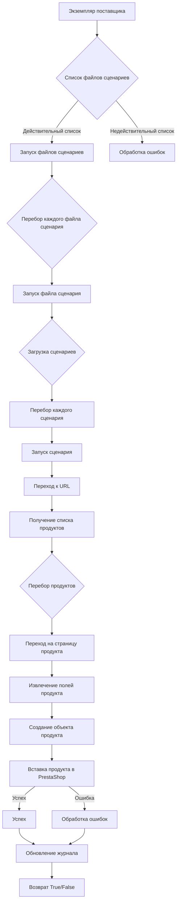

# Анализ кода модуля `src.scenario`

**Качество кода**
9
-  Плюсы
    -  Хорошая структурированность и подробное описание модуля.
    -  Использование Mermaid для визуализации потока выполнения.
    -  Четкое описание функций и их параметров.
    -  Наличие примера JSON сценария.
-  Минусы
    - Отсутствует reStructuredText в комментариях.
    - Не все функции документированы с использованием docstring.
    - Не используются `j_loads` или `j_loads_ns` для чтения файлов.
    - Не используется  `from src.logger.logger import logger` для логирования ошибок.

**Рекомендации по улучшению**

1.  **Применение reStructuredText:**
    - Переписать все комментарии, включая описание модуля и функций, в формате reStructuredText (RST).
2.  **Документирование функций:**
    - Добавить docstring для каждой функции, включая описание параметров, возвращаемых значений и возможных исключений.
3.  **Использование `j_loads` и `j_loads_ns`:**
    -  Заменить стандартный `json.load` на `j_loads` или `j_loads_ns` из `src.utils.jjson` для загрузки JSON файлов.
4.  **Логирование:**
    -   Использовать `from src.logger.logger import logger` для логирования ошибок и избегать стандартных блоков `try-except`, где это возможно.
5.  **Обработка ошибок:**
    -  Улучшить обработку ошибок, используя `logger.error` для логирования исключений.
6.  **Улучшение структуры документации:**
    - Привести пример документации к стандарту RST.
7. **Соответствие инструкциям:**
    - Привести код в соответствие со всеми инструкциями.

**Оптимизированный код**
```markdown
# Модуль `src.scenario`
"""
Модуль для автоматизации взаимодействия с поставщиками с использованием сценариев, описанных в файлах JSON.
======================================================================================================

Этот модуль предназначен для автоматизации взаимодействия с поставщиками с использованием сценариев,
описанных в файлах JSON. Он упрощает процесс извлечения и обработки данных о продуктах с веб-сайтов
поставщиков и синхронизации этой информации с базой данных (например, PrestaShop).

Модуль включает в себя функциональность для чтения сценариев, взаимодействия с веб-сайтами, обработки данных,
ведения журнала выполнения и организации всего рабочего процесса.

Пример использования
--------------------

Пример запуска сценариев из списка файлов:

.. code-block:: python

    from src.scenario import main

    if __name__ == "__main__":
        main()
"""
## Обзор

Модуль `src.scenario` разработан для автоматизации взаимодействия с поставщиками с использованием сценариев, описанных в файлах JSON. Он упрощает процесс извлечения и обработки данных о продуктах с веб-сайтов поставщиков и синхронизации этой информации с базой данных (например, PrestaShop). Модуль включает в себя функциональность для чтения сценариев, взаимодействия с веб-сайтами, обработки данных, ведения журнала выполнения и организации всего рабочего процесса.

## Содержание

* [Модуль `src.scenario`](#модуль-srcscenario)
* [Обзор](#обзор)
* [Основные функции модуля](#основные-функции-модуля)
* [Основные компоненты модуля](#основные-компоненты-модуля)
    * [`run_scenario_files(s, scenario_files_list)`](#run_scenario_files-s-scenario_files_list)
    * [`run_scenario_file(s, scenario_file)`](#run_scenario_file-s-scenario_file)
    * [`run_scenario(s, scenario)`](#run_scenario-s-scenario)
    * [`dump_journal(s, journal)`](#dump_journal-s-journal)
    * [`main()`](#main)
* [Пример сценария](#пример-сценария)
* [Принцип работы](#принцип-работы)

## Основные функции модуля

1.  **Чтение сценариев**: Загрузка сценариев из файлов JSON, содержащих информацию о продуктах и URL-адреса на веб-сайте поставщика.
2.  **Взаимодействие с веб-сайтами**: Обработка URL-адресов из сценариев для извлечения данных о продуктах.
3.  **Обработка данных**: Преобразование извлеченных данных в формат, подходящий для базы данных, и их сохранение.
4.  **Ведение журнала выполнения**: Ведение журналов с подробной информацией о выполнении сценариев и результатах для отслеживания прогресса и выявления ошибок.



## Основные компоненты модуля

### `run_scenario_files(s, scenario_files_list)`

**Описание**: Принимает список файлов сценариев и последовательно выполняет их, вызывая функцию `run_scenario_file` для каждого файла.

**Параметры**:
- `s` (:obj:`Settings`): Объект настроек (например, для подключения к базе данных).
- `scenario_files_list` (:obj:`list`): Список путей к файлам сценариев.

**Возвращает**:
- :obj:`None`

**Вызывает исключения**:
- :exc:`FileNotFoundError`: Если файл сценария не найден.
- :exc:`JSONDecodeError`: Если файл сценария содержит недопустимый JSON.

### `run_scenario_file(s, scenario_file)`

**Описание**: Загружает сценарии из указанного файла и вызывает `run_scenario` для каждого сценария в файле.

**Параметры**:
- `s` (:obj:`Settings`): Объект настроек.
- `scenario_file` (:obj:`str`): Путь к файлу сценария.

**Возвращает**:
- :obj:`None`

**Вызывает исключения**:
- :exc:`FileNotFoundError`: Если файл сценария не найден.
- :exc:`JSONDecodeError`: Если файл сценария содержит недопустимый JSON.
- :exc:`Exception`: Для любых других ошибок во время выполнения сценария.

### `run_scenario(s, scenario)`

**Описание**: Обрабатывает отдельный сценарий, переходя по URL-адресу, извлекая данные о продукте и сохраняя их в базе данных.

**Параметры**:
- `s` (:obj:`Settings`): Объект настроек.
- `scenario` (:obj:`dict`): Словарь, содержащий сценарий (например, с URL и категориями).

**Возвращает**:
- :obj:`None`

**Вызывает исключения**:
- :exc:`requests.exceptions.RequestException`: Если есть проблемы с запросом к веб-сайту.
- :exc:`Exception`: Для любых других проблем во время обработки сценария.

### `dump_journal(s, journal)`

**Описание**: Сохраняет журнал выполнения в файл для последующего анализа.

**Параметры**:
- `s` (:obj:`Settings`): Объект настроек.
- `journal` (:obj:`list`): Список записей журнала выполнения.

**Возвращает**:
- :obj:`None`

**Вызывает исключения**:
- :exc:`Exception`: Если есть проблемы с записью в файл.

### `main()`

**Описание**: Основная функция для запуска модуля.

**Параметры**:
- :obj:`None`

**Возвращает**:
- :obj:`None`

**Вызывает исключения**:
- :exc:`Exception`: Для любых критических ошибок во время выполнения.

## Пример сценария

Пример сценария JSON описывает взаимодействие с категориями продуктов на веб-сайте. Он включает в себя URL, название категории и идентификаторы категорий в базе данных PrestaShop.

```json
{
    "scenarios": {
        "mineral+creams": {
            "url": "https://example.com/category/mineral-creams/",
            "name": "mineral+creams",
            "presta_categories": {
                "default_category": 12345,
                "additional_categories": [12346, 12347]
            }
        }
    }
}
```
## Принцип работы

Модуль `src.scenario` предназначен для автоматизации процесса извлечения данных о продуктах с веб-сайтов поставщиков и их последующей обработки и синхронизации с базой данных.

1.  **Инициализация:** Модуль инициализируется с использованием объекта настроек (`s`), который содержит необходимые параметры для подключения к базе данных и другим ресурсам.
2.  **Загрузка сценариев:** Сценарии загружаются из файлов JSON, каждый из которых содержит описание конкретной задачи по обработке данных с определенного URL.
3.  **Выполнение сценариев:** Модуль последовательно обрабатывает каждый сценарий, переходя по указанному URL, извлекая необходимую информацию о продуктах и приводя ее к нужному формату.
4.  **Сохранение данных:** Извлеченные и обработанные данные о продуктах сохраняются в базе данных, обеспечивая синхронизацию информации о товарах.
5.  **Ведение журнала:** Во время выполнения каждого сценария ведется журнал, в котором фиксируются все шаги процесса, а также ошибки, если они возникают. Это позволяет отслеживать прогресс и проводить анализ при возникновении проблем.

```python
"""
Модуль для автоматизации взаимодействия с поставщиками с использованием сценариев, описанных в файлах JSON.
======================================================================================================

Этот модуль предназначен для автоматизации взаимодействия с поставщиками с использованием сценариев,
описанных в файлах JSON. Он упрощает процесс извлечения и обработки данных о продуктах с веб-сайтов
поставщиков и синхронизации этой информации с базой данных (например, PrestaShop).

Модуль включает в себя функциональность для чтения сценариев, взаимодействия с веб-сайтами, обработки данных,
ведения журнала выполнения и организации всего рабочего процесса.

Пример использования
--------------------

Пример запуска сценариев из списка файлов:

.. code-block:: python

    from src.scenario import main

    if __name__ == "__main__":
        main()
"""
import asyncio
import json
# Проверка наличия библиотеки requests
try:
    import requests
except ImportError:
    print("The 'requests' library is not installed. Please install it using 'pip install requests'")
    exit()
#  Импорт j_loads_ns для чтения json файлов.
from src.utils.jjson import j_loads_ns
from src.logger.logger import logger  #  Импорт logger для логирования ошибок.

async def run_scenario_files(s, scenario_files_list):
    """
    Выполняет сценарии из списка файлов.

    :param s: Объект настроек.
    :type s: Settings
    :param scenario_files_list: Список путей к файлам сценариев.
    :type scenario_files_list: list
    :raises FileNotFoundError: Если файл сценария не найден.
    :raises json.JSONDecodeError: Если файл сценария содержит неверный JSON.
    :return: None
    """
    for scenario_file in scenario_files_list:
        # код исполняет вызов функции run_scenario_file для каждого файла
        await run_scenario_file(s, scenario_file)

async def run_scenario_file(s, scenario_file):
    """
    Выполняет сценарии из файла.

    :param s: Объект настроек.
    :type s: Settings
    :param scenario_file: Путь к файлу сценариев.
    :type scenario_file: str
    :raises FileNotFoundError: Если файл сценария не найден.
    :raises json.JSONDecodeError: Если файл сценария содержит неверный JSON.
    :raises Exception: В случае других ошибок.
    :return: None
    """
    try:
        # код исполняет чтение файла сценария
        with open(scenario_file, 'r') as f:
            # код исполняет загрузку json данных с использованием j_loads_ns
            scenarios = j_loads_ns(f)
        # код исполняет перебор сценариев и их запуск
        for scenario_name, scenario in scenarios.get('scenarios', {}).items():
            await run_scenario(s, scenario)
    except FileNotFoundError as e:
        logger.error(f'Файл сценария не найден: {scenario_file}', exc_info=True)  #  логирование ошибки
    except json.JSONDecodeError as e:
        logger.error(f'Ошибка декодирования JSON в файле: {scenario_file}', exc_info=True)  #  логирование ошибки
    except Exception as e:
         logger.error(f'Непредвиденная ошибка при выполнении сценария из файла: {scenario_file}', exc_info=True) #  логирование ошибки

async def run_scenario(s, scenario):
    """
     Выполняет отдельный сценарий.

    :param s: Объект настроек.
    :type s: Settings
    :param scenario: Словарь с параметрами сценария.
    :type scenario: dict
    :raises requests.exceptions.RequestException: В случае проблем с запросом к веб-сайту.
    :raises Exception: В случае других ошибок.
    :return: None
    """
    try:
        # код исполняет отправку запроса к url из сценария
        url = scenario.get('url')
        if not url:
            logger.error(f'URL не найден в сценарии: {scenario}')  #  логирование ошибки
            return
        response = requests.get(url)
        response.raise_for_status()
        # код исполняет получение списка продуктов и их обработку
        products = []  # TODO: Здесь должна быть логика извлечения продуктов.
        for product in products: # TODO: Здесь должна быть логика обработки каждого продукта.
            ...
    except requests.exceptions.RequestException as e:
        logger.error(f'Ошибка при запросе к URL: {url}', exc_info=True)  #  логирование ошибки
    except Exception as e:
        logger.error(f'Непредвиденная ошибка при выполнении сценария: {scenario}', exc_info=True) #  логирование ошибки

def dump_journal(s, journal):
    """
    Сохраняет журнал выполнения в файл.

    :param s: Объект настроек.
    :type s: Settings
    :param journal: Список записей журнала.
    :type journal: list
    :raises Exception: В случае ошибок при записи в файл.
    :return: None
    """
    try:
         # код исполняет сохранение журнала
        with open('journal.json', 'w') as f:
            json.dump(journal, f, indent=4)
    except Exception as e:
        logger.error(f'Ошибка при записи журнала', exc_info=True) #  логирование ошибки

async def main():
    """
    Основная функция запуска модуля.

    :return: None
    """
    # TODO: Заменить на реальные настройки и список файлов
    s = None # Пример объекта настроек.
    scenario_files_list = ['example_scenario.json']
    try:
        # код исполняет запуск сценариев
        await run_scenario_files(s, scenario_files_list)
    except Exception as e:
         logger.error(f'Критическая ошибка при выполнении', exc_info=True) #  логирование ошибки
    finally:
        # код исполняет логирование и сохранение журнала
        journal = [] # TODO: Добавить формирование журнала.
        dump_journal(s, journal)

if __name__ == "__main__":
    # код исполняет запуск асинхронной функции main
    asyncio.run(main())
```