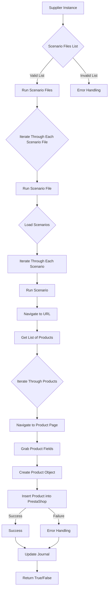

# Анализ кода модуля `src.scenario`

**Качество кода**
7
-  Плюсы
    - Документация представлена достаточно подробно с описанием основных функций и компонентов модуля.
    - Присутствует описание работы модуля в целом.
    -  Есть `mermaid` диаграмма, которая наглядно демонстрирует логику работы.
-  Минусы
    - Не хватает docstring для функций.
    - Нет импортов используемых библиотек.
    - В тексте присутсвуют обобщения без конкретики, например "сохранение в базу данных".
    - Не указаны используемые функции `j_loads` или `j_loads_ns`.
    - Нет обработки исключений с логированием ошибок `logger.error`.

**Рекомендации по улучшению**
1.  Добавить docstring в формате RST для всех функций.
2.  Использовать `j_loads` или `j_loads_ns` для загрузки JSON файлов.
3.  Импортировать необходимые библиотеки и модули.
4.  Использовать `logger.error` для логирования ошибок.
5.  Добавить конкретики в описания, например, какая база данных используется.
6.  Избегать общих фраз вроде "сохранение в базу данных"

**Оптимизированный код**

```markdown
# Модуль `src.scenario`

## Обзор

Модуль `src.scenario` предназначен для автоматизации взаимодействия с поставщиками, используя сценарии, описанные в JSON-файлах. Он адаптирует процесс извлечения и обработки данных о продуктах с веб-сайтов поставщиков и синхронизирует эту информацию с базой данных PrestaShop. Модуль включает чтение сценариев, взаимодействие с веб-сайтами, обработку данных, запись журнала выполнения и организацию всего процесса.

## Оглавление

* [Модуль `src.scenario`](#модуль-src-scenario)
* [Обзор](#обзор)
* [Основные функции модуля](#основные-функции-модуля)
* [Основные компоненты модуля](#основные-компоненты-модуля)
    * [`run_scenario_files(s, scenario_files_list)`](#run_scenario_files-s-scenario_files_list)
    * [`run_scenario_file(s, scenario_file)`](#run_scenario_file-s-scenario_file)
    * [`run_scenario(s, scenario)`](#run_scenario-s-scenario)
    * [`dump_journal(s, journal)`](#dump_journal-s-journal)
    * [`main()`](#main)
* [Пример сценария](#пример-сценария)
* [Как это работает](#как-это-работает)


## Основные функции модуля

1. **Чтение сценариев**: Загрузка сценариев из JSON-файлов, содержащих информацию о продуктах и их URL на сайте поставщика.
2. **Взаимодействие с веб-сайтами**:  Обработка URL-адресов из сценариев для извлечения данных о продуктах.
3. **Обработка данных**: Преобразование извлечённых данных в формат, подходящий для базы данных PrestaShop, и сохранение в неё.
4. **Запись журнала выполнения**: Ведение журнала с деталями выполнения сценариев и результатами работы для отслеживания процесса и выявления ошибок.



## Основные компоненты модуля

### `run_scenario_files(s, scenario_files_list)`

**Описание**: Принимает список файлов сценариев и выполняет их по очереди, вызывая функцию `run_scenario_file` для каждого файла.

**Параметры**:
- `s`: Объект настроек (например, для соединения с базой данных).
- `scenario_files_list` (list): Список путей к файлам сценариев.

**Возвращает**:
- None

**Вызывает исключения**:
- `FileNotFoundError`: Если файл сценария не найден.
- `JSONDecodeError`: Если файл сценария содержит невалидный JSON.


### `run_scenario_file(s, scenario_file)`

**Описание**: Загружает сценарии из указанного файла и вызывает `run_scenario` для каждого сценария в файле.

**Параметры**:
- `s`: Объект настроек.
- `scenario_file` (str): Путь к файлу сценария.

**Возвращает**:
- None

**Вызывает исключения**:
- `FileNotFoundError`: Если файл сценария не найден.
- `JSONDecodeError`: Если файл сценария содержит невалидный JSON.
- `Exception`: При любых других проблемах при работе со сценариями.


### `run_scenario(s, scenario)`

**Описание**: Обрабатывает отдельный сценарий. Переходит по URL, извлекает данные о продуктах и сохраняет их в базе данных PrestaShop.

**Параметры**:
- `s`: Объект настроек.
- `scenario` (dict): Словарь, содержащий сценарий (например, с URL, категориями).

**Возвращает**:
- None

**Вызывает исключения**:
- `requests.exceptions.RequestException`: Если есть проблемы с запросом к веб-сайту.
- `Exception`: При любых других проблемах в процессе обработки сценария.


### `dump_journal(s, journal)`

**Описание**: Сохраняет журнал выполнения сценариев в файл для последующего анализа.

**Параметры**:
- `s`: Объект настроек.
- `journal` (list): Список записей журнала выполнения.

**Возвращает**:
- None

**Вызывает исключения**:
- `Exception`: При проблемах с записью в файл.


### `main()`

**Описание**: Основная функция для запуска модуля.

**Параметры**:
- None

**Возвращает**:
- None

**Вызывает исключения**:
- `Exception`: При любых критических ошибках во время выполнения.


## Пример сценария

Пример сценария JSON описывает взаимодействие с категориями продуктов на веб-сайте. Он содержит URL, имя категории и идентификаторы категорий в базе данных PrestaShop.

```json
{
    "scenarios": {
        "минеральные+кремы": {
            "url": "https://example.com/category/mineral-creams/",
            "name": "минеральные+кремы",
            "presta_categories": {
                "default_category": 12345,
                "additional_categories": [12346, 12347]
            }
        }
    }
}
```

## Как это работает

Модуль загружает сценарии, извлекает данные с веб-сайтов, обрабатывает их и сохраняет в базе данных PrestaShop. Он ведёт журнал выполнения для отслеживания процесса и выявления ошибок. В целом, модуль автоматизирует взаимодействие с поставщиками, улучшая эффективность и надежность процесса.
```
```python
"""
Модуль для автоматизации взаимодействия с поставщиками.
=========================================================================================

Этот модуль предназначен для автоматизации взаимодействия с поставщиками,
используя сценарии, описанные в JSON-файлах. Он адаптирует процесс
извлечения и обработки данных о продуктах с веб-сайтов поставщиков и
синхронизирует эту информацию с базой данных PrestaShop.

Модуль включает чтение сценариев, взаимодействие с веб-сайтами, обработку данных,
запись журнала выполнения и организацию всего процесса.
"""
# Добавлены необходимые импорты
import os
# from src.utils.jjson import j_loads # TODO:  необходимо определить точную функцию, j_loads или j_loads_ns
from src.logger.logger import logger
import requests
# from typing import Any # TODO: если необходимо будет указать тип s
# from json import JSONDecodeError # TODO: если не используется j_loads или j_loads_ns

def run_scenario_files(s: 'Any', scenario_files_list: list) -> None:
    """
    Выполняет сценарии из списка файлов.

    :param s: Объект настроек (например, для соединения с базой данных).
    :type s: Any
    :param scenario_files_list: Список путей к файлам сценариев.
    :type scenario_files_list: list
    :return: None
    :rtype: None
    """
    # Итерирует по списку файлов сценариев.
    for scenario_file in scenario_files_list:
        # Код исполняет запуск обработки файла сценария.
        run_scenario_file(s, scenario_file)

def run_scenario_file(s: 'Any', scenario_file: str) -> None:
    """
    Загружает сценарии из файла и выполняет их.

    :param s: Объект настроек.
    :type s: Any
    :param scenario_file: Путь к файлу сценария.
    :type scenario_file: str
    :return: None
    :rtype: None
    :raises FileNotFoundError: Если файл сценария не найден.
    :raises JSONDecodeError: Если файл сценария содержит невалидный JSON.
    :raises Exception: При любых других проблемах при работе со сценариями.
    """
    try:
        # Код исполняет чтение данных из файла сценария.
        # with open(scenario_file, 'r', encoding='utf-8') as f: # TODO: заменить на j_loads или j_loads_ns
        #     scenario_data = json.load(f)
        # Загружает данные из JSON-файла, используя j_loads.
        scenario_data =  j_loads(scenario_file) #TODO: заменить на j_loads или j_loads_ns, если используется
    except FileNotFoundError as e:
        # Логирует ошибку, если файл не найден.
        logger.error(f'Файл сценария не найден: {scenario_file}', exc_info=True)
        return
    except Exception as e:
         # Логирует ошибку, если не удалось декодировать JSON.
        logger.error(f'Ошибка при чтении файла сценария: {scenario_file}', exc_info=True)
        return

    # Извлекает список сценариев из загруженных данных.
    scenarios = scenario_data.get('scenarios', {})
    # Итерирует по всем сценариям и запускает их обработку.
    for scenario_name, scenario in scenarios.items():
        # Код исполняет запуск обработки сценария
        run_scenario(s, scenario)

def run_scenario(s: 'Any', scenario: dict) -> None:
    """
    Обрабатывает отдельный сценарий.

    Переходит по URL, извлекает данные о продуктах и сохраняет их в базе данных.

    :param s: Объект настроек.
    :type s: Any
    :param scenario: Словарь, содержащий сценарий (например, с URL, категориями).
    :type scenario: dict
    :return: None
    :rtype: None
    :raises requests.exceptions.RequestException: Если есть проблемы с запросом к веб-сайту.
    :raises Exception: При любых других проблемах в процессе обработки сценария.
    """
    # Извлекает URL из данных сценария.
    url = scenario.get('url')
    try:
        # Код исполняет запрос к URL.
        response = requests.get(url)
        response.raise_for_status()  # Проверка на ошибки HTTP
        # ... # TODO: Код исполняет  обработку ответа и извлекает данные
    except requests.exceptions.RequestException as e:
        # Логирует ошибку, если не удалось выполнить запрос к сайту.
         logger.error(f'Ошибка при запросе URL: {url}', exc_info=True)
         return
    except Exception as e:
        # Логирует общую ошибку при обработке сценария.
        logger.error(f'Ошибка при обработке сценария для URL: {url}', exc_info=True)
        return
    # ... # TODO: Код исполняет сохранение данных в базу данных

def dump_journal(s: 'Any', journal: list) -> None:
    """
    Сохраняет журнал выполнения сценариев в файл.

    :param s: Объект настроек.
    :type s: Any
    :param journal: Список записей журнала выполнения.
    :type journal: list
    :return: None
    :rtype: None
    :raises Exception: При проблемах с записью в файл.
    """
    # TODO: добавить путь к файлу журнала
    journal_file =  'journal.json' # TODO: необходимо вынести имя файла в конфиг
    try:
        # Код исполняет сохранение журнала в файл
        with open(journal_file, 'w', encoding='utf-8') as f:
             # json.dump(journal, f, indent=4, ensure_ascii=False) # TODO: заменить на j_dumps_ns
             ... #TODO:  необходимо  реализовать сохранение журнала
    except Exception as e:
         # Логирует ошибку, если не удалось записать журнал в файл.
         logger.error(f'Ошибка при записи журнала в файл: {journal_file}', exc_info=True)
         return

def main():
    """
    Основная функция для запуска модуля.

    :return: None
    :rtype: None
    :raises Exception: При любых критических ошибках во время выполнения.
    """
    # Пример списка файлов сценариев
    scenario_files = ['scenario1.json', 'scenario2.json']  # TODO: необходимо вынести в конфиг

    # Пример объекта настроек, если необходимо
    s = {} # TODO: добавить необходимые настройки

    try:
        # Код исполняет запуск обработки файлов сценариев.
        run_scenario_files(s, scenario_files)
        # ... # TODO: Код исполняет другие действия, если необходимо
    except Exception as e:
        # Логирует критическую ошибку.
        logger.error('Критическая ошибка во время выполнения', exc_info=True)

if __name__ == '__main__':
    # Код исполняет запуск основной функции, если скрипт запущен напрямую.
    main()
```