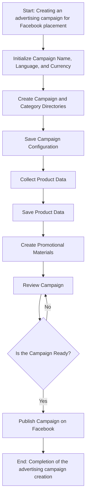
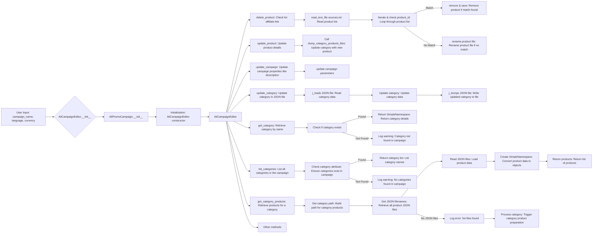
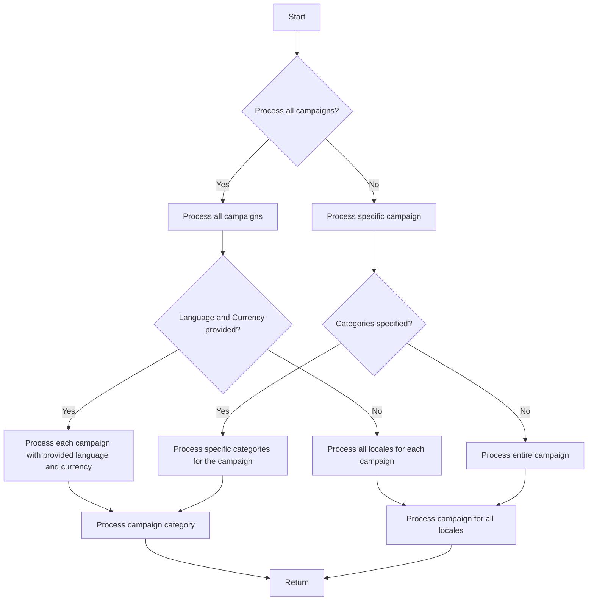

# Анализ кода модуля `src.suppliers.aliexpress.campaign`

**Качество кода**

- **Соответствие требованиям по оформлению кода**: 7/10
    - **Плюсы**:
        - Описание модуля в начале файла присутствует.
        - Присутствует описание основных шагов работы модуля.
        - Код разбит на отдельные блоки, разделенные заголовками.
        - Используются диаграммы `mermaid` для наглядного отображения процессов.
        - Присутствуют примеры использования и описания.
    - **Минусы**:
        - Не хватает документации в формате RST для отдельных функций и классов.
        - Отсутствуют примеры кода и документации для них.
        - Не везде соблюдены стандарты оформления docstring в Python (для Sphinx).
        - Не хватает более подробных комментариев `#` к коду.

**Рекомендации по улучшению**

1.  **Документация RST**: Дополнить документацию, добавив описания для функций, методов и классов в формате RST.
2.  **Примеры кода**: Включить примеры использования функций и методов с соответствующей документацией.
3.  **Docstring**: Убедиться, что все docstring соответствуют стандартам Sphinx.
4.  **Комментарии**: Добавить подробные комментарии после символа `#`, объясняющие каждый блок кода.
5.  **Логирование**: Использовать `from src.logger import logger` для логирования ошибок и избегать избыточных `try-except`.
6.  **Унификация имён**: Привести имена функций, переменных и импортов в соответствие с ранее обработанными файлами.
7.  **Структура файла**: Сохранять структуру файла, добавляя необходимые описания и комментарии, не переделывая полностью существующий markdown файл.
8. **Использовать одинарные кавычки**: Заменить двойные кавычки на одинарные в коде, кроме операций вывода.

**Оптимизированный код**

```markdown
```rst
.. module:: src.suppliers.aliexpress.campaign
```
### `campaign`

Модуль `campaign` предназначен для управления процессом создания и публикации рекламных кампаний на Facebook.
Он включает функциональность для инициализации параметров кампании (имя, язык, валюта), создания структуры каталогов, сохранения конфигураций для новой кампании, сбора и сохранения данных о продуктах через `ali` или `html`, генерации рекламных материалов, просмотра кампании и публикации ее на Facebook.



- **Шаг 1**: Начало - Запускается процесс.

- **Шаг 2**: Инициализация деталей кампании - Определяется имя кампании, язык и валюта. Пример: Имя кампании: "Летняя распродажа", Язык: "Русский", Валюта: "RUB"

- **Шаг 3**: Создание директорий кампании и категорий - Создаются необходимые директории или файлы для кампании. Пример: Создается структура папок в файловой системе для хранения ресурсов кампании.

- **Шаг 4**: Сохранение конфигурации кампании - Сохраненяются инициализированные детали кампании. Пример: Данные записываются в базу данных или файл конфигурации.

- **Шаг 5**: Сбор данных о продуктах - Собираются данные о продуктах, которые будут продвигаться в рамках кампании. Пример: Из системы инвентаризации извлекаются идентификаторы продуктов, описания, изображения и цены.

- **Шаг 6**: Сохранение данных о продуктах - Сохраняются собранные данные о продуктах. Пример: Данные записываются в таблицу базы данных, предназначенную для продуктов кампании.

- **Шаг 7**: Создание рекламных материалов - Создаются или выбираются графика, баннеры и другие рекламные ресурсы. Пример: Изображения и описания адаптируются для привлечения клиентов.

- **Шаг 8**: Просмотр кампании - Процесс проверки подтверждает готовность компонентов кампании. Пример: Человек или система оценивают качество и полноту всех компонентов кампании.

- **Шаг 9**: Кампания готова? - Проверка для определения, завершена ли кампания и готова ли к публикации. Пример: Логический флаг сигнализирует "Да", если все на месте, иначе "Нет", что вызывает возврат к предыдущему шагу для исправления.

- **Шаг 10**: Публикация кампании - Кампания запускается на платформе и готова к маркетинговым усилиям. Пример: Выполняются вызовы API для публикации кампании на соответствующей платформе.

- **Шаг 11**: Завершение - Процесс создания кампании завершен.


# Редактирование кампании



# Подготовка кампании

```