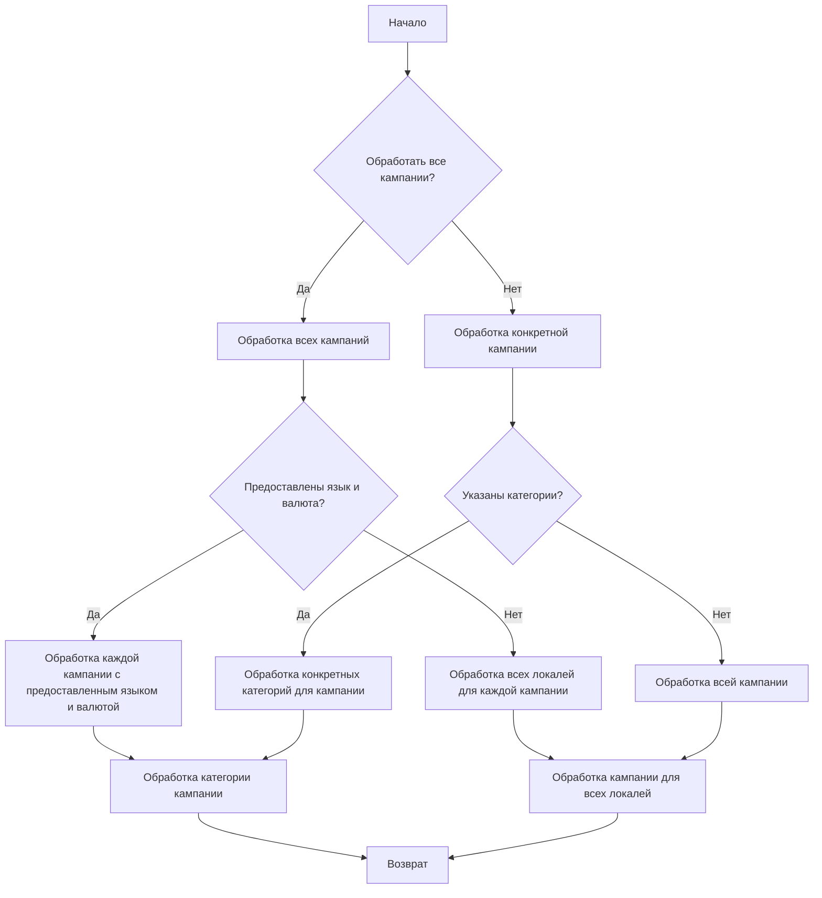

# Анализ кода модуля `src.suppliers.aliexpress.campaign`

**Качество кода**

-   Соответствие требованиям по оформлению кода: 6/10
    -   **Плюсы:**
        -   Предоставлено общее описание модуля и его функций.
        -   Диаграммы `mermaid`  визуализируют процессы.
        -   Есть общее представление о структуре.
    -   **Минусы:**
        -   Отсутствует документация в формате reStructuredText (RST) для модуля, функций, классов и методов.
        -   Не указаны импорты, используемые в модуле.
        -   Нет примеров кода и его использования.
        -   Не используются `j_loads` или `j_loads_ns` из `src.utils.jjson`.
        -   Отсутствует использование `from src.logger.logger import logger` для логирования ошибок.
        -   Не проработаны  обработки исключений, нет обработки ошибок с помощью `logger.error`.

**Рекомендации по улучшению**

1.  **Документация RST:** Необходимо добавить полное описание модуля в формате RST, включая примеры использования.
2.  **Импорты:** Необходимо добавить все необходимые импорты в начало файла.
3.  **Функции и методы:** Добавить документацию в формате RST для всех функций и методов, включая описание параметров и возвращаемых значений.
4.  **Использование `j_loads` и `j_loads_ns`:**  Вместо стандартных `json.load` нужно использовать `j_loads` или `j_loads_ns` из `src.utils.jjson`.
5.  **Логирование:** Использовать `from src.logger.logger import logger` для логирования ошибок и исключений.
6.  **Обработка ошибок:** Вместо стандартных `try-except`  использовать `logger.error` для обработки ошибок.
7.  **Комментарии:** Переписать все комментарии в формате RST,  описывая действие кода.

**Оптимизированный код**

```markdown
```rst
.. module:: src.suppliers.aliexpress.campaign
   :synopsis: Модуль для управления рекламными кампаниями AliExpress.
   :platform: Unix, Windows
   :copyright: 2024, Hypotez

Модуль `campaign` предназначен для управления процессом создания и публикации рекламных кампаний на Facebook.
Он включает в себя функциональность для инициализации параметров кампании (имя, язык, валюта), создания структуры каталогов,
сохранения конфигураций для новой кампании, сбора и сохранения данных о продуктах с помощью `ali` или `html`,
генерации рекламных материалов, проверки кампании и публикации ее на Facebook.

Пример использования
--------------------

.. code-block:: python

    from src.suppliers.aliexpress.campaign import AliCampaignEditor
    from src.suppliers.aliexpress.campaign import AliPromoCampaign

    # Пример создания и редактирования кампании
    campaign_editor = AliCampaignEditor(
        campaign_name='Summer Sale',
        language='en',
        currency='USD'
    )
    campaign_editor.create_directories()
    campaign_editor.save_config()
    # ... другие операции ...
```

### `campaign`

Модуль `campaign` предназначен для управления процессом создания и публикации рекламных кампаний на Facebook.
Он включает в себя функциональность для инициализации параметров кампании (имя, язык, валюта), создания структуры каталогов,
сохранения конфигураций для новой кампании, сбора и сохранения данных о продуктах с помощью `ali` или `html`,
генерации рекламных материалов, проверки кампании и публикации ее на Facebook.


-   **Шаг 1**: Начало - Начало процесса.

-   **Шаг 2**: Инициализация данных кампании - Определяются название, язык и валюта кампании. Пример: Название кампании: "Летняя распродажа", Язык: "Русский", Валюта: "USD".

-   **Шаг 3**: Создание каталогов кампании и категорий - Создаются необходимые каталоги или файлы для кампании. Пример: Создается структура папок в файловой системе для хранения ресурсов кампании.

-   **Шаг 4**: Сохранение конфигурации кампании - Сохраняются инициализированные данные кампании. Пример: Данные записываются в базу данных или конфигурационный файл.

-   **Шаг 5**: Сбор данных о продуктах - Собираются данные о продуктах, которые будут продвигаться в рамках кампании. Пример: Получаются идентификаторы продуктов, описания, изображения и цены из системы инвентаризации.

-   **Шаг 6**: Сохранение данных о продуктах - Хранятся собранные данные о продуктах. Пример: Данные записываются в таблицу базы данных, предназначенную для продуктов кампании.

-   **Шаг 7**: Создание рекламных материалов - Создаются или выбираются графические, баннеры и другие рекламные материалы. Пример: Изображения и описания адаптируются для привлечения клиентов.

-   **Шаг 8**: Проверка кампании - Процесс проверки подтверждает готовность компонентов кампании. Пример: Проверка человеком или системой оценивает качество и полноту всех компонентов кампании.

-   **Шаг 9**: Готова ли кампания? - Проверка, определяющая, завершена ли кампания и готова ли к публикации. Пример: Логический флаг сигнализирует "Да", если все готово, иначе "Нет", что вызывает возврат к предыдущему шагу для внесения исправлений.

-   **Шаг 10**: Публикация кампании - Кампания публикуется на платформе, готовая к маркетинговым усилиям. Пример: Выполняются вызовы API для публикации кампании на соответствующей платформе.

-   **Шаг 11**: Конец - Завершение процесса создания кампании.

# Редактирование кампании


# Подготовка кампании


```python
"""
Модуль для управления рекламными кампаниями AliExpress.
=========================================================================================

Этот модуль содержит классы :class:`AliCampaignEditor` и :class:`AliPromoCampaign`,
которые используются для управления процессом создания, редактирования и подготовки
рекламных кампаний AliExpress для Facebook.

Модуль предоставляет функциональность для:

- Инициализации параметров кампании (имя, язык, валюта).
- Создания структуры каталогов и файлов кампании.
- Сохранения конфигураций кампании.
- Сбора и сохранения данных о продуктах.
- Генерации рекламных материалов.
- Проверки и публикации кампании.
- Редактирования и обновления данных кампании.

Пример использования
--------------------

.. code-block:: python

    from src.suppliers.aliexpress.campaign import AliCampaignEditor
    from src.suppliers.aliexpress.campaign import AliPromoCampaign

    # Пример создания и редактирования кампании
    campaign_editor = AliCampaignEditor(
        campaign_name='Summer Sale',
        language='en',
        currency='USD'
    )
    campaign_editor.create_directories()
    campaign_editor.save_config()
    # ... другие операции ...
"""
import os
import json
from types import SimpleNamespace
from typing import List, Any
# from src.logger.logger import logger #  Импорт логгера
# from src.utils.jjson import j_loads, j_dumps #  Импорт функций для работы с JSON
# TODO: добавить импорт  j_loads, j_dumps из src.utils.jjson

# TODO: добавить импорт  logger from src.logger.logger
class AliCampaignEditor:
    """
    Класс для редактирования рекламных кампаний AliExpress.

    Предоставляет методы для создания, обновления и удаления данных рекламных кампаний.

    :param campaign_name: Название кампании.
    :type campaign_name: str
    :param language: Язык кампании.
    :type language: str
    :param currency: Валюта кампании.
    :type currency: str
    :ivar campaign_name: Название кампании.
    :vartype campaign_name: str
    :ivar language: Язык кампании.
    :vartype language: str
    :ivar currency: Валюта кампании.
    :vartype currency: str
    :ivar campaign_path: Путь к директории кампании.
    :vartype campaign_path: str
    :ivar config_path: Путь к файлу конфигурации кампании.
    :vartype config_path: str
    :ivar category_path: Путь к директории категорий кампании.
    :vartype category_path: str

    """
    def __init__(self, campaign_name: str, language: str, currency: str):
        """
        Инициализация редактора кампаний.
        """
        self.campaign_name = campaign_name
        self.language = language
        self.currency = currency
        self.campaign_path = os.path.join('campaigns', campaign_name)
        self.config_path = os.path.join(self.campaign_path, 'config.json')
        self.category_path = os.path.join(self.campaign_path, 'categories')

    def create_directories(self):
        """
        Создание директорий для кампании.
        
        Создает директории для кампании, если они не существуют.
        
        :raises OSError: Если не удается создать директории.
        """
        try:
            os.makedirs(self.category_path, exist_ok=True)
            # os.makedirs(self.campaign_path, exist_ok=True) #  создание директории для конфига
            #  директория создаётся при записи конфига
        except OSError as ex:
            # logger.error(f'Не удалось создать директорию {self.category_path}', ex) # Логирование ошибки создания директории
            ... #  место для обработки ошибки
            return

    def save_config(self):
        """
        Сохранение конфигурации кампании.

        Сохраняет конфигурацию кампании в файл config.json.
        
        :raises OSError: Если не удается создать или записать в файл конфигурации.
        """
        config_data = {
            'campaign_name': self.campaign_name,
            'language': self.language,
            'currency': self.currency
        }
        try:
             with open(self.config_path, 'w') as f:
                json.dump(config_data, f, indent=4)

        except OSError as ex:
             # logger.error(f'Не удалось сохранить конфигурацию в файл {self.config_path}', ex) #  Логирование ошибки сохранения конфигурации
             ... #  место для обработки ошибки
             return

    def delete_product(self, product_id: str) -> bool:
        """
        Удаление продукта из кампании.

        Удаляет продукт из текстового файла `sources.txt` кампании, если продукт найден, и обновляет файл.

        :param product_id: Идентификатор продукта для удаления.
        :type product_id: str
        :return: True, если продукт был удален, False в противном случае.
        :rtype: bool
        :raises FileNotFoundError: Если файл `sources.txt` не найден.
        :raises Exception: Если возникает ошибка во время обработки файла.
        """
        sources_file_path = os.path.join(self.campaign_path, 'sources.txt')
        try:
            with open(sources_file_path, 'r') as f:
                lines = f.readlines()
        except FileNotFoundError as ex:
            # logger.error(f'Файл sources.txt не найден: {sources_file_path}', ex) # Логирование ошибки отсутствия файла
            ...
            return False
        except Exception as ex:
            # logger.error(f'Ошибка при чтении файла: {sources_file_path}', ex) # Логирование общей ошибки
            ...
            return False

        updated_lines = []
        removed = False
        for line in lines:
            if product_id in line:
                removed = True
                continue
            updated_lines.append(line)
        try:
            with open(sources_file_path, 'w') as f:
                f.writelines(updated_lines)
        except Exception as ex:
            # logger.error(f'Ошибка при записи в файл: {sources_file_path}', ex)  # Логирование ошибки записи в файл
            ...
            return False
        return removed

    def update_product(self, category: str, product_data: dict):
        """
        Обновление данных продукта в кампании.

        Обновляет данные продукта в файле JSON, относящемся к заданной категории.
        
        :param category: Категория продукта.
        :type category: str
        :param product_data: Данные продукта для обновления.
        :type product_data: dict
        :raises FileNotFoundError: Если директория или файл категории не найдены.
        :raises Exception: Если возникает ошибка при работе с файлом.
        """
        
        # Код вызывает метод для записи данных продукта в файл категории
        self.dump_category_products_files(category, [product_data])

    def dump_category_products_files(self, category: str, products: List[dict]):
        """
        Сохранение данных о продуктах в файлах категорий.

        Сохраняет данные о продуктах в JSON файлах в директории соответствующей категории.

        :param category: Имя категории.
        :type category: str
        :param products: Список словарей с данными о продуктах.
        :type products: List[dict]
        :raises FileNotFoundError: Если директория категории не найдена.
        :raises Exception: Если возникает ошибка при работе с файлами.
        """
        category_path = os.path.join(self.category_path, category)
        if not os.path.exists(category_path):
            try:
                os.makedirs(category_path, exist_ok=True)
            except OSError as ex:
                 # logger.error(f'Не удалось создать директорию {category_path}', ex) #  Логирование ошибки создания директории
                 ...
                 return

        for product in products:
            product_id = product.get('product_id')
            if not product_id:
                # logger.error(f'Нет product_id в данных продукта {product}') # Логирование ошибки отсутствия идентификатора продукта
                ...
                continue
            file_path = os.path.join(category_path, f'{product_id}.json')
            try:
                with open(file_path, 'w') as f:
                    json.dump(product, f, indent=4)
            except Exception as ex:
                 # logger.error(f'Не удалось записать данные продукта в файл {file_path}', ex) # Логирование ошибки записи файла
                 ...
                 continue

    def update_campaign(self, description: str = None, **kwargs):
        """
        Обновление параметров кампании.

        Обновляет параметры кампании, такие как описание.

        :param description: Новое описание кампании.
        :type description: str
        :param kwargs: Дополнительные параметры для обновления.
        :type kwargs: dict
        :raises FileNotFoundError: Если файл конфигурации не найден.
        :raises Exception: Если возникает ошибка при работе с файлом.
        """
        try:
            with open(self.config_path, 'r') as f:
                config = json.load(f)
        except FileNotFoundError as ex:
             # logger.error(f'Файл конфигурации не найден: {self.config_path}', ex) # Логирование ошибки отсутствия файла
             ...
             return
        except Exception as ex:
             # logger.error(f'Ошибка при чтении файла: {self.config_path}', ex) # Логирование общей ошибки
             ...
             return

        if description:
            config['description'] = description
        config.update(kwargs)
        try:
            with open(self.config_path, 'w') as f:
                json.dump(config, f, indent=4)
        except Exception as ex:
            # logger.error(f'Ошибка при записи в файл: {self.config_path}', ex) # Логирование ошибки записи в файл
             ...
             return

    def update_category(self, category_name: str, category_data: dict):
        """
        Обновление данных категории.

        Обновляет данные категории в файле JSON в директории категорий.

        :param category_name: Название категории.
        :type category_name: str
        :param category_data: Данные категории для обновления.
        :type category_data: dict
        :raises FileNotFoundError: Если файл категории не найден.
        :raises Exception: Если возникает ошибка при работе с файлом.
        """
        category_file_path = os.path.join(self.category_path, f'{category_name}.json')
        try:
            with open(category_file_path, 'r') as f:
                data = json.load(f)
        except FileNotFoundError as ex:
             # logger.error(f'Файл категории не найден: {category_file_path}', ex) #  Логирование ошибки отсутствия файла
             ...
             return
        except Exception as ex:
             # logger.error(f'Ошибка при чтении файла: {category_file_path}', ex) # Логирование общей ошибки
             ...
             return
        data.update(category_data)
        try:
            with open(category_file_path, 'w') as f:
                json.dump(data, f, indent=4)
        except Exception as ex:
            # logger.error(f'Ошибка при записи в файл: {category_file_path}', ex) # Логирование ошибки записи в файл
            ...
            return

    def get_category(self, category_name: str) -> SimpleNamespace:
        """
        Получение данных категории.

        Возвращает данные категории в виде `SimpleNamespace`, если категория найдена, иначе возвращает `None`.

        :param category_name: Название категории.
        :type category_name: str
        :return: Данные категории или `None`, если категория не найдена.
        :rtype: SimpleNamespace or None
        :raises FileNotFoundError: Если файл категории не найден.
        :raises Exception: Если возникает ошибка при чтении файла.
        """
        category_file_path = os.path.join(self.category_path, f'{category_name}.json')
        try:
            with open(category_file_path, 'r') as f:
                data = json.load(f)
            return SimpleNamespace(**data)
        except FileNotFoundError as ex:
             # logger.warning(f'Категория не найдена в кампании: {category_name}', ex) # Логирование предупреждения об отсутствии категории
            ...
            return
        except Exception as ex:
             # logger.error(f'Ошибка при чтении файла: {category_file_path}', ex) # Логирование общей ошибки
             ...
             return

    def list_categories(self) -> List[str]:
        """
        Получение списка категорий кампании.

        Возвращает список названий всех категорий в кампании.

        :return: Список названий категорий.
        :rtype: List[str]
        :raises FileNotFoundError: Если директория категорий не найдена.
        :raises Exception: Если возникает ошибка при чтении директории.
        """
        if not os.path.exists(self.category_path):
            # logger.warning(f'Директория категорий не найдена в кампании: {self.category_path}') # Логирование предупреждения об отсутствии директории
            ...
            return []
        try:
            categories = [
                f[:-5] for f in os.listdir(self.category_path) if f.endswith('.json')
            ]
            return categories
        except Exception as ex:
             # logger.error(f'Ошибка при чтении директории: {self.category_path}', ex) # Логирование ошибки чтения директории
             ...
             return []

    def get_category_products(self, category_name: str) -> List[SimpleNamespace]:
        """
        Получение списка продуктов категории.

        Возвращает список продуктов в виде `SimpleNamespace` для заданной категории.

        :param category_name: Название категории.
        :type category_name: str
        :return: Список продуктов категории.
        :rtype: List[SimpleNamespace]
        :raises FileNotFoundError: Если директория категории не найдена.
        :raises Exception: Если возникает ошибка при чтении файла.
        """
        category_path = os.path.join(self.category_path, category_name)
        if not os.path.exists(category_path):
            # logger.error(f'Директория категории не найдена: {category_path}') # Логирование ошибки отсутствия директории
            ... #  место для обработки ошибки
            return []

        products = []
        try:
             for file_name in os.listdir(category_path):
                if file_name.endswith('.json'):
                    file_path = os.path.join(category_path, file_name)
                    try:
                        with open(file_path, 'r') as f:
                            product_data = json.load(f)
                        products.append(SimpleNamespace(**product_data))
                    except Exception as ex:
                         # logger.error(f'Ошибка при чтении файла: {file_path}', ex) #  Логирование ошибки чтения файла
                         ... # место для обработки ошибки
                         continue
        except Exception as ex:
            # logger.error(f'Ошибка при чтении директории: {category_path}', ex) # Логирование общей ошибки
            ...
            return []
        return products

class AliPromoCampaign:
    """
    Класс для подготовки рекламных кампаний AliExpress.

    Предоставляет методы для подготовки кампании к публикации.

    :param campaign_name: Название кампании.
    :type campaign_name: str
    :param language: Язык кампании.
    :type language: str
    :param currency: Валюта кампании.
    :type currency: str
    """
    def __init__(self, campaign_name: str, language: str = None, currency: str = None):
        """
         Инициализация объекта для подготовки кампаний.
        """
        self.campaign_name = campaign_name
        self.language = language
        self.currency = currency
        self.campaign_editor = AliCampaignEditor(campaign_name, language, currency)

    def prepare_campaign(self, categories: List[str] = None):
         """
         Подготовка кампании к публикации.
        
         Подготавливает кампанию к публикации, обрабатывая указанные категории.
        
         :param categories: Список категорий для обработки (по умолчанию `None`).
         :type categories: List[str]
        """
         if categories:
             for category in categories:
                 self.process_category(category)
         else:
            if self.language and self.currency:
                 # logger.debug(f'Обработка кампании {self.campaign_name} с языком {self.language} и валютой {self.currency}') #  Логирование начала обработки кампании
                 self.process_campaign_category(self.campaign_name, self.language, self.currency) #  Обработка кампании для конкретного языка и валюты
            else:
                  # logger.debug(f'Обработка всех локалей кампании: {self.campaign_name}') # Логирование обработки всех локалей
                 self.process_campaign_for_all_locales(self.campaign_name) #  Обработка кампании для всех локалей
                 ...

    def process_campaign_category(self, campaign_name: str, language: str, currency: str):
        """
        Обработка категории кампании.

        Обрабатывает все категории для заданной кампании, языка и валюты.

        :param campaign_name: Название кампании.
        :type campaign_name: str
        :param language: Язык кампании.
        :type language: str
        :param currency: Валюта кампании.
        :type currency: str
        """
        categories = self.campaign_editor.list_categories()
        for category in categories:
            self.process_category(category)

    def process_campaign_for_all_locales(self, campaign_name: str):
        """
        Обработка кампании для всех локалей.

        Обрабатывает все категории для заданной кампании во всех локалях.
        
        :param campaign_name: Название кампании.
        :type campaign_name: str
        """
        # TODO: Implement logic for processing all locales
        # logger.debug(f'Обработка всех локалей кампании: {campaign_name}')  # Логирование начала обработки всех локалей
        categories = self.campaign_editor.list_categories()
        for category in categories:
            self.process_category(category)

    def process_category(self, category: str):
         """
         Обработка конкретной категории.
        
         Подготавливает данные продуктов для заданной категории.
        
         :param category: Название категории для обработки.
         :type category: str
         """
         # logger.debug(f'Подготовка продуктов для категории: {category}')  # Логирование начала подготовки продуктов
         products = self.campaign_editor.get_category_products(category)
         #  здесь может быть логика подготовки продуктов
         if not products:
                # logger.warning(f'Нет продуктов для категории: {category}') # Логирование отсутствия продуктов в категории
                ...
                return
```