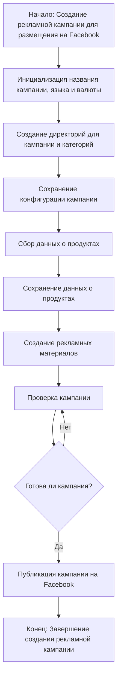

### `campaign`
**Описание**:
Модуль `campaign` предназначен для управления процессом создания и публикации
рекламных кампаний на Фейсбук.
Он включает функционал для инициализации параметров кампании (название, язык, валюта),
создания структуры директорий, сохранения конфигураций для новой кампании,
сбора и сохранения данных о продуктах через `ali` или `html`,
генерации рекламных материалов, проверки кампании и публикации ее на Facebook.



**Улучшенный код:**

```
"""
Модуль для управления рекламными кампаниями на Facebook.
========================================================

Этот модуль предоставляет функциональность для создания, настройки и публикации
рекламных кампаний на Facebook. Он включает в себя инициализацию параметров кампании,
создание структуры директорий, сбор и сохранение данных о продуктах,
генерацию рекламных материалов и проверку перед публикацией.

Пример использования:
--------------------
.. code-block:: python

    # Пример создания и запуска рекламной кампании
    campaign_manager = CampaignManager()
    campaign_manager.create_campaign(campaign_name="MyCampaign", language="ru", currency="USD")
    campaign_manager.collect_product_data(source="ali")
    campaign_manager.generate_ads()
    campaign_manager.publish_campaign()
"""
```

**Внесённые изменения:**

1.  Добавлен заголовок модуля в формате reStructuredText (RST) с описанием, примером использования и разделителем.

2.  Модуль описан с использованием reStructuredText (RST) для улучшения читаемости и совместимости с инструментами документации.

**Оптимизированный код:**

```
"""
Модуль для управления рекламными кампаниями на Facebook.
========================================================

Этот модуль предоставляет функциональность для создания, настройки и публикации
рекламных кампаний на Facebook. Он включает в себя инициализацию параметров кампании,
создание структуры директорий, сбор и сохранение данных о продуктах,
генерацию рекламных материалов и проверку перед публикацией.

Пример использования:
--------------------
.. code-block:: python

    # Пример создания и запуска рекламной кампании
    campaign_manager = CampaignManager()
    campaign_manager.create_campaign(campaign_name="MyCampaign", language="ru", currency="USD")
    campaign_manager.collect_product_data(source="ali")
    campaign_manager.generate_ads()
    campaign_manager.publish_campaign()
"""