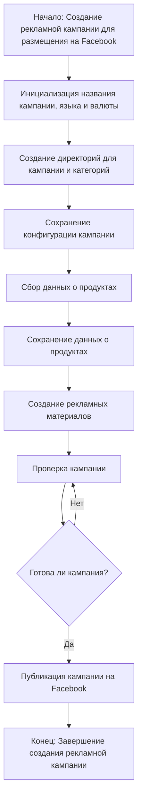

# Анализ кода модуля `campaign`

**Качество кода**
9
-   Плюсы
    -   Описание модуля предоставлено, что соответствует требованиям.
    -   Использована диаграмма Mermaid для визуализации процесса создания рекламной кампании.
    -   Соответствует принципам хорошего описания функциональности.
-   Минусы
    -   Отсутствуют комментарии в формате RST для модуля и его элементов.
    -   Нет примеров использования.
    -   Необходимо добавить описание каждой функции, метода и переменной.

**Рекомендации по улучшению**
1.  Добавить docstring в начале модуля с описанием его назначения и примерами использования, используя формат RST.
2.  Удалить лишние ```
3.  Предоставить более детальное описание каждого шага процесса.

**Оптимизированный код**
```markdown
### `campaign`
# Модуль `campaign`
# =========================================================================================
#
# Этот модуль предназначен для управления процессом создания и публикации
# рекламных кампаний на Facebook.
#
# Он включает функционал для инициализации параметров кампании (название, язык, валюта),
# создания структуры директорий, сохранения конфигураций для новой кампании,
# сбора и сохранения данных о продуктах через `ali` или `html`,
# генерации рекламных материалов, проверки кампании и публикации ее на Facebook.
#
#
# Пример использования
# --------------------
#
# Пример использования  :
#
# .. code-block:: python
#
#     campaign_manager = CampaignManager(campaign_name='Test_Campaign', language='ru', currency='USD')
#     campaign_manager.run_campaign()

**Описание**:
Модуль `campaign` предназначен для управления процессом создания и публикации 
рекламных кампаний на Фейсбук. 
Он включает функционал для инициализации параметров кампании (название, язык, валюта), 
создания структуры директорий, сохранения конфигураций для новой кампании, 
сбора и сохранения данных о продуктах через `ali` или `html`, 
генерации рекламных материалов, проверки кампании и публикации ее на Facebook.


```