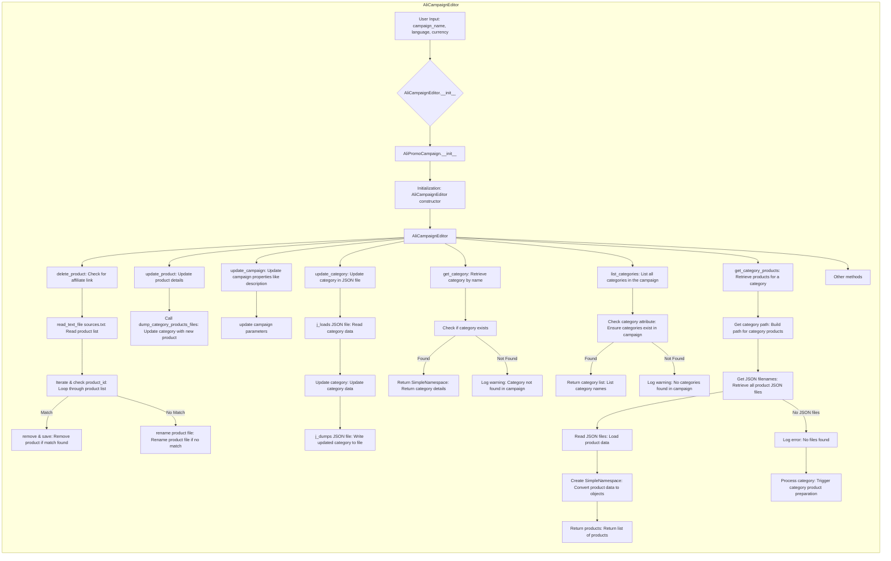

# Анализ кода модуля `ali_campaign_editor.mmd`

**Качество кода**
1
-   Плюсы
        -   Код представляет собой Mermaid-диаграмму, что является хорошим способом визуализации процесса.
        -   Диаграмма хорошо структурирована и позволяет отследить основные операции редактора кампаний AliExpress.
-   Минусы
    -   Код не является исполняемым кодом Python, а представляет собой описание процесса в формате Mermaid.
    -   Отсутствует документация в формате RST, так как это не Python-код.

**Рекомендации по улучшению**
1.  **Предназначение:** Mermaid-диаграмма отлично подходит для визуализации, но не является исполняемым кодом. Рекомендуется хранить ее отдельно от кода и использовать для документации.
2.  **Документация:** Добавить текстовое описание диаграммы с объяснением основных блоков и их функций в формате Markdown.
3.  **Подробности:** Добавить более подробное описание процессов и переменных, используемых в диаграмме. Это может быть полезно для понимания логики работы редактора кампаний.

**Оптимизированный код**

```markdown
# Анализ кода модуля `ali_campaign_editor.mmd`

**Качество кода**
1
-   Плюсы
    -   Код представляет собой Mermaid-диаграмму, что является хорошим способом визуализации процесса.
    -   Диаграмма хорошо структурирована и позволяет отследить основные операции редактора кампаний AliExpress.
-   Минусы
    -   Код не является исполняемым кодом Python, а представляет собой описание процесса в формате Mermaid.
    -   Отсутствует документация в формате RST, так как это не Python-код.

**Рекомендации по улучшению**
1.  **Предназначение:** Mermaid-диаграмма отлично подходит для визуализации, но не является исполняемым кодом. Рекомендуется хранить ее отдельно от кода и использовать для документации.
2.  **Документация:** Добавить текстовое описание диаграммы с объяснением основных блоков и их функций в формате Markdown.
3.  **Подробности:** Добавить более подробное описание процессов и переменных, используемых в диаграмме. Это может быть полезно для понимания логики работы редактора кампаний.

**Описание диаграммы**

##  Обзор редактора кампаний AliExpress

Диаграмма представляет собой визуальное описание логики работы редактора кампаний AliExpress, разработанного с использованием Mermaid.
Она демонстрирует последовательность операций, выполняемых редактором, начиная с ввода пользовательских данных и заканчивая различными операциями с продуктами, категориями и параметрами кампании.

### Основные компоненты и процессы:
- **AliCampaignEditor:** Главный класс, управляющий процессом редактирования кампаний.
    - Инициализация: Класс AliCampaignEditor инициализируется с именем кампании, языком и валютой. Он также включает в себя инициализацию класса AliPromoCampaign.

-   **Работа с продуктами:**
    -   **delete_product:** Удаление продукта из кампании путем проверки наличия партнерской ссылки. Чтение списка продуктов из файла sources.txt, проверка product_id и удаление продукта при совпадении, переименование файла при отсутствии совпадений.
    -   **update_product:** Обновление деталей продукта и вызов функции dump_category_products_files для обновления категории.

-   **Работа с параметрами кампании:**
    -   **update_campaign:** Обновление параметров кампании, таких как описание.

-   **Работа с категориями:**
    -   **update_category:** Обновление данных категории путем чтения JSON-файла, изменения данных и записи обратно в файл.
    -   **get_category:** Получение категории по имени с проверкой её существования, возврат данных в виде SimpleNamespace или логирование предупреждения.
    -   **list_categories:** Вывод списка категорий, с проверкой наличия атрибута категорий и возвратом списка или логированием предупреждения.
    -   **get_category_products:** Получение списка продуктов для заданной категории. Построение пути к файлам, получение списка файлов, чтение данных, создание объектов SimpleNamespace.

### Дополнительные процессы:

-   **Другие методы:** Различные методы, не включенные в основные операции (помечены как AI).

### Описание операций:

-   **Ввод пользователя (User Input):** Начало работы с редактором, где пользователь задает имя кампании, язык и валюту.
-   **Инициализация (Initialization):** Процесс инициализации редактора и кампании.
-   **Чтение файлов (read_text_file):** Загрузка данных из текстовых и JSON файлов.
-   **Итерация и проверка (Iterate & check):** Циклическая обработка списка продуктов или категорий.
-   **Обновление (update):** Изменение данных продуктов, категорий или параметров кампании.
-   **Логирование (Log warning/error):** Регистрация предупреждений и ошибок.

** Mermaid диаграмма:**


```