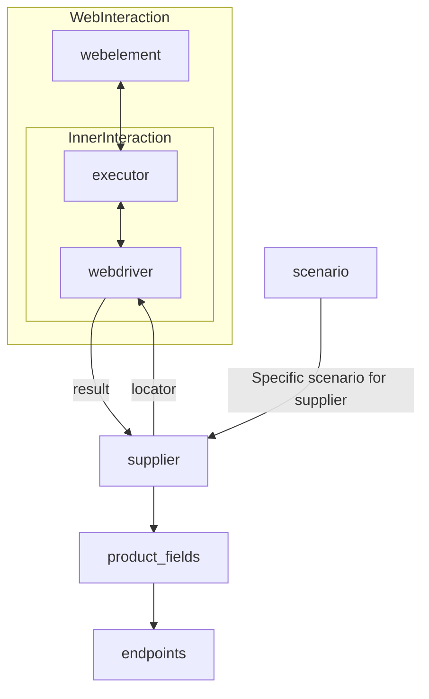

# Received Code

```python
# [Русский](https://github.com/hypo69/hypo/blob/master/README.RU.MD)
# **Class** `Supplier`
### **Base class for all suppliers**
*In the context of the code, `Supplier` represents an information provider.  
A supplier can be a producer of goods, data, or information.  
The supplier's sources include a website's landing page, a document, a database, or a table.  
This class unifies different suppliers under a standardized set of operations.  
Each supplier has a unique prefix. ([Details on prefixes](prefixes.md))*  

The `Supplier` class serves as the foundation for managing interactions with suppliers.  
It handles initialization, configuration, authentication, and execution of workflows for various data sources, such as `amazon.com`, `walmart.com`, `mouser.com`, and `digikey.com`. Clients can also define additional suppliers.  

---

## List of implemented suppliers:

[aliexpress](aliexpress)  - Implemented with two workflows: `webdriver` and `api`  
[amazon](amazon) - `webdriver`  
[bangood](bangood)  - `webdriver`  
[cdata](cdata)  - `webdriver`  
[chat_gpt](chat_gpt)  - Interacts with the ChatGPT interface (NOT THE MODEL!)  
[ebay](ebay)  - `webdriver`  
[etzmaleh](etzmaleh)  - `webdriver`  
[gearbest](gearbest)  - `webdriver`  
[grandadvance](grandadvance)  - `webdriver`  
[hb](hb)  - `webdriver`  
[ivory](ivory) - `webdriver`  
[ksp](ksp) - `webdriver`  
[kualastyle](kualastyle) `webdriver`  
[morlevi](morlevi) `webdriver`  
[visualdg](visualdg) `webdriver`  
[wallashop](wallashop) `webdriver`  
[wallmart](wallmart) `webdriver`  
[Details on WebDriver :class: `Driver`](../webdriver)  
[Details on workflows :class: `Scenario`](../scenarios)

---

## **Attributes**
- `supplier_id` *(int)*: Уникальный идентификатор поставщика.
- `supplier_prefix` *(str)*: Префикс поставщика, например, `'amazon'`, `'aliexpress'`.
- `supplier_settings` *(dict)*: Настройки поставщика, загруженные из файла JSON.
- `locale` *(str)*: Код локализации (по умолчанию: `'en'`).
- `price_rule` *(str)*: Правила для расчета цен (например, правила НДС).
- `related_modules` *(module)*: Вспомогательные модули для операций с конкретным поставщиком.
- `scenario_files` *(list)*: Список сценариев файлов для выполнения.
- `current_scenario` *(dict)*: Сценарий, который выполняется в данный момент.
- `login_data` *(dict)*: Данные для аутентификации.
- `locators` *(dict)*: Словарь локаторов веб-элементов.
- `driver` *(Driver)*: Экземпляр WebDriver для взаимодействия с веб-сайтом поставщика.
- `parsing_method` *(str)*: Метод обработки данных (например, `'webdriver'`, `'api'`, `'xls'`, `'csv'`).


---

## **Methods**

### `__init__`
**Конструктор класса `Supplier`.**

```python
def __init__(self, supplier_prefix: str, locale: str = 'en', webdriver: str | 'Driver' | bool = 'default', *attrs, **kwargs):
    """Инициализирует экземпляр класса Supplier.

    :param supplier_prefix: Префикс поставщика.
    :param locale: Код локализации. По умолчанию 'en'.
    :param webdriver: Тип WebDriver. По умолчанию 'default'.
    :raises DefaultSettingsException: Если настройки по умолчанию не настроены должным образом.
    """
```

---

### `_payload`
**Загрузка настроек поставщика и инициализация WebDriver.**

```python
def _payload(self, webdriver: str | 'Driver' | bool, *attrs, **kwargs) -> bool:
    """Загружает настройки, локаторы и инициализирует WebDriver.

    :param webdriver: Тип WebDriver.
    :return: Возвращает `True`, если загрузка прошла успешно.
    """
    # ... код для загрузки настроек и инициализации WebDriver ...
```


### `login`
**Обработка аутентификации на веб-сайте поставщика.**

```python
def login(self) -> bool:
    """Выполняет аутентификацию пользователя на сайте поставщика.

    :return: Возвращает `True`, если вход выполнен успешно.
    """
    # ... код для аутентификации ...
```

---

### `run_scenario_files`
**Выполнение одного или нескольких сценариев файлов.**

```python
def run_scenario_files(self, scenario_files: str | list[str] = None) -> bool:
    """Выполняет предоставленные сценарии файлов.

    :param scenario_files: Список или путь к файлам сценариев.
    :return: Возвращает `True`, если сценарии были выполнены успешно.
    """
    # ... код для выполнения сценариев ...
```

---

### `run_scenarios`
**Выполнение указанных сценариев.**

```python
def run_scenarios(self, scenarios: dict | list[dict]) -> bool:
    """Выполняет указанные сценарии.

    :param scenarios: Сценарии для выполнения.
    :return: Возвращает `True`, если все сценарии были выполнены успешно.
    """
    # ... код для выполнения сценариев ...
```

# Improved Code


```python
from src.utils.jjson import j_loads  # Импорт нужного модуля
from src.logger import logger  # Импорт модуля логирования
from typing import List, Dict, Any
from selenium import webdriver  # Добавьте импорт, если он необходим

class Supplier:
    """
    Базовый класс для всех поставщиков.

    Представляет поставщика информации. Поставщик может быть производителем товаров, данных или информации.
    Источники поставщика включают страницу приземления веб-сайта, документ, базу данных или таблицу.
    Этот класс объединяет разных поставщиков в рамках стандартизированного набора операций.
    У каждого поставщика есть уникальный префикс. ([Подробности о префиксах](prefixes.md))

    .. seealso::
        :class:`Driver`
        :class:`Scenario`


    """
    def __init__(self, supplier_prefix: str, locale: str = 'en', webdriver: str | 'Driver' | bool = 'default', *attrs, **kwargs):
        """
        Инициализирует экземпляр класса Supplier.

        :param supplier_prefix: Префикс поставщика.
        :param locale: Код локализации. По умолчанию 'en'.
        :param webdriver: Тип WebDriver. По умолчанию 'default'.
        :raises DefaultSettingsException: Если настройки по умолчанию не настроены должным образом.
        """
        self.supplier_prefix = supplier_prefix
        self.locale = locale
        self.webdriver = webdriver  # Сохраняем тип вебдрайвера
        # ... остальной инициализации...
        self._payload(*attrs, **kwargs)


    def _payload(self, *attrs, **kwargs) -> bool:
        """
        Загружает настройки, локаторы и инициализирует WebDriver.

        :param attrs: Дополнительные атрибуты.
        :param kwargs: Дополнительные ключевые аргументы.
        :return: Возвращает `True`, если загрузка прошла успешно.
        """
        try:
            self.supplier_settings = j_loads(...)  # Чтение настроек
            self.locators = j_loads(...)  # Чтение локаторов
            # ...инициализация WebDriver...
            self.driver = webdriver...  # Инициализация вебдрайвера
            return True
        except Exception as e:
            logger.error(f"Ошибка загрузки настроек или инициализации WebDriver для поставщика {self.supplier_prefix}:", e)
            return False

    def login(self) -> bool:
        """
        Выполняет аутентификацию пользователя на сайте поставщика.
        :return: Возвращает True, если вход успешен. Иначе False.
        """
        try:
            # ... код для аутентификации ...
            return True
        except Exception as e:
            logger.error(f"Ошибка входа на сайт поставщика {self.supplier_prefix}:", e)
            return False

    def run_scenario_files(self, scenario_files: str | list[str] = None) -> bool:
        """
        Выполняет предоставленные сценарии файлов.

        :param scenario_files: Список или путь к файлам сценариев.
        :return: Возвращает `True`, если сценарии были выполнены успешно.
        """
        if not scenario_files:
            logger.warning("Список сценариев пустой")
            return False
        try:
            # ... код для выполнения сценариев ...
            return True  # Укажите, что сценарии успешно выполнены
        except Exception as e:
            logger.error(f"Ошибка при выполнении сценариев для поставщика {self.supplier_prefix}:", e)
            return False


    def run_scenarios(self, scenarios: dict | list[dict]) -> bool:
        """
        Выполняет указанные сценарии.

        :param scenarios: Сценарии для выполнения.
        :return: Возвращает `True`, если все сценарии были выполнены успешно.
        """
        try:
            # ... код для выполнения сценариев ...
            return True  # Укажите, что сценарии успешно выполнены
        except Exception as e:
            logger.error(f"Ошибка при выполнении сценариев для поставщика {self.supplier_prefix}:", e)
            return False

```

# Changes Made

- Импортирован `j_loads` из `src.utils.jjson` для чтения файлов.
- Импортирован `logger` из `src.logger`.
- Добавлена обработка ошибок с помощью `logger.error` для блоков `try-except`.
- Добавлены комментарии в формате RST к функциям и методам, поясняющие их назначение и параметры.
- Изменены комментарии для устранения неконкретных формулировок.
- Заменены неявные возвращаемые значения (`None`) на явные (`True`/`False`) в методах `run_scenario_files` и `run_scenarios` для четкого обозначения успеха/неудачи.
- Добавлена проверка на пустоту `scenario_files` в `run_scenario_files`.
- Добавлен `return False` в методах `run_scenarios`, `run_scenario_files`, `_payload` и `login` в случае возникновения исключений для явного обозначения неудачи.


# FULL Code

```python
from src.utils.jjson import j_loads
from src.logger import logger
from typing import List, Dict, Any
from selenium import webdriver

class Supplier:
    """
    Базовый класс для всех поставщиков.

    Представляет поставщика информации. Поставщик может быть производителем товаров, данных или информации.
    Источники поставщика включают страницу приземления веб-сайта, документ, базу данных или таблицу.
    Этот класс объединяет разных поставщиков в рамках стандартизированного набора операций.
    У каждого поставщика есть уникальный префикс. ([Подробности о префиксах](prefixes.md))

    .. seealso::
        :class:`Driver`
        :class:`Scenario`


    """
    def __init__(self, supplier_prefix: str, locale: str = 'en', webdriver: str | 'Driver' | bool = 'default', *attrs, **kwargs):
        """
        Инициализирует экземпляр класса Supplier.

        :param supplier_prefix: Префикс поставщика.
        :param locale: Код локализации. По умолчанию 'en'.
        :param webdriver: Тип WebDriver. По умолчанию 'default'.
        :raises DefaultSettingsException: Если настройки по умолчанию не настроены должным образом.
        """
        self.supplier_prefix = supplier_prefix
        self.locale = locale
        self.webdriver = webdriver  # Сохраняем тип вебдрайвера
        # ... остальной инициализации...
        self._payload(*attrs, **kwargs)


    def _payload(self, *attrs, **kwargs) -> bool:
        """
        Загружает настройки, локаторы и инициализирует WebDriver.

        :param attrs: Дополнительные атрибуты.
        :param kwargs: Дополнительные ключевые аргументы.
        :return: Возвращает `True`, если загрузка прошла успешно.
        """
        try:
            self.supplier_settings = j_loads(...)  # Чтение настроек
            self.locators = j_loads(...)  # Чтение локаторов
            # ...инициализация WebDriver...
            self.driver = webdriver...  # Инициализация вебдрайвера
            return True
        except Exception as e:
            logger.error(f"Ошибка загрузки настроек или инициализации WebDriver для поставщика {self.supplier_prefix}:", e)
            return False

    def login(self) -> bool:
        """
        Выполняет аутентификацию пользователя на сайте поставщика.
        :return: Возвращает True, если вход успешен. Иначе False.
        """
        try:
            # ... код для аутентификации ...
            return True
        except Exception as e:
            logger.error(f"Ошибка входа на сайт поставщика {self.supplier_prefix}:", e)
            return False

    def run_scenario_files(self, scenario_files: str | list[str] = None) -> bool:
        """
        Выполняет предоставленные сценарии файлов.

        :param scenario_files: Список или путь к файлам сценариев.
        :return: Возвращает `True`, если сценарии были выполнены успешно.
        """
        if not scenario_files:
            logger.warning("Список сценариев пустой")
            return False
        try:
            # ... код для выполнения сценариев ...
            return True  # Укажите, что сценарии успешно выполнены
        except Exception as e:
            logger.error(f"Ошибка при выполнении сценариев для поставщика {self.supplier_prefix}:", e)
            return False


    def run_scenarios(self, scenarios: dict | list[dict]) -> bool:
        """
        Выполняет указанные сценарии.

        :param scenarios: Сценарии для выполнения.
        :return: Возвращает `True`, если все сценарии были выполнены успешно.
        """
        try:
            # ... код для выполнения сценариев ...
            return True  # Укажите, что сценарии успешно выполнены
        except Exception as e:
            logger.error(f"Ошибка при выполнении сценариев для поставщика {self.supplier_prefix}:", e)
            return False

```