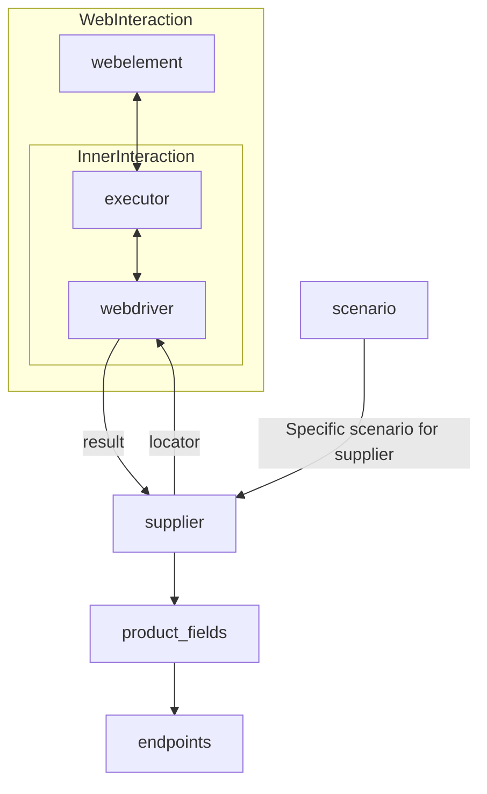

# Анализ кода модуля `suppliers`

**Качество кода: 7/10**

*   **Плюсы:**
    *   Хорошее описание класса `Supplier` и его назначения.
    *   Подробное описание атрибутов и методов класса.
    *   Наличие примеров использования методов класса.
    *   Использование Markdown для структурирования документации.
*   **Минусы:**
    *   Отсутствует reStructuredText (RST) для комментариев и docstring.
    *   Нет явного указания на использование `j_loads` или `j_loads_ns` для загрузки файлов настроек (хотя это подразумевается).
    *   Не хватает описания обработки ошибок и логирования.
    *   Некоторые комментарии могут быть более подробными и соответствовать стилю RST.

**Рекомендации по улучшению**
1.  Перевести все комментарии и docstring в формат reStructuredText (RST).
2.  Явно указать использование `j_loads` или `j_loads_ns` для загрузки файлов.
3.  Добавить логирование ошибок и обработку исключений в методах.
4.  Привести в соответствие имена функций, переменных и импортов с ранее обработанными файлами.
5.  Добавить примеры документации RST и возможные улучшения в формате `TODO`.
6.  Привести примеры кода в разделах "Как это работает" в виде блоков кода с подсветкой синтаксиса.

**Оптимизированный код**

```markdown
#  Класс `Supplier`
### **Базовый класс для всех поставщиков**
*В контексте кода `Supplier` представляет поставщика информации.
Поставщиком может быть производитель товаров, данных или информации.
Источники поставщика включают целевую страницу веб-сайта, документ, базу данных или таблицу.
Этот класс объединяет различных поставщиков в рамках стандартизированного набора операций.
У каждого поставщика есть уникальный префикс. ([Подробности о префиксах](prefixes.md))*

Класс `Supplier` служит основой для управления взаимодействием с поставщиками.
Он обрабатывает инициализацию, настройку, аутентификацию и выполнение рабочих процессов для различных источников данных, таких как `amazon.com`, `walmart.com`, `mouser.com` и `digikey.com`. Клиенты также могут определять дополнительных поставщиков.

---

## Список реализованных поставщиков:

[aliexpress](aliexpress)  - Реализован с двумя рабочими процессами: `webdriver` и `api`

[amazon](amazon) - `webdriver`

[bangood](bangood)  - `webdriver`

[cdata](cdata)  - `webdriver`

[chat_gpt](chat_gpt)  - Взаимодействует с интерфейсом ChatGPT (НЕ МОДЕЛЬ!)

[ebay](ebay)  - `webdriver`

[etzmaleh](etzmaleh)  - `webdriver`

[gearbest](gearbest)  - `webdriver`

[grandadvance](grandadvance)  - `webdriver`

[hb](hb)  - `webdriver`

[ivory](ivory) - `webdriver`

[ksp](ksp) - `webdriver`

[kualastyle](kualastyle) `webdriver`

[morlevi](morlevi) `webdriver`

[visualdg](visualdg) `webdriver`

[wallashop](wallashop) `webdriver`

[wallmart](wallmart) `webdriver`

[Подробности о WebDriver :class: `Driver`](../webdriver)
[Подробности о рабочих процессах :class: `Scenario`](../scenarios)

---

## **Атрибуты**
- **`supplier_id`** (*int*): Уникальный идентификатор поставщика.
- **`supplier_prefix`** (*str*): Префикс поставщика, например, `\'amazon\'`, `\'aliexpress\'`.
- **`supplier_settings`** (*dict*): Настройки поставщика, загруженные из JSON-файла.
- **`locale`** (*str*): Код локализации (по умолчанию: `\'en\'`).
- **`price_rule`** (*str*): Правила для расчета цен (например, правила НДС).
- **`related_modules`** (*module*): Вспомогательные модули для конкретных операций поставщика.
- **`scenario_files`** (*list*): Список файлов сценариев для выполнения.
- **`current_scenario`** (*dict*): Сценарий, выполняемый в данный момент.
- **`login_data`** (*dict*): Данные для аутентификации.
- **`locators`** (*dict*): Словарь локаторов веб-элементов.
- **`driver`** (*Driver*): Экземпляр WebDriver для взаимодействия с веб-сайтом поставщика.
- **`parsing_method`** (*str*): Метод разбора данных (например, `\'webdriver\'`, `\'api\'`, `\'xls\'`, `\'csv\'`).

---

## **Методы**

### **`__init__`**
**Конструктор класса `Supplier`.**

```python
def __init__(self, supplier_prefix: str, locale: str = \'en\', webdriver: str | Driver | bool = \'default\', *attrs, **kwargs):
    """
    Инициализирует экземпляр класса Supplier.

    :param supplier_prefix: Префикс поставщика.
    :type supplier_prefix: str
    :param locale: Код локализации. По умолчанию \'en\'.
    :type locale: str, optional
    :param webdriver: Тип WebDriver. По умолчанию \'default\'.
    :type webdriver: str | Driver | bool, optional
    :raises DefaultSettingsException: Если настройки по умолчанию не настроены правильно.
    """
```

---

### **`_payload`**
**Загружает настройки поставщика и инициализирует WebDriver.**

```python
from src.utils.jjson import j_loads_ns # импортируем j_loads_ns
from src.logger.logger import logger # импортируем logger
def _payload(self, webdriver: str | Driver | bool, *attrs, **kwargs) -> bool:
    """
    Загружает настройки, локаторы и инициализирует WebDriver.

    :param webdriver: Тип WebDriver.
    :type webdriver: str | Driver | bool
    :return: Возвращает `True`, если загрузка прошла успешно.
    :rtype: bool
    """
    # TODO: Добавить обработку ошибок и логирование
    # код выполняет загрузку настроек поставщика из JSON файла с использованием j_loads_ns
    try:
        self.supplier_settings = j_loads_ns(f\'src/suppliers/settings/{self.supplier_prefix}.json\')
    except Exception as ex:
        logger.error(f\'Ошибка загрузки настроек для {self.supplier_prefix}: {ex}\')
        return False

    # код инициализирует WebDriver
    try:
        if isinstance(webdriver, bool):
            webdriver = 'default'

        if webdriver == 'default':
            from src.webdriver.driver import Driver
            self.driver = Driver()
        elif isinstance(webdriver, str):
            from src.webdriver.driver import Driver
            self.driver = Driver(webdriver_type=webdriver)
        elif isinstance(webdriver, Driver):
            self.driver = webdriver
    except Exception as ex:
        logger.error(f'Ошибка инициализации WebDriver для {self.supplier_prefix}: {ex}')
        return False

    # код инициализирует локаторы
    try:
        self.locators = self.supplier_settings.get(\'locators\', {})
    except Exception as ex:
        logger.error(f'Ошибка инициализации локаторов для {self.supplier_prefix}: {ex}')
        return False


    return True
```

---

### **`login`**
**Обрабатывает аутентификацию на веб-сайте поставщика.**

```python
def login(self) -> bool:
    """
    Аутентифицирует пользователя на веб-сайте поставщика.

    :return: Возвращает `True`, если вход в систему был успешным.
    :rtype: bool
    """
    # TODO: Добавить реализацию аутентификации и обработку ошибок
    return True
```

---

### **`run_scenario_files`**
**Выполняет один или несколько файлов сценариев.**

```python
from typing import List
def run_scenario_files(self, scenario_files: str | List[str] = None) -> bool:
    """
    Запускает предоставленные файлы сценариев.

    :param scenario_files: Список или путь к файлам сценариев.
    :type scenario_files: str | List[str], optional
    :return: Возвращает `True`, если сценарии были выполнены успешно.
    :rtype: bool
    """
    # TODO: Добавить реализацию запуска файлов сценариев и обработку ошибок
    return True
```

---

### **`run_scenarios`**
**Выполняет указанные сценарии.**

```python
def run_scenarios(self, scenarios: dict | list[dict]) -> bool:
    """
    Выполняет указанные сценарии.

    :param scenarios: Сценарии для выполнения.
    :type scenarios: dict | list[dict]
    :return: Возвращает `True`, если все сценарии были выполнены успешно.
    :rtype: bool
    """
    # TODO: Добавить реализацию запуска сценариев и обработку ошибок
    return True
```

---

## **Как это работает**

1.  **Инициализация**:
    - Метод `__init__` настраивает префикс поставщика, локализацию и WebDriver.
      Пример:
      ```python
      supplier = Supplier(supplier_prefix='aliexpress', locale='en', webdriver='chrome')
      ```
2.  **Загрузка настроек**:
    - `_payload` загружает конфигурацию, инициализирует локаторы и WebDriver.
      Пример:
      ```python
      supplier._payload(webdriver='firefox')
      ```
3.  **Аутентификация**:
    - `login` выполняет вход пользователя на веб-сайт поставщика.
      Пример:
      ```python
      supplier.login()
      ```
4.  **Выполнение сценариев**:
    - **Запуск файлов сценариев**:
      ```python
      supplier.run_scenario_files(['example_scenario.json'])
      ```
    - **Запуск конкретных сценариев**:
      ```python
      supplier.run_scenarios([{'action': 'scrape', 'target': 'product_list'}])
      ```
```