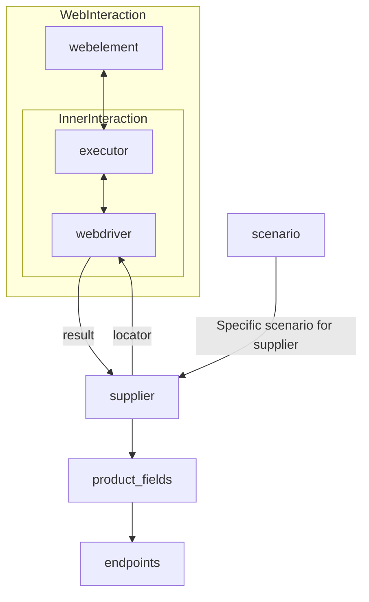

# Анализ кода модуля `readme.ru.md`

**Качество кода: 7/10**
-   **Плюсы:**
    -   Хорошее описание класса `Supplier` и его назначения.
    -   Подробное перечисление атрибутов и методов.
    -   Наличие примеров использования методов.
    -   Использование `mermaid` для визуализации архитектуры.
    -   Логичное разделение на блоки.
-   **Минусы:**
    -   Отсутствие reStructuredText (RST) разметки в описании класса, атрибутов и методов.
    -   Нет единого стандарта в описании методов (где-то используется reStructuredText, а где-то нет).
    -   Отсутствие импортов, необходимых для кода (хотя это больше проблема исходного файла).
    -   Использование `code-block:: python` в описании примеров, что не является необходимым в markdown.

**Рекомендации по улучшению:**

1.  **Использовать reStructuredText (RST):**
    -   Полностью переписать описание модуля, атрибутов, методов, используя RST.
    -   Использовать docstring для описания методов, как указано в инструкции.
2.  **Унифицировать стиль:**
    -   Привести все описания методов к единому стилю с использованием RST.
3.  **Удалить лишние `code-block:: python`:**
    -   Убрать `code-block:: python` из примеров, так как они не нужны в markdown.
4.  **Добавить импорты**:
    -   Хотя этот файл не содержит кода, он описывает класс `Supplier`, и можно предположить что `List` используется в type hints. Стоит упомянуть в описании что `List`  импортируется из `typing`
5.  **Улучшить примеры**:
    -   В примерах вызова методов стоит указывать полные примеры с вызовом объекта поставщика.

**Оптимизированный код:**

```markdown
# **Класс** `Supplier`
### **Базовый класс для всех поставщиков**

*В контексте кода `Supplier` - поставщик информации.
Поставщиком может быть производитель какого-либо товара, данных или информации.
Источники поставщика - целевая страница сайта, документ, база данных, таблица.
Класс сводит разных поставщиков к одинаковому алгоритму действий внутри класса.
У каждого поставщика есть свой уникальный префикс. ([подробно о префиксах](prefixes.md))*

Класс `Supplier` служит основой для управления взаимодействиями с поставщиками.
Он выполняет инициализацию, настройку, аутентификацию и запуск сценариев для различных источников данных, таких как `amazon.com`, `walmart.com`, `mouser.com` и `digikey.com`. Клиент может определить дополнительные поставщики.

---
## Список реализованных поставщиков:

[aliexpress](aliexpress/README.RU.MD)  - Реализован в двух вариантах сценариев: `webriver` и `api`

[amazon](amazon/README.RU.MD) - `webdriver`

[bangood](bangood/README.RU.MD)  - `webdriver`

[cdata](cdata/README.RU.MD)  - `webdriver`

[chat_gpt](chat_gpt/README.RU.MD)  - Работа с чатом chatgpt (НЕ С МОДЕЛЬЮ!)

[ebay](ebay/README.RU.MD)  - `webdriver`

[etzmaleh](etzmaleh/README.RU.MD)  - `webdriver`

[gearbest](gearbest/README.RU.MD)  - `webdriver`

[grandadvance](grandadvance/README.RU.MD)  - `webdriver`

[hb](hb/README.RU.MD)  - `webdriver`

[ivory](ivory/README.RU.MD) - `webdriver`

[ksp](ksp/README.RU.MD) - `webdriver`

[kualastyle](kualastyle/README.RU.MD) `webdriver`

[morlevi](morlevi/README.RU.MD) `webdriver`

[visualdg](visualdg/README.RU.MD) `webdriver`

[wallashop](wallashop/README.RU.MD) `webdriver`

[wallmart](wallmart/README.RU.MD) `webdriver`

[подробно о вебдрайвере :class: `Driver`](../webdriver/README.RU.MD)
[подробно о сценариях :class: `Scenario`](../scenarios/README.RU.MD)
---

## **Атрибуты**

- **`supplier_id`** (*int*): Уникальный идентификатор поставщика.
- **`supplier_prefix`** (*str*): Префикс поставщика, например, `'amazon'`, `'aliexpress'`.
- **`supplier_settings`** (*dict*): Настройки поставщика, загружаемые из JSON-файла.
- **`locale`** (*str*): Код локализации (по умолчанию: `'en'`).
- **`price_rule`** (*str*): Правила расчета цен (например, правила НДС).
- **`related_modules`** (*module*): Модули-помощники для работы с конкретным поставщиком.
- **`scenario_files`** (*list*): Список файлов сценариев для выполнения.
- **`current_scenario`** (*dict*): Выполняемый в текущий момент сценарий.
- **`login_data`** (*dict*): Данные для аутентификации.
- **`locators`** (*dict*): Словарь локаторов веб-элементов.
- **`driver`** (*Driver*): Экземпляр WebDriver для взаимодействия с сайтом поставщика.
- **`parsing_method`** (*str*): Метод парсинга данных (например, `'webdriver'`, `'api'`, `'xls'`, `'csv'`).

---

## **Методы**

### **`__init__`**
**Конструктор класса `Supplier`.**

```python
def __init__(self, supplier_prefix: str, locale: str = 'en', webdriver: str | Driver | bool = 'default', *attrs, **kwargs):
    """
    Инициализирует экземпляр Supplier.

    :param supplier_prefix: Префикс поставщика.
    :type supplier_prefix: str
    :param locale: Код локализации. По умолчанию 'en'.
    :type locale: str, optional
    :param webdriver: Тип WebDriver. По умолчанию 'default'.
    :type webdriver: str | Driver | bool, optional
    :raises DefaultSettingsException: Если настройки по умолчанию не настроены корректно.

    Пример::
    
        supplier = Supplier(supplier_prefix='aliexpress', locale='en', webdriver='chrome')
    
    """
```

---

### **`_payload`**
**Загружает настройки поставщика и инициализирует WebDriver.**

```python
def _payload(self, webdriver: str | Driver | bool, *attrs, **kwargs) -> bool:
    """
    Загружает настройки, локаторы и инициализирует WebDriver.

    :param webdriver: Тип WebDriver.
    :type webdriver: str | Driver | bool
    :return: Возвращает `True`, если загрузка выполнена успешно.
    :rtype: bool
    
    Пример::
    
        supplier = Supplier(supplier_prefix='aliexpress')
        supplier._payload(webdriver='firefox')
    """
```

---

### **`login`**
**Обрабатывает аутентификацию на сайте поставщика.**

```python
def login(self) -> bool:
    """
    Производит аутентификацию пользователя на сайте поставщика.

    :return: Возвращает `True`, если вход выполнен успешно.
    :rtype: bool
    
    Пример::
    
        supplier = Supplier(supplier_prefix='aliexpress')
        supplier._payload(webdriver='chrome')
        supplier.login()
    """
```

---

### **`run_scenario_files`**
**Выполняет один или несколько файлов сценариев.**

```python
def run_scenario_files(self, scenario_files: str | list[str] = None) -> bool:
    """
    Запускает предоставленные файлы сценариев.

    :param scenario_files: Список или путь к файлам сценариев.
    :type scenario_files: str | list[str], optional
    :return: Возвращает `True`, если сценарии выполнены успешно.
    :rtype: bool
    
    Пример::
    
        supplier = Supplier(supplier_prefix='aliexpress')
        supplier._payload(webdriver='chrome')
        supplier.run_scenario_files(['example_scenario.json'])
    """
```

---

### **`run_scenarios`**
**Выполняет указанные сценарии.**

```python
def run_scenarios(self, scenarios: dict | list[dict]) -> bool:
    """
    Запускает указанные сценарии.

    :param scenarios: Сценарии для выполнения.
    :type scenarios: dict | list[dict]
    :return: Возвращает `True`, если все сценарии выполнены успешно.
    :rtype: bool
    
    Пример::
    
        supplier = Supplier(supplier_prefix='aliexpress')
        supplier._payload(webdriver='chrome')
        supplier.run_scenarios([{'action': 'scrape', 'target': 'product_list'}])
    """
```

---

## **Как это работает**

1.  **Инициализация**:
    -   Метод `__init__` настраивает префикс поставщика, локализацию и WebDriver.
        Пример:

        ```python
        supplier = Supplier(supplier_prefix='aliexpress', locale='en', webdriver='chrome')
        ```

2.  **Загрузка настроек**:
    -   `_payload` загружает конфигурацию, инициализирует локаторы и WebDriver.
        Пример:

        ```python
        supplier = Supplier(supplier_prefix='aliexpress')
        supplier._payload(webdriver='firefox')
        ```

3.  **Аутентификация**:
    -   `login` выполняет вход пользователя на сайте поставщика.
        Пример:

        ```python
        supplier = Supplier(supplier_prefix='aliexpress')
        supplier._payload(webdriver='chrome')
        supplier.login()
        ```

4.  **Выполнение сценариев**:
    -   **Запуск файлов сценариев**:

        ```python
        supplier = Supplier(supplier_prefix='aliexpress')
        supplier._payload(webdriver='chrome')
        supplier.run_scenario_files(['example_scenario.json'])
        ```
    -   **Запуск конкретных сценариев**:

        ```python
        supplier = Supplier(supplier_prefix='aliexpress')
        supplier._payload(webdriver='chrome')
        supplier.run_scenarios([{'action': 'scrape', 'target': 'product_list'}])
        ```

```