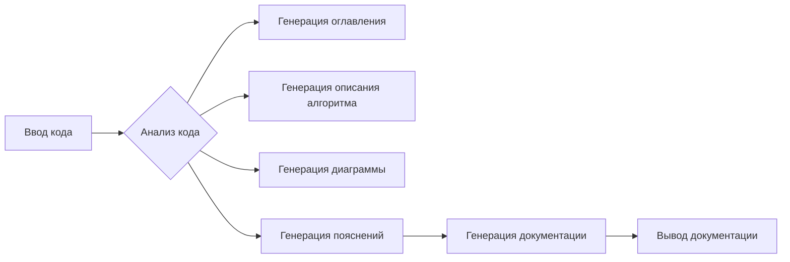

# Документация для instruction_code_explainer_md_en.py

## Обзор

Этот модуль предназначен для генерации Markdown-документации для входных Python-файлов. Он анализирует код, определяет функции, классы и переменные, и строит структурированную документацию, включающую оглавление, описание алгоритма, блок-схему, диаграмму зависимости, пояснения к импортам, классам, функциям, переменным и потенциальным проблемам.

## Оглавление

* [Обзор](#обзор)
* [Алгоритм](#алгоритм)
* [Диаграмма](#диаграмма)
* [Пояснения](#пояснения)
    * [Импорты](#импорты)
    * [Классы](#классы)
    * [Функции](#функции)
    * [Переменные](#переменные)
* [Возможные проблемы](#возможные-проблемы)
* [Связи с другими частями проекта](#связи-с-другими-частями-проекта)


## Алгоритм

Алгоритм работы модуля можно представить в виде следующей блок-схемы:

1. **Ввод кода**: Принимает на вход строку с кодом Python.
2. **Анализ кода**:  Выполняет лексический и синтаксический анализ входного кода для определения функций, классов и переменных.
3. **Генерация оглавления**: Создает оглавление, содержащее ссылки на все разделы документации.
4. **Генерация описания алгоритма**: Строит текстовое описание алгоритма в виде блок-схемы.
5. **Генерация диаграммы зависимостей**: Создаёт диаграмму зависимостей, используя `mermaid` формат.
6. **Генерация пояснений**: Создает детальные пояснения к импортам, классам, функциям, переменным, отмечая потенциальные ошибки или улучшения.
7. **Генерация документации**: Формирует окончательный Markdown-документ, объединяя все сгенерированные разделы.
8. **Вывод документации**: Возвращает сгенерированный Markdown-документ.

**Пример входного кода (для иллюстрации):**

```python
import some_module

class MyClass:
    def my_method(self, arg1):
        # ...
        return 123

def my_function(arg1, arg2=None):
    # ...
    return arg1 + arg2
```

## Диаграмма



## Пояснения

### Импорты

В примере импорта `import some_module` необходим для использования функций или классов из модуля `some_module`. Необходимо указать назначение импортируемого модуля. Если `some_module` определен в `src`, то его назначение должно быть объяснено.


### Классы

Класс `MyClass` представляет собой структуру данных, содержащую атрибуты и методы. `my_method` - метод класса, принимающий аргумент `arg1` и возвращающий целое число `123`.


### Функции

Функция `my_function` принимает два аргумента: `arg1` и `arg2` (по умолчанию `None`). Она возвращает сумму `arg1` и `arg2`.


### Переменные

Пример переменных в примере кода отсутствует.


## Возможные проблемы

* Недостаточная документация по методам/функциям.
* Сложность в анализе сложных алгоритмов.
* Возможные ошибки в генерируемом Markdown-формате.
* Проблемы при работе с нестандартными именами или структурами кода.


## Связи с другими частями проекта

Модуль тесно связан с другими модулями, которые обеспечивают обработку входного кода и вывод документации в нужном формате. Описание этих связей и взаимодействия должно быть дополнено.


```
```
```