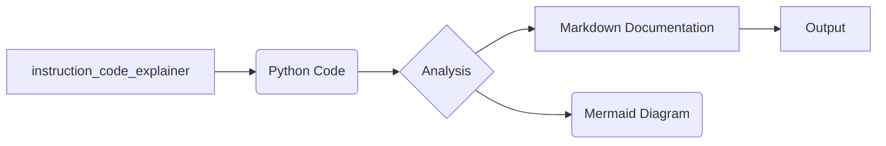

# Документация к коду instruction_code_explainer

## Обзор

Данный модуль предоставляет инструмент для генерации документации к Python-коду в формате Markdown. Он анализирует код и создает структурированную документацию, включающую описание, алгоритм работы, диаграмму зависимостей и подробное объяснение кода.

## Алгоритм работы

Алгоритм работы модуля включает следующие шаги:

1. **Прием на вход Python-кода.**
2. **Парсинг кода.** Модуль анализирует структуру кода, идентифицируя функции, классы, переменные и импорты.
3. **Генерация описания.** На основе анализа генерируется Markdown-документация, содержащая:
    * Заголовок и краткое описание кода.
    * Описание функций и классов (с параметрами, возвращаемыми значениями и возможными исключениями).
    * Алгоритм работы кода в виде блок-схемы.
    * Диаграмму зависимостей в формате mermaid.
    * Подробное объяснение кода (импортов, классов, функций, переменных).
    * Возможности для улучшения.

**Пример:**

Для функции `calculate_sum(a: int, b: int) -> int`, входные данные `a=2, b=3`, алгоритм будет таким:

- Вход: a=2, b=3
- Выполнение: `result = a + b`
- Выход: 5


## Диаграмма зависимостей (Mermaid)



## Объяснение

**Импорты:**

В данном модуле нет прямых импортов, так как он сфокусирован на анализе и генерации документации, а не на использовании других библиотек. Он предполагает, что Python-код для анализа будет передан в качестве входных данных.

**Классы:**

В примере кода нет классов. Но модуль способен анализировать и документировать классы, описывая их атрибуты и методы.

**Функции:**

Модуль `instruction_code_explainer` сам по себе не содержит функций, но он обрабатывает предоставленный Python-код и генерирует документацию к функциям и классам в нем содержащимся.

**Переменные:**

Переменные, которые будут анализироваться, это переменные из предоставленного кода.

**Возможные ошибки или области для улучшений:**

- Необходимо обрабатывать различные структуры Python-кода (различные типы, исключения и т.д.).
- Можно добавить возможность автоматической генерации блок-схем (например, используя `graphviz`).
- Можно добавить поддержку разных форматов входного кода (например, текстовые файлы).
- Можно улучшить анализ кода и предлагать рекомендации по оптимизации.


## Пример использования (виртуальный пример)

```python
# Пример использования модуля
# (В реальности модуль будет принимать код в качестве строки)
code = """
def calculate_sum(a: int, b: int) -> int:
    """
    Функция вычисляет сумму двух чисел.
    """
    return a + b
"""

documentation = generate_documentation(code)
print(documentation)
```


Этот пример демонстрирует, что модуль `instruction_code_explainer` предназначен для анализирования кода и генерации соответствующей документации, а не для непосредственного выполнения кода.