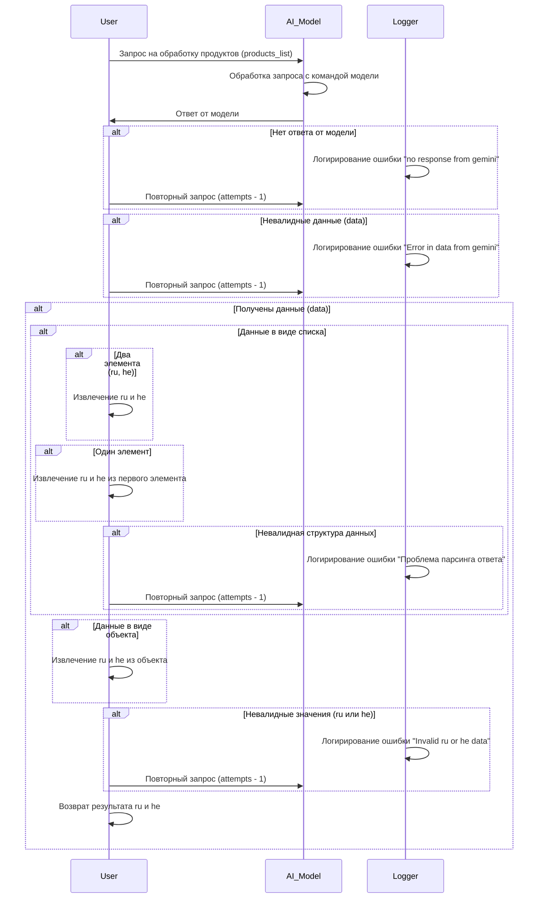

# Процесс обработки списка продуктов (scenario_picelist.process_ai.mmd)

## Обзор

Данный сценарий описывает процесс обработки запроса на обработку списка продуктов (products_list) с помощью AI-модели.  Сценарий включает в себя обработку потенциальных ошибок и невалидных данных, а также различные варианты структуры ответа от модели.

## Последовательность действий



## Обрабатываемые типы данных

В данном сценарии обрабатываются следующие типы данных:

* **products_list:** Список продуктов, передаваемый в запрос.
* **Ответ от модели:**  Может быть в виде списка или объекта. Ожидаемые данные `ru` и `he`.


## Возможные ошибки

* `"no response from gemini"` -  Модель не отвечает.
* `"Error in data from gemini"` -  Невалидные данные получены от модели.
* `"Проблема парсинга ответа"` -  Неправильный формат ответа от модели.
* `"Invalid ru or he data"` - Невалидные значения `ru` или `he` в ответе.


##  Описание алгоритма

Сценарий реализует цикл повторных запросов к AI-модели, пока не будет получен корректный ответ.  На каждом шаге производится проверка типа данных ответа от модели, наличие необходимых элементов `ru` и `he`. При возникновении ошибок, происходит логирование соответствующего сообщения и выполняется повторный запрос.  Если  получен корректный ответ, то происходит извлечение данных `ru` и `he` и возврат результата пользователю.


## Замечания

* Введены дополнительные проверки валидности данных, чтобы обеспечить надежную обработку.
* Для увеличения устойчивости к ошибкам используется цикл повторных запросов.
* Необходимая логика извлечения `ru` и `he`  зависит от структуры данных в ответе от модели и должна быть реализована в соответствующей функции.


```