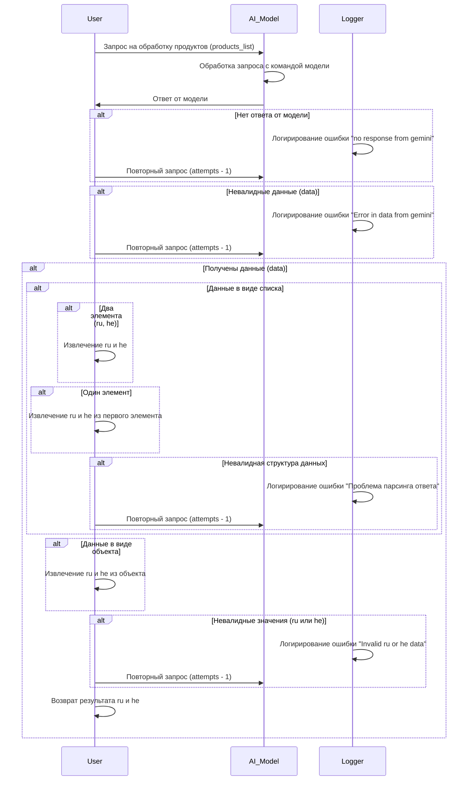

# Сценарии обработки запросов к модели Gemini

## Обзор

Данный документ описывает сценарии обработки запросов к модели Gemini для извлечения данных. Он описывает последовательность действий при запросе данных, включая возможные ошибки и повторные попытки.  

## Диаграмма последовательности




## Обрабатываемые ошибки

* **`no response from gemini`**: Модель не вернула ответ.
* **`Error in data from gemini`**: Полученные данные невалидны.
* **`Проблема парсинга ответа`**: Невозможно разобрать полученные данные (например, неверный формат).
* **`Invalid ru or he data`**: Извлечённые данные `ru` или `he` невалидны.


##  Описание сценариев

**Шаг 1: Запрос к модели:** Пользователь отправляет запрос на обработку списка продуктов (`products_list`) к модели Gemini.

**Шаг 2: Обработка запроса:** Модель обрабатывает запрос и возвращает данные.

**Шаг 3: Обработка ответа:** 
* **Успешный ответ:** Программа проверяет полученные данные на корректность.
* **Ошибка:** В зависимости от типа ошибки (невалидные данные, отсутствие ответа, ошибка парсинга) происходит повторный запрос или логирование ошибки.

**Шаг 4: Извлечение данных:** В случае успешного получения данных, программа извлекает необходимые значения `ru` и `he` из полученных данных. Программа обрабатывает ситуации, когда данные представлены в виде списка или объекта.

**Шаг 5: Возврат данных:** Программа возвращает результат, содержащий извлечённые значения `ru` и `he`.


## Поток обработки

1. Пользователь отправляет запрос.
2. Модель обрабатывает запрос и возвращает ответ.
3. Проверка ответа на валидность.
4. Извлечение данных `ru` и `he`.
5. Если данные валидны, возвращается результат.
6. Если обнаружена ошибка, выполняется логирование и, при необходимости, повторный запрос.

##  Влияние на производительность


Повторные запросы к модели могут негативно сказаться на производительности. Важно оптимизировать алгоритм обработки ошибок, чтобы минимизировать количество повторных запросов.

```
```