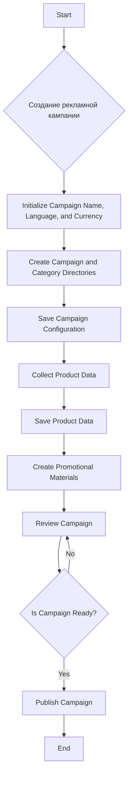

# Модуль создания рекламной кампании на AliExpress

## Обзор

Данный модуль описывает процесс создания рекламной кампании на AliExpress.  Он представляет собой пошаговый алгоритм, начиная с инициализации параметров (название, язык, валюта) и заканчивая публикацией готовой кампании.

## Алгоритм



## Подробное описание шагов

### Инициализация параметров кампании

Этот шаг включает в себя определение имени кампании, языка и валюты, используемых в рекламной кампании.

### Создание каталогов кампании и категорий

В данном шаге создаются необходимые каталоги и директории для хранения данных о кампании.

### Сохранение конфигурации кампании

Этот шаг предполагает сохранение всех параметров кампании в соответствующем формате (например, в базе данных).

### Сбор данных о продуктах

Этот шаг включает в себя сбор данных о продуктах, которые будут рекламироваться в кампании.  Это могут быть данные о цене, характеристиках, изображениях и т.д.

### Сохранение данных о продуктах

Сохранённые данные о продуктах сохраняются в соответствующей базе данных или файловой системе.

### Создание рекламных материалов

Этот шаг включает в себя создание рекламных материалов, таких как тексты объявлений, изображения и видео.

### Проверка кампании

Этот шаг предполагает полную проверку всех параметров кампании (корректность данных, полнота информации, и т.д.).

### Готовность кампании к публикации

После проверки принимается решение о готовности кампании к публикации.

### Публикация кампании

После подтверждения готовности кампания публикуется на платформе AliExpress.

### Конец

Процесс создания кампании завершен.


```