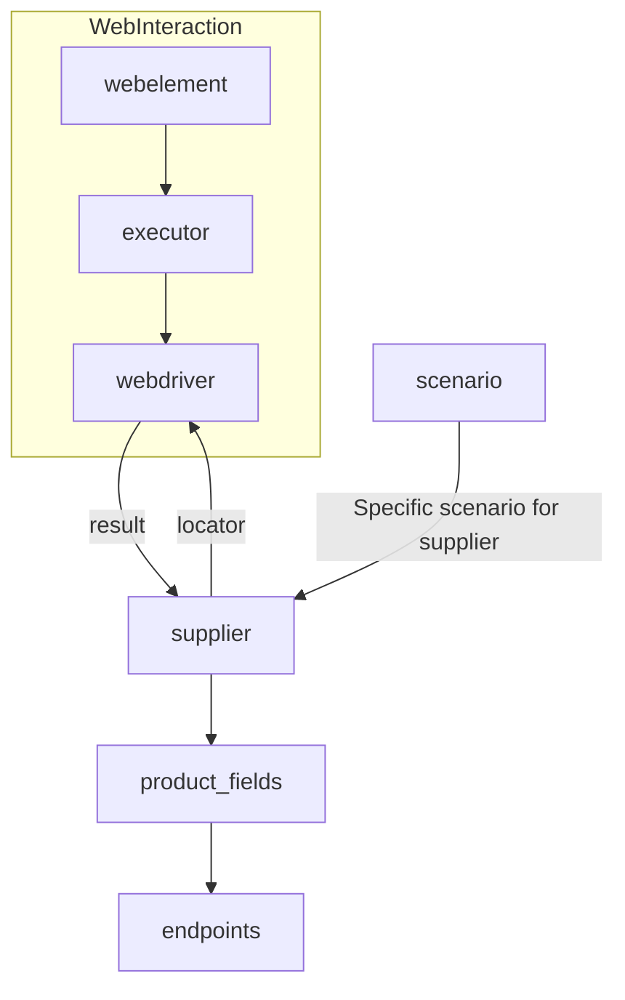

# Модуль `suppliers`

## Обзор

Этот модуль предоставляет базовый класс `Supplier` для взаимодействия с различными поставщиками данных.  Класс `Supplier` абстрагирует процесс взаимодействия с поставщиками, обеспечивая стандартный интерфейс для получения данных с различных платформ (например, `amazon.com`, `walmart.com`).  Модуль также включает список реализованных поставщиков и примеры использования.


## Классы

### `Supplier`

**Описание**: Базовый класс для всех поставщиков данных. Предназначен для унифицированного взаимодействия с различными источниками информации, например, веб-сайтами, документами, базами данных. Каждый поставщик имеет уникальный префикс. (Подробности о префиксах см. в файле `prefixes.md`).

**Атрибуты**:

- `supplier_id` (int): Уникальный идентификатор поставщика.
- `supplier_prefix` (str): Префикс поставщика (например, `'amazon'`, `'aliexpress'`).
- `supplier_settings` (dict): Настройки поставщика, загружаемые из файла JSON.
- `locale` (str): Код локализации (по умолчанию: `'en'`).
- `price_rule` (str): Правила расчета цены (например, правила НДС).
- `related_modules` (module): Вспомогательные модули для операций с конкретным поставщиком.
- `scenario_files` (list): Список файлов сценариев для выполнения.
- `current_scenario` (dict): Сценарий, который выполняется в данный момент.
- `login_data` (dict): Данные для авторизации.
- `locators` (dict): Словарь локаторов веб-элементов.
- `driver` (Driver): Экземпляр WebDriver для взаимодействия с веб-сайтом поставщика.
- `parsing_method` (str): Метод парсинга данных (например, `'webdriver'`, `'api'`, `'xls'`, `'csv'`).


**Методы**:

- `__init__`: Конструктор класса `Supplier`.

```python
def __init__(self, supplier_prefix: str, locale: str = 'en', webdriver: str | Driver | bool = 'default', *attrs, **kwargs):
    """Инициализирует экземпляр класса Supplier.

    Args:
        supplier_prefix (str): Префикс поставщика.
        locale (str, optional): Код локализации. По умолчанию 'en'.
        webdriver (str | Driver | bool, optional): Тип WebDriver. По умолчанию 'default'.

    Raises:
        DefaultSettingsException: Если настройки по умолчанию не настроены должным образом.
    """
```

- `_payload`: Загружает настройки поставщика и инициализирует WebDriver.

```python
def _payload(self, webdriver: str | Driver | bool, *attrs, **kwargs) -> bool:
    """Загружает настройки, локаторы и инициализирует WebDriver.

    Args:
        webdriver (str | Driver | bool): Тип WebDriver.

    Returns:
        bool: Возвращает True, если загрузка прошла успешно.
    """
```

- `login`: Обрабатывает авторизацию на веб-сайте поставщика.

```python
def login(self) -> bool:
    """Авторизует пользователя на веб-сайте поставщика.

    Returns:
        bool: Возвращает True, если вход выполнен успешно.
    """
```

- `run_scenario_files`: Выполняет один или несколько файлов сценариев.

```python
def run_scenario_files(self, scenario_files: str | List[str] = None) -> bool:
    """Выполняет предоставленные файлы сценариев.

    Args:
        scenario_files (str | List[str], optional): Список или путь к файлам сценариев.

    Returns:
        bool: Возвращает True, если сценарии были успешно выполнены.
    """
```

- `run_scenarios`: Выполняет указанные сценарии.

```python
def run_scenarios(self, scenarios: dict | list[dict]) -> bool:
    """Выполняет указанные сценарии.

    Args:
        scenarios (dict | list[dict]): Сценарии для выполнения.

    Returns:
        bool: Возвращает True, если все сценарии были успешно выполнены.
    """
```


## Список реализованных поставщиков

Список реализованных поставщиков:

- `aliexpress` (`webdriver`, `api`)
- `amazon` (`webdriver`)
- `bangood` (`webdriver`)
- ... (и остальные)

## Как это работает

1. Инициализация: Метод `__init__` настраивает префикс поставщика, локализацию и WebDriver.
2. Загрузка настроек: `_payload` загружает конфигурацию, инициализирует локаторы и WebDriver.
3. Авторизация: `login` выполняет вход на веб-сайте поставщика.
4. Выполнение сценариев:  `run_scenario_files` и `run_scenarios` выполняют сценарии, определенные в файлах.


```

```