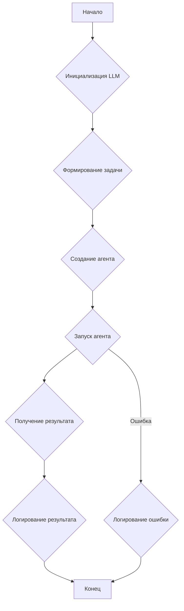

# Модуль habra_agent

## Обзор

Модуль `habra_agent` предназначен для автоматической генерации токсичных комментариев к статьям на сайте Habr.com с использованием языковой модели OpenAI. Он содержит функции для поиска статей по имени автора, открытия этих статей и генерации токсичных комментариев на русском языке.

## Подробней

Этот модуль использует библиотеку `browser_use` для автоматизации действий в браузере и `langchain_openai` для взаимодействия с OpenAI API. Основная функция `habra_toxic_commenter` принимает имя автора на Хабре и, используя указанную языковую модель, генерирует и публикует токсичный комментарий к одной из статей этого автора. Модуль также включает функцию `main` для демонстрации использования `habra_toxic_commenter`.

## Классы

В данном модуле классы отсутствуют.

## Функции

### `habra_toxic_commenter`

```python
async def habra_toxic_commenter(author_username: str, model_name: str = "gpt-4o") -> str | None:
    """
    Ищет статью на Хабре по указанному автору, открывает её и генерирует токсичный комментарий.

    Args:
        author_username (str): Имя пользователя на Хабре.
        model_name (str): Название языковой модели OpenAI для использования. По умолчанию gpt-4o.

    Returns:
        str | None: Строку с результатом работы агента, содержащую название статьи и сгенерированный комментарий.
                    Возвращает None, если произошла ошибка.

    Raises:
        Exception: Если возникает ошибка при работе с OpenAI API или при автоматизации действий в браузере.
```


**Как работает функция**:
1. Инициализирует языковую модель OpenAI (`ChatOpenAI`) с указанным именем модели.
2. Формирует задачу для агента, включающую поиск статьи указанного автора на Хабре, открытие полной версии статьи и генерацию токсичного комментария на русском языке.
3. Создает экземпляр класса `Agent` из библиотеки `browser_use`, передавая ему задачу и языковую модель.
4. Запускает агента для выполнения задачи и получает результат.
5. Логирует начало и завершение работы агента.
6. В случае возникновения ошибки, логирует её и возвращает `None`.



**Описание**: Ищет статью на Хабре по указанному автору, открывает её и генерирует токсичный комментарий.

**Параметры**:
- `author_username` (str): Имя пользователя на Хабре.
- `model_name` (str, optional): Название языковой модели OpenAI для использования. По умолчанию `"gpt-4o"`.

**Возвращает**:
- `str | None`: Строку с результатом работы агента, содержащую название статьи и сгенерированный комментарий. Возвращает `None`, если произошла ошибка.

**Вызывает исключения**:
- `Exception`: Если возникает ошибка при работе с OpenAI API или при автоматизации действий в браузере.

**Примеры**:

```python

import asyncio
async def example():
    author = "ElKornacio"
    result = await habra_toxic_commenter(author_username=author)
    if result:
        print(f"Результат: {result}")
    else:
        print("Не удалось получить результат.")

asyncio.run(example())
# Ожидаемый вывод:
# "Результат: ..." или "Не удалось получить результат."
```

### `main`

```python
async def main():
    """
    Пример использования функции habra_toxic_commenter.
    """
```

**Описание**: Пример использования функции `habra_toxic_commenter`.

**Параметры**:
- Отсутствуют

**Возвращает**:
- Отсутствует

**Вызывает исключения**:
- Отсутствуют

**Примеры**:
```python
import asyncio
async def example():
    await main()

asyncio.run(example())
# Ожидаемый вывод:
# "Результат работы агента:"
#  [Результат работы агента]
# или
# "Не удалось получить результат."