# Модуль `code_explainer_md_ru`

## Обзор

Модуль содержит инструкции и примеры для генерации документации к коду на Python в формате Markdown. Основная цель - помочь разработчикам понимать и документировать свой код, предоставляя структурированное описание всех ключевых элементов.

## Содержание

- [Инструкция](#инструкция)
- [Пример вызова](#пример-вызова)
- [Ожидаемый ответ](#ожидаемый-ответ)
- [Инструкция для создания Mermaid flowchart диаграмм с использованием HTML в описании узлов](#инструкция-для-создания-mermaid-flowchart-диаграмм-с-использованием-html-в-описании-узлов)

## Инструкция

### Формат документации
- Используется стандарт Markdown (.md).
- Каждый файл начинается с заголовка и краткого описания его содержимого.
- Для всех классов и функций используется следующий формат комментариев:

```python
 def function(param: str, param1: Optional[str | dict | str] = None) -> dict | None:
    """
    Args:
        param (str): Описание параметра `param`.
        param1 (Optional[str | dict | str], optional): Описание параметра `param1`. По умолчанию `None`.

    Returns:
        dict | None: Описание возвращаемого значения. Возвращает словарь или `None`.

    Raises:
        SomeError: Описание ситуации, в которой возникает исключение `SomeError`.
    """
```
- Используется `ex` вместо `e` в блоках обработки исключений.

### Содержание (TOC)
- В начале каждого файла документации добавляется раздел с оглавлением.
- Структура оглавления включает ссылки на все основные разделы документации модуля.

### Форматирование документации
- Используется правильный синтаксис Markdown для всех заголовков, списков и ссылок.
- Для документирования классов, функций и методов включаются структурированные разделы с описаниями, деталями параметров, возвращаемых значений и вызываемых исключений.

### Заголовки разделов
- Используются заголовки первого уровня (`#`), второго уровня (`##`), третьего уровня (`###`) и четвёртого уровня (`####`) последовательно на протяжении всего файла.

### Пример файла

```markdown
# Название модуля

## Обзор

Краткое описание назначения модуля.

## Классы

### `ClassName`

**Описание**: Краткое описание класса.

**Методы**:
- `method_name`: Краткое описание метода.
- `method_name`: Краткое описание метода.
**Параметры**:
- `param` (str): Описание параметра `param`.
- `param1` (Optional[str | dict | str], optional): Описание параметра `param1`. По умолчанию `None`.

## Функции

### `function_name`

**Описание**: Краткое описание функции.

**Методы**:
- `method_name`: Краткое описание метода.
- `method_name`: Краткое описание метода.

**Параметры**:
- `param` (str): Описание параметра `param`.
- `param1` (Optional[str | dict | str], optional): Описание параметра `param1`. По умолчанию `None`.

**Возвращает**:
- `dict | None`: Описание возвращаемого значения.

**Вызывает исключения**:
- `SomeError`: Описание ситуации, в которой возникает исключение `SomeError`.
```

## Пример вызова

```python
from src.utils.calculator import calculate_sum

def add_numbers(a, b):
    result = calculate_sum(a, b)
    return result
```

## Ожидаемый ответ

```
<input code>
from src.utils.calculator import calculate_sum

def add_numbers(a, b):
    result = calculate_sum(a, b)
    return result

<algorithm>
1. Импортируется функция `calculate_sum` из модуля `src.utils.calculator`.
2. Определяется функция `add_numbers`, принимающая два аргумента `a` и `b`.
3. Вызов функции `calculate_sum(a, b)` выполняет сложение `a` и `b`.
4. Результат функции возвращается вызывающему коду.

Пример:
- Входные данные: `a = 3`, `b = 5`.
- Алгоритм: `calculate_sum(3, 5)`.
- Результат: `8`.

<explanation>
**Импорты**:
- `from src.utils.calculator import calculate_sum`: Импортирует функцию `calculate_sum`, которая используется для вычисления суммы. Модуль лежит в папке `src.utils`.

**Функция `add_numbers`**:
- Назначение: упрощает сложение двух чисел через вызов функции `calculate_sum`.
- Аргументы:
  - `a` (число): Первое слагаемое.
  - `b` (число): Второе слагаемое.
- Возвращаемое значение: результат сложения `a` и `b`.

**Связь с другими пакетами**:
- Модуль `src.utils.calculator` может быть частью библиотеки для математических вычислений.
- Если `calculate_sum` использует дополнительные модули, это можно уточнить в её документации.

**Возможные улучшения**:
- Добавить проверку типов аргументов `a` и `b` для предотвращения ошибок.
- Локализовать вызов `calculate_sum` в рамках модуля, если он больше нигде не используется.
```

## Инструкция для создания Mermaid flowchart диаграмм с использованием HTML в описании узлов

1.  **Тип графа:**
    *   Использовать `flowchart` (например, `flowchart TD` для направленного графа сверху вниз).
    *   Другие варианты: `LR` (слева направо), `BT` (снизу вверх), `RL` (справа налево).

2.  **Названия узлов:**
    *   Узлы должны иметь осмысленные и описательные названия, отражающие выполняемую операцию или состояние.
    *   Избегать названий типа `A`, `B`, `C`. Использовать читабельные и понятные имена, например: `Start`, `InitSupplier`, `ValidateInput`.

3.  **Использование HTML:**
    *   Для оформления текста узлов применять HTML-теги.
    *   Поддерживаются стилизация текста, форматирование, добавление тегов `h1`, `h3`, `<code>`, `<b>`, `<i>` и т.д.
    *   При необходимости использовать HTML-escape для символов:
        *   `(` → `&#40;`
        *   `)` → `&#41;`
        *   `\'` → `&#39;`
        *   `"` → `&quot;`
        *   `:` → `&#58;`

4.  **Связи между узлами:**
    *   Указывать логический переход между узлами с использованием стрелок: `-->` для однонаправленных или `---` для ассоциативных связей.
    *   Использовать текстовые метки на стрелках для уточнения условий перехода, например: `-->|Success|`.

5.  **Пример использования:**

```mermaid
flowchart TD
    Start[<html>Начало процесса<br><b>Создание экземпляра</b></html>] 
        --> InitSupplier[<html>Инициализация Supplier<br><code>_payload&#40;params&#41;</code></html>]
    InitSupplier --> Validate[<html>Проверка параметров<br><i>is_valid&#40;params&#41;</i></html>]
    Validate -->|Проверка успешна| Success[<html><b>Успех</b><br>Создание завершено</html>]
    Validate -->|Ошибка| Error[<html>Ошибка<br><span style="color:red;">Некорректные параметры</span></html>]
```



6.  **Генерация узлов:**
    *   Генерировать названия узлов на основе действия или состояния.
    *   Узлы должны быть короткими, но информативными. При необходимости дополнять текст HTML-тегами для улучшения визуального восприятия.

7.  **Использование меток и комментариев:**
    *   Добавлять метки на стрелках для пояснения условий перехода.
    *   Использовать комментарии `%%` для описания сложных связей.

8.  **Проверка синтаксиса:**
    *   Убедиться, что HTML-код внутри узлов корректен и не нарушает синтаксис Mermaid.

**Результат:** Диаграмма с осмысленными узлами, описанными с использованием HTML, демонстрирующая логический процесс или архитектуру системы.