# Документация для модуля обработки и пояснения кода

## Оглавление

1. [Обзор](#обзор)
2. [Описание формата ответа](#описание-формата-ответа)
3. [Требования к анализу кода](#требования-к-анализу-кода)
4. [Пример вызова](#пример-вызова)
5. [Пример ответа](#пример-ответа)
6. [Инструкция для создания Mermaid flowchart диаграмм](#инструкция-для-создания-mermaid-flowchart-диаграмм)
   
## Обзор

Этот документ описывает требования к анализу и объяснению кода проекта `hypotez`, предоставляя разработчикам подробную документацию по работе кода, его алгоритму, а также взаимосвязям с другими компонентами проекта. 

## Описание формата ответа

Документация должна быть предоставлена в следующем формате:

```
<input code>
<algorithm>
<explanation>
```

1.  **`<input code>`**:
    *   Представление исходного кода без изменений.
2.  **`<algorithm>`**:
    *   Пошаговое описание алгоритма работы кода в виде блок-схемы.
    *   Примеры работы каждого логического блока, если применимо.
    *   Описание перемещения данных между функциями, классами или методами.
3.  **`<explanation>`**:
    *   Подробное описание:
        *   Импортов: зачем нужны, связь с другими пакетами (начиная с `src.`).
        *   Классов: назначение, атрибуты и методы, взаимосвязь с другими компонентами.
        *   Функций: назначение, аргументы, возвращаемые значения и примеры.
        *   Переменных: типы и использование.
    *   Цепочка взаимосвязей с другими частями проекта.
    *   Потенциальные ошибки или области для улучшений.

## Требования к анализу кода

*   Анализ предоставленного кода и его объяснение.
*   Описание работы кода должно быть понятным для разработчика.
*   Особое внимание уделяется взаимосвязям между различными частями кода.

## Пример вызова

```python
from src.utils.calculator import calculate_sum

def add_numbers(a, b):
    result = calculate_sum(a, b)
    return result
```

## Пример ответа

```
<input code>
from src.utils.calculator import calculate_sum

def add_numbers(a, b):
    result = calculate_sum(a, b)
    return result

<algorithm>
1. Импортируется функция `calculate_sum` из модуля `src.utils.calculator`.
2. Определяется функция `add_numbers`, принимающая два аргумента `a` и `b`.
3. Вызов функции `calculate_sum(a, b)` выполняет сложение `a` и `b`.
4. Результат функции возвращается вызывающему коду.

Пример:
- Входные данные: `a = 3`, `b = 5`.
- Алгоритм: `calculate_sum(3, 5)`.
- Результат: `8`.

<explanation>
**Импорты**:
- `from src.utils.calculator import calculate_sum`: Импортирует функцию `calculate_sum`, которая используется для вычисления суммы. Этот модуль лежит в папке `src.utils`.

**Функция `add_numbers`**:
- Назначение: упрощает сложение двух чисел через вызов функции `calculate_sum`.
- Аргументы:
  - `a` (число): Первое слагаемое.
  - `b` (число): Второе слагаемое.
- Возвращаемое значение: результат сложения `a` и `b`.

**Связь с другими пакетами**:
- Модуль `src.utils.calculator` может быть частью библиотеки для математических вычислений.
- Если `calculate_sum` использует дополнительные модули, это можно уточнить в её документации.

**Возможные улучшения**:
- Добавить проверку типов аргументов `a` и `b` для предотвращения ошибок.
- Локализовать вызов `calculate_sum` в рамках модуля, если он больше нигде не используется.
```

## Инструкция для создания Mermaid flowchart диаграмм

### Тип графа

*   Используйте `flowchart` (например, `flowchart TD` для направленного графа сверху вниз).
*   Другие варианты: `LR` (слева направо), `BT` (снизу вверх), `RL` (справа налево).

### Названия узлов

*   Узлы должны иметь осмысленные и описательные названия, отражающие выполняемую операцию или состояние.
*   Избегать названий типа `A`, `B`, `C`. Использовать читабельные и понятные имена, например: `Start`, `InitSupplier`, `ValidateInput`.

### Использование HTML

*   Для оформления текста узлов применять HTML-теги.
*   Поддерживаются стилизация текста, форматирование, добавление тегов `h1`, `h3`, `<code>`, `<b>`, `<i>` и т.д.
*   При необходимости использовать HTML-escape для символов:
    *   `(` → `&#40;`
    *   `)` → `&#41;`
    *   `'` → `&#39;`
    *   `"` → `&quot;`
    *   `:` → `&#58;`

### Связи между узлами

*   Указывать логический переход между узлами с использованием стрелок: `-->` для однонаправленных или `---` для ассоциативных связей.
*   Использовать текстовые метки на стрелках для уточнения условий перехода, например: `-->|Success|`.

### Пример использования

```mermaid
flowchart TD
    Start[<html>Начало процесса<br><b>Создание экземпляра</b></html>] 
        --> InitSupplier[<html>Инициализация Supplier<br><code>_payload&#40;params&#41;</code></html>]
    InitSupplier --> Validate[<html>Проверка параметров<br><i>is_valid&#40;params&#41;</i></html>]
    Validate -->|Проверка успешна| Success[<html><b>Успех</b><br>Создание завершено</html>]
    Validate -->|Ошибка| Error[<html>Ошибка<br><span style="color:red;">Некорректные параметры</span></html>]
```



### Генерация узлов

*   Генерировать названия узлов на основе действия или состояния.
*   Узлы должны быть короткими, но информативными. При необходимости дополнять текст HTML-тегами для улучшения визуального восприятия.

### Использование меток и комментариев

*   Добавлять метки на стрелках для пояснения условий перехода.
*   Использовать комментарии `%%` для описания сложных связей.

### Проверка синтаксиса

*   Убедиться, что HTML-код внутри узлов корректен и не нарушает синтаксис Mermaid.