# Документация модуля

## Обзор

Этот документ содержит подробное описание инструкций для создания документации в формате `Markdown` для Python-кода. Инструкция определяет структуру и стиль документации, включая использование заголовков, списков, форматирования кода и разделов, а также использование `ex` вместо `e` в блоках обработки исключений.

## Содержание

- [Обзор](#обзор)
- [Инструкция](#инструкция)
  - [Формат документации](#формат-документации)
  - [Содержание (TOC)](#содержание-toc)
  - [Форматирование документации](#форматирование-документации)
  - [Заголовки разделов](#заголовки-разделов)
  - [Пример файла](#пример-файла)
- [Инструкция](#инструкция-1)
  - [Описание модуля](#описание-модуля)
  - [Описание класса](#описание-класса)
  - [Описание функций и методов](#описание-функций-и-методов)
  - [Комментарии к коду](#комментарии-к-коду)
  - [Исключения](#исключения)
  - [Инструкции по созданию диаграмм потоков Mermaid](#инструкции-по-созданию-диаграмм-потоков-mermaid)
    - [Тип графа](#тип-графа)
    - [Имена узлов](#имена-узлов)
    - [Использование HTML](#использование-html)
    - [Соединения между узлами](#соединения-между-узлами)
    - [Пример](#пример)
    - [Генерация узлов](#генерация-узлов)
    - [Метки и комментарии](#метки-и-комментарии)
    - [Проверка синтаксиса](#проверка-синтаксиса)
- [Конец инструкции](#конец-инструкции)

## ИНСТРУКЦИЯ

### Формат документации

- Используйте стандарт `Markdown (.md)`.
- Каждый файл должен начинаться с заголовка и краткого описания его содержимого.
- Для всех классов и функций используйте следующий формат комментариев:

  ```python
  def function(param: str, param1: Optional[str | dict | str] = None) -> dict | None:
      """
      Args:
          param (str): Описание параметра `param`.
          param1 (Optional[str | dict | str], optional): Описание параметра `param1`. По умолчанию `None`.

      Returns:
          dict | None: Описание возвращаемого значения. Возвращает словарь или `None`.

      Raises:
          SomeError: Описание ситуации, в которой возникает исключение `SomeError`.
      """
  ```

- Используйте `ex` вместо `e` в блоках обработки исключений.

### Содержание (TOC)

- В начале каждого файла документации добавьте раздел с оглавлением.
- Структура оглавления должна включать ссылки на все основные разделы документации модуля.

### Форматирование документации

- Используйте правильный синтаксис Markdown для всех заголовков, списков и ссылок.
- Для документирования классов, функций и методов включайте структурированные разделы с описаниями, деталями параметров, возвращаемых значений и вызываемых исключений. Пример:

  ```markdown
  ## Функции

  ### `function_name`

  **Описание**: Краткое описание функции.

  **Параметры**:
  - `param` (str): Описание параметра `param`.
  - `param1` (Optional[str | dict | str], optional): Описание параметра `param1`. По умолчанию `None`.

  **Возвращает**:
  - `dict | None`: Описание возвращаемого значения.

  **Вызывает исключения**:
  - `SomeError`: Описание ситуации, в которой возникает исключение `SomeError`.
  ```

### Заголовки разделов

- Используйте заголовки первого уровня (`#`), второго уровня (`##`), третьего уровня (`###`) и четвёртого уровня (`####`) последовательно на протяжении всего файла.

### Пример файла

```markdown
# Название модуля

## Обзор

Краткое описание назначения модуля.

## Классы

### `ClassName`

**Описание**: Краткое описание класса.

**Методы**:
- `method_name`: Краткое описание метода.
- `method_name`: Краткое описание метода.
**Параметры**:
- `param` (str): Описание параметра `param`.
- `param1` (Optional[str | dict | str], optional): Описание параметра `param1`. По умолчанию `None`.

## Функции

### `function_name`

**Описание**: Краткое описание функции.

**Методы**:
- `method_name`: Краткое описание метода.
- `method_name`: Краткое описание метода.

**Параметры**:
- `param` (str): Описание параметра `param`.
- `param1` (Optional[str | dict | str], optional): Описание параметра `param1`. По умолчанию `None`.

**Возвращает**:
- `dict | None`: Описание возвращаемого значения.

**Вызывает исключения**:
- `SomeError`: Описание ситуации, в которой возникает исключение `SomeError`.
```

## ИНСТРУКЦИЯ

### Описание модуля

- Описание модуля должно быть написано вверху, указывая на его назначение.
- Предоставьте примеры использования модуля, если это возможно. Примеры кода должны быть заключены в блок кода с идентификатором языка `python`.
- Укажите платформы и краткое описание модуля.
- Используйте заголовки для описания атрибутов и методов модуля, где это необходимо.

### Описание класса

- Каждый класс должен быть описан в соответствии с его назначением. Включите описание класса, его атрибуты и методы.
- В разделе класса перечислите все методы, их назначение и примеры использования.
- Для каждого метода укажите описание его параметров и возвращаемых значений, а также примеры.

### Описание функций и методов

- Документируйте каждую функцию или метод, указывая параметры и возвращаемые значения.
- Для каждой функции предоставьте описание ее назначения и примеры использования в блоках кода с идентификатором языка `python`.

### Комментарии к коду

- Все комментарии в коде должны быть написаны в формате Markdown и должны объяснять, что делает конкретная часть кода.
- Оставляйте комментарии блоками, а не строками. Используйте комментарии для описания логики и объяснения решений или временных решений в коде.

  ```markdown
  # Here, the exception is being handled to continue execution if the file is not found
  try:
      process_file(file)
  except FileNotFoundError as ex:
      handle_exception(ex)
  ```

### Исключения

- Документируйте исключения для классов, методов и функций.
- Укажите, какие исключения могут быть вызваны и при каких обстоятельствах.

### Инструкции по созданию диаграмм потоков Mermaid

#### Тип графа

- Используйте `flowchart` (например, `flowchart TD` для направленного графа сверху вниз).
- Другие варианты: `LR` (слева направо), `BT` (снизу вверх), `RL` (справа налево).

#### Имена узлов

- Узлы должны иметь значимые и описательные имена, отражающие операцию или состояние, которые они представляют.
- Избегайте имен, таких как `A`, `B`, `C`. Используйте четкие и понятные имена, такие как `Start`, `InitSupplier`, `ValidateInput`.

#### Использование HTML

- Применяйте HTML-теги для стилизации текста в узлах.
- Поддерживаемые теги включают форматирование текста (например, `<b>`, `<i>`, `<h1>`, `<h3>`, `<code>`).
- Используйте HTML-коды для специальных символов:
  - `(` → `&#40;`
  - `)` → `&#41;`
  - `'` → `&#39;`
  - `"` → `&quot;`
  - `:` → `&#58;`

#### Соединения между узлами

- Определите логические переходы между узлами с помощью стрелок: `-->` для направленных или `---` для ассоциативных связей.
- Добавьте текстовые метки к стрелкам для пояснения условий перехода, например, `-->|Success|`.

#### Пример

```mermaid
flowchart TD
    Start[<html>Start of the process<br><b>Create instance</b></html>]
        --> InitSupplier[<html>Initialize Supplier<br><code>_payload&#40;params&#41;</code></html>]
    InitSupplier --> Validate[<html>Validate parameters<br><i>is_valid&#40;params&#41;</i></html>]
    Validate -->|Validation passed| Success[<html><b>Success</b><br>Creation completed</html>]
    Validate -->|Error| Error[<html>Error<br><span style="color:red;">Invalid parameters</span></html>]
```



#### Генерация узлов

- Генерируйте имена узлов на основе действия или состояния, которое они представляют.
- Узлы должны быть краткими, но информативными. Используйте HTML-теги для улучшения читабельности там, где это необходимо.

#### Метки и комментарии

- Добавляйте метки к стрелкам для объяснения условий перехода.
- Используйте комментарии с `%%` для описания сложных связей.

#### Проверка синтаксиса

- Убедитесь, что HTML внутри узлов является действительным и не нарушает синтаксис Mermaid.

## КОНЕЦ ИНСТРУКЦИИ