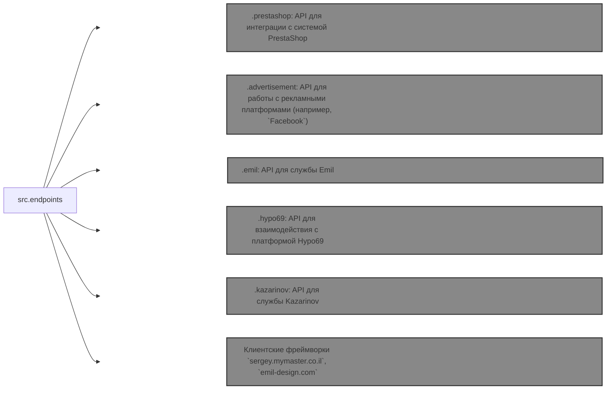

# Модуль конечных точек потребителей данных

## Обзор

Модуль `endpoints` предоставляет реализацию API для взаимодействия с потребителями данных. Каждый подкаталог представляет отдельный модуль, реализующий API для конкретной службы. Модуль `endpoints` включает подмодули для интеграции с различными системами потребителей, обеспечивая бесшовное взаимодействие с внешними службами.

## Структура модуля



## Конечные точки потребителей данных

#### 1. **PrestaShop**
Интеграция с API PrestaShop, использующая стандартные возможности API.

#### 2. **bots**
Подмодуль для управления интеграцией с ботами Telegram и Discord.

#### 3. **emil**
`https://emil-design.com`
Подмодуль для интеграции с клиентом по адресу https://emil-design.com (PrestaShop + Facebook).

#### 4. **kazarinov**
`https://sergey.mymaster.co.il`, `@hypo69_kazarinov_bot`
Подмодуль для интеграции с поставщиком данных Kazarinov (создатель прайс-листов, продвижение в Facebook).


## Описания модулей

### 1. `prestashop`
Этот модуль предназначен для интеграции с системой электронной коммерции PrestaShop. Он реализует функциональность для управления заказами, продуктами и клиентами.

* **Основные возможности**:
    * Создание, редактирование и удаление продуктов.
    * Управление заказами и пользователями.

### 2. `advertisement`
Модуль предоставляет API для управления рекламными платформами, включая создание кампаний и аналитические отчеты.

* **Основные возможности**:
    * Управление рекламными кампаниями.
    * Сбор и обработка аналитических данных.

### 3. `emil`
Интерфейс для работы со службой Emil, предоставляющий API для обмена данными.

* **Основные возможности**:
    * Обработка и отправка запросов к службе.
    * Получение данных из API Emil.

### 4. `hypo69`
API для взаимодействия с платформой Hypo69, предлагающей определённые бизнес-решения.

* **Основные возможности**:
    * Получение данных о клиентах.
    * Работа с пользовательскими отчётами.

### 5. `kazarinov`
Модуль для интеграции со службой Kazarinov. Он поддерживает функциональность анализа и обмена данными.

* **Основные возможности**:
    * Интеграция данных между системами.
    * Генерация отчетов и выполнение анализа.


## Установка и использование

### Установка

Убедитесь, что все зависимости проекта установлены перед запуском. Используйте следующую команду:

```bash
pip install -r requirements.txt
```

### Использование

Импортируйте необходимый модуль в свой код:

```python
from src.endpoints.prestashop import PrestashopAPI
from src.endpoints.advertisement import AdvertisementAPI
```

Затем настройте и используйте методы в зависимости от вашего случая использования.


## Вклад

Если вы хотите внести вклад в модуль, следуйте этим рекомендациям:

1. Следуйте [PEP 8](https://peps.python.org/pep-0008/) для стиля кода.
2. Добавьте тесты для новых функций.
3. Оставляйте подробные комментарии для любых изменений.

Для вопросов и предложений обратитесь к владельцу репозитория или оставьте комментарии в [Вопросы](#).