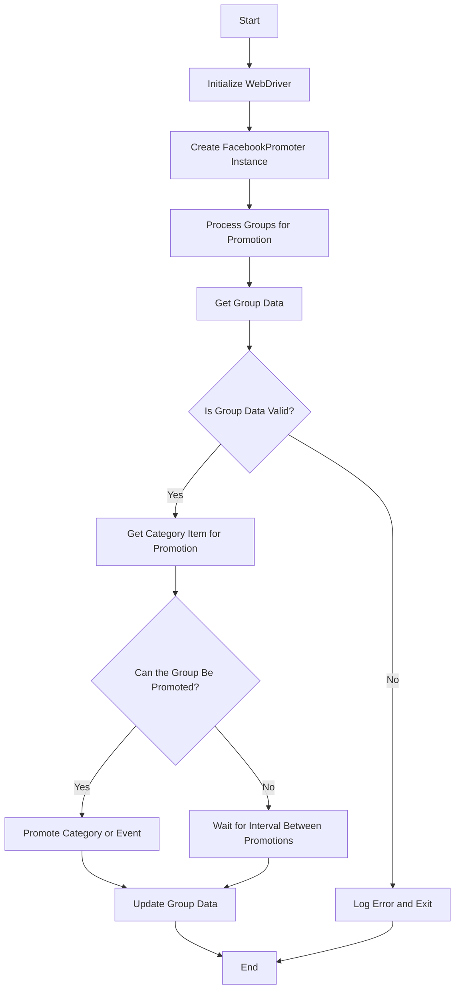

# Модуль для автоматизации продвижения в Facebook

## Обзор

Модуль **Facebook Promoter** автоматизирует продвижение товаров и событий AliExpress в группах Facebook. Он управляет публикацией рекламных материалов, обеспечивая продвижение категорий и событий без дубликатов. Модуль использует WebDriver для автоматизации браузера, что обеспечивает эффективное управление рекламными кампаниями.

## Особенности модуля

- Продвижение категорий и событий в группах Facebook.
- Предотвращение дублирования рекламных материалов путем отслеживания ранее продвигаемых элементов.
- Поддержка конфигурации данных групп через файлы.
- Возможность отключения загрузки видео в рекламных публикациях.

## Требования

- **Python** 3.x
- Необходимые библиотеки:
  - `random`
  - `datetime`
  - `pathlib`
  - `urllib.parse`
  - `types.SimpleNamespace`
  - `src` (пользовательский модуль)

## Блок-схема



## Использование

### Пример использования класса `FacebookPromoter`

```python
from src.endpoints.advertisement.facebook.promoter import FacebookPromoter
from src.webdriver.driver import Driver
from src.utils.jjson import j_loads_ns

# Настройка экземпляра WebDriver (замените на фактический WebDriver)
d = Driver()

# Создание экземпляра FacebookPromoter
promoter = FacebookPromoter(
    d=d, 
    promoter="aliexpress", 
    group_file_paths=["path/to/group/file1.json", "path/to/group/file2.json"]
)

# Запуск продвижения товаров или событий
promoter.process_groups(
    campaign_name="Campaign1",
    events=[], 
    group_categories_to_adv=["sales"],
    language="en",
    currency="USD"
)
```

## Классы

### `FacebookPromoter`

**Описание**:
Этот класс управляет процессом продвижения товаров и событий AliExpress в группах Facebook.

**Методы**:

- `__init__`: Инициализирует промоутер Facebook с необходимыми конфигурациями.
- `promote`: Продвигает категорию или событие в указанной группе Facebook.
- `log_promotion_error`: Записывает ошибку при неудачном продвижении.
- `update_group_promotion_data`: Обновляет данные группы после продвижения, добавляя продвинутый элемент в список продвинутых категорий или событий.
- `process_groups`: Обрабатывает группы для текущей кампании или продвижения событий.
- `get_category_item`: Получает элемент категории для продвижения на основе кампании и промоутера.
- `check_interval`: Проверяет, достаточно ли времени прошло для повторного продвижения в этой группе.
- `validate_group`: Проверяет данные группы, чтобы убедиться, что у нее есть необходимые атрибуты.

### `__init__`

```python
 def __init__(self, d: Driver, promoter: str, group_file_paths: Optional[list[str | Path] | str | Path] = None, no_video: bool = False):
    """
    Args:
        d (Driver): WebDriver instance for automation.
        promoter (str): The name of the promoter (e.g., "aliexpress").
        group_file_paths (Optional[list[str | Path] | str | Path]): File paths for group data.
        no_video (bool): Flag to disable videos in posts. Defaults to `False`.
    """
```

**Описание**:
Инициализирует промоутер Facebook с необходимыми конфигурациями.

**Параметры**:
- `d` (Driver): Экземпляр WebDriver для автоматизации.
- `promoter` (str): Название промоутера (например, "aliexpress").
- `group_file_paths` (Optional[list[str | Path] | str | Path]): Пути к файлам данных группы.
- `no_video` (bool): Флаг для отключения видео в постах. По умолчанию `False`.

**Примеры**:
```python
from src.endpoints.advertisement.facebook.promoter import FacebookPromoter
from src.webdriver.driver import Driver
from src.utils.jjson import j_loads_ns

# Настройка экземпляра WebDriver (замените на фактический WebDriver)
d = Driver()

# Создание экземпляра FacebookPromoter
promoter = FacebookPromoter(
    d=d, 
    promoter="aliexpress", 
    group_file_paths=["path/to/group/file1.json", "path/to/group/file2.json"]
)
```

### `promote`

```python
 def promote(self, group: SimpleNamespace, item: SimpleNamespace, is_event: bool = False, language: str = None, currency: str = None) -> bool:
    """
    Args:
        group (SimpleNamespace): Group data.
        item (SimpleNamespace): Category or event item to promote.
        is_event (bool): Whether the item is an event or not.
        language (str): The language of the promotion.
        currency (str): The currency for the promotion.

    Returns:
        bool: Whether the promotion was successful or not.
    """
```

**Описание**:
Продвигает категорию или событие в указанной группе Facebook.

**Параметры**:
- `group` (SimpleNamespace): Данные группы.
- `item` (SimpleNamespace): Элемент категории или события для продвижения.
- `is_event` (bool): Указывает, является ли элемент событием или нет.
- `language` (str): Язык продвижения.
- `currency` (str): Валюта для продвижения.

**Возвращает**:
- `bool`: Указывает, было ли продвижение успешным или нет.

**Примеры**:
```python
from types import SimpleNamespace

# Пример данных группы и элемента
group_data = SimpleNamespace(id="12345", name="Test Group")
item_data = SimpleNamespace(title="Test Item", link="https://example.com")

# Пример вызова функции promote
result = promoter.promote(group_data, item_data, is_event=False, language="en", currency="USD")
print(f"Promotion successful: {result}")
```

### `log_promotion_error`

```python
 def log_promotion_error(self, is_event: bool, item_name: str):
    """
    Args:
        is_event (bool): Whether the item is an event or not.
        item_name (str): The name of the item.
    """
```

**Описание**:
Записывает ошибку при неудачном продвижении.

**Параметры**:
- `is_event` (bool): Указывает, является ли элемент событием или нет.
- `item_name` (str): Название элемента.

**Примеры**:
```python
# Пример вызова функции log_promotion_error
promoter.log_promotion_error(is_event=True, item_name="Event1")
```

### `update_group_promotion_data`

```python
 def update_group_promotion_data(self, group: SimpleNamespace, item_name: str, is_event: bool = False):
    """
    Args:
        group (SimpleNamespace): Group data.
        item_name (str): The name of the item that was promoted.
        is_event (bool): Whether the item is an event or not.
    """
```

**Описание**:
Обновляет данные группы после продвижения, добавляя продвинутый элемент в список продвинутых категорий или событий.

**Параметры**:
- `group` (SimpleNamespace): Данные группы.
- `item_name` (str): Название продвинутого элемента.
- `is_event` (bool): Указывает, является ли элемент событием или нет.

**Примеры**:
```python
group_data = SimpleNamespace(id="12345", name="Test Group", promoted_items=[])
promoter.update_group_promotion_data(group_data, item_name="Item1", is_event=False)
print(f"Updated group data: {group_data}")
```

### `process_groups`

```python
def process_groups(self, campaign_name: str = None, events: list[SimpleNamespace] = None, is_event: bool = False, group_file_paths: list[str] = None, group_categories_to_adv: list[str] = ['sales'], language: str = None, currency: str = None):
    """
    Args:
        campaign_name (str): The name of the campaign.
        events (list[SimpleNamespace]): List of events to promote.
        is_event (bool): Whether to promote events or categories.
        group_file_paths (list[str]): File paths for group data.
        group_categories_to_adv (list[str]): Categories to promote.
        language (str): The language of the promotion.
        currency (str): The currency for the promotion.
    """
```

**Описание**:
Обрабатывает группы для текущей кампании или продвижения событий.

**Параметры**:
- `campaign_name` (str): Название кампании.
- `events` (list[SimpleNamespace]): Список событий для продвижения.
- `is_event` (bool): Указывает, нужно ли продвигать события или категории.
- `group_file_paths` (list[str]): Пути к файлам данных группы.
- `group_categories_to_adv` (list[str]): Категории для продвижения.
- `language` (str): Язык продвижения.
- `currency` (str): Валюта для продвижения.

**Примеры**:
```python
# Пример вызова функции process_groups
promoter.process_groups(
    campaign_name="Campaign1",
    events=[], 
    group_categories_to_adv=["sales"],
    language="en",
    currency="USD"
)
```

### `get_category_item`

```python
 def get_category_item(self, campaign_name: str, group: SimpleNamespace, language: str, currency: str) -> SimpleNamespace:
    """
    Args:
        campaign_name (str): The name of the campaign.
        group (SimpleNamespace): Group data.
        language (str): The language for the promotion.
        currency (str): The currency for the promotion.

    Returns:
        SimpleNamespace: The category item for promotion.
    """
```

**Описание**:
Получает элемент категории для продвижения на основе кампании и промоутера.

**Параметры**:
- `campaign_name` (str): Название кампании.
- `group` (SimpleNamespace): Данные группы.
- `language` (str): Язык продвижения.
- `currency` (str): Валюта для продвижения.

**Возвращает**:
- `SimpleNamespace`: Элемент категории для продвижения.

**Примеры**:
```python
group_data = SimpleNamespace(id="12345", name="Test Group")
item = promoter.get_category_item(campaign_name="Campaign1", group=group_data, language="en", currency="USD")
print(f"Category item: {item}")
```

### `check_interval`

```python
def check_interval(self, group: SimpleNamespace) -> bool:
    """
    Args:
        group (SimpleNamespace): Group data.

    Returns:
        bool: Whether the group is eligible for promotion.
    """
```

**Описание**:
Проверяет, достаточно ли времени прошло для повторного продвижения в этой группе.

**Параметры**:
- `group` (SimpleNamespace): Данные группы.

**Возвращает**:
- `bool`: Указывает, может ли группа быть продвинута.

**Примеры**:
```python
# Пример вызова функции check_interval
group_data = SimpleNamespace(last_promotion_time=datetime.datetime.now())
is_eligible = promoter.check_interval(group_data)
print(f"Is group eligible for promotion: {is_eligible}")
```

### `validate_group`

```python
def validate_group(self, group: SimpleNamespace) -> bool:
    """
    Args:
        group (SimpleNamespace): Group data.

    Returns:
        bool: Whether the group data is valid.
    """
```

**Описание**:
Проверяет данные группы, чтобы убедиться, что у нее есть необходимые атрибуты.

**Параметры**:
- `group` (SimpleNamespace): Данные группы.

**Возвращает**:
- `bool`: Указывает, действительны ли данные группы.

**Примеры**:
```python
# Пример вызова функции validate_group
group_data = SimpleNamespace(id="12345", name="Test Group")
is_valid = promoter.validate_group(group_data)
print(f"Is group data valid: {is_valid}")
```

## Лицензия

Этот модуль является частью более крупного пакета **Facebook Promoter** и лицензируется в соответствии с лицензией MIT.