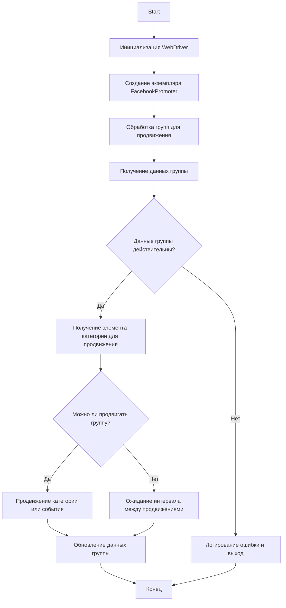

# Модуль Facebook Promoter

## Обзор

Модуль **Facebook Promoter** автоматизирует продвижение товаров и событий AliExpress в группах Facebook. Модуль обрабатывает публикацию рекламных материалов в Facebook, обеспечивая продвижение категорий и событий без дубликатов. Он использует WebDriver для автоматизации браузера, чтобы эффективно обрабатывать продвижения.

## Возможности модуля

- Продвижение категорий и событий в группы Facebook.
- Избегание дубликатов продвижения путем отслеживания ранее продвигаемых элементов.
- Поддержка конфигурации данных группы через файлы.
- Возможность отключения загрузки видео в рекламных постах.

## Требования

- **Python** 3.x
- Необходимые библиотеки:
  - `random`
  - `datetime`
  - `pathlib`
  - `urllib.parse`
  - `types.SimpleNamespace`
  - `src` (пользовательский модуль)

## Блок-схема



## Использование

### Пример использования класса FacebookPromoter

```python
from src.endpoints.advertisement.facebook.promoter import FacebookPromoter
from src.webdriver.driver import Driver
from src.utils.jjson import j_loads_ns

# Настройка экземпляра WebDriver (замените на фактический WebDriver)
d = Driver()

# Создание экземпляра FacebookPromoter
promoter = FacebookPromoter(
    d=d, 
    promoter="aliexpress", 
    group_file_paths=["path/to/group/file1.json", "path/to/group/file2.json"]
)

# Начало продвижения товаров или событий
promoter.process_groups(
    campaign_name="Campaign1",
    events=[], 
    group_categories_to_adv=["sales"],
    language="en",
    currency="USD"
)
```

## Документация класса

### Класс `FacebookPromoter`

Этот класс управляет процессом продвижения товаров и событий AliExpress в группах Facebook.

#### Методы

##### `__init__`

```python
def __init__(self, d: Driver, promoter: str, group_file_paths: Optional[list[str | Path] | str | Path] = None, no_video: bool = False) -> None:
    """
    Args:
        d (Driver): Экземпляр WebDriver для автоматизации.
        promoter (str): Название промоутера (например, "aliexpress").
        group_file_paths (Optional[list[str | Path] | str | Path], optional): Пути к файлам данных групп. По умолчанию `None`.
        no_video (bool, optional): Флаг для отключения видео в постах. По умолчанию `False`.
    """
```

Инициализирует промоутер Facebook с необходимыми настройками.

**Параметры**:

-   `d` (Driver): Экземпляр WebDriver для автоматизации.
-   `promoter` (str): Название промоутера (например, "aliexpress").
-   `group_file_paths` (Optional[list[str | Path] | str | Path], optional): Пути к файлам данных групп. По умолчанию `None`.
-   `no_video` (bool, optional): Флаг для отключения видео в постах. По умолчанию `False`.

##### `promote`

```python
def promote(self, group: SimpleNamespace, item: SimpleNamespace, is_event: bool = False, language: str = None, currency: str = None) -> bool:
    """
    Args:
        group (SimpleNamespace): Данные группы.
        item (SimpleNamespace): Элемент категории или событие для продвижения.
        is_event (bool, optional): Указывает, является ли элемент событием. По умолчанию `False`.
        language (str, optional): Язык продвижения. По умолчанию `None`.
        currency (str, optional): Валюта для продвижения. По умолчанию `None`.

    Returns:
        bool: Успешно ли прошло продвижение.
    """
```

Продвигает категорию или событие в указанной группе Facebook.

**Параметры**:

-   `group` (SimpleNamespace): Данные группы.
-   `item` (SimpleNamespace): Элемент категории или событие для продвижения.
-   `is_event` (bool, optional): Указывает, является ли элемент событием. По умолчанию `False`.
-   `language` (str, optional): Язык продвижения.
-   `currency` (str, optional): Валюта для продвижения.

**Возвращает**:

-   `bool`: Успешно ли прошло продвижение.

##### `log_promotion_error`

```python
def log_promotion_error(self, is_event: bool, item_name: str) -> None:
    """
    Args:
        is_event (bool): Указывает, является ли элемент событием.
        item_name (str): Название элемента.
    """
```

Логирует ошибку при неудачном продвижении.

**Параметры**:

-   `is_event` (bool): Указывает, является ли элемент событием.
-   `item_name` (str): Название элемента.

##### `update_group_promotion_data`

```python
def update_group_promotion_data(self, group: SimpleNamespace, item_name: str, is_event: bool = False) -> None:
    """
    Args:
        group (SimpleNamespace): Данные группы.
        item_name (str): Название продвигаемого элемента.
        is_event (bool, optional): Указывает, является ли элемент событием. По умолчанию `False`.
    """
```

Обновляет данные группы после продвижения, добавляя продвинутый элемент в список продвинутых категорий или событий.

**Параметры**:

-   `group` (SimpleNamespace): Данные группы.
-   `item_name` (str): Название продвигаемого элемента.
-   `is_event` (bool, optional): Указывает, является ли элемент событием. По умолчанию `False`.

##### `process_groups`

```python
def process_groups(self, campaign_name: str = None, events: list[SimpleNamespace] = None, is_event: bool = False, group_file_paths: list[str] = None, group_categories_to_adv: list[str] = ['sales'], language: str = None, currency: str = None) -> None:
    """
    Args:
        campaign_name (str, optional): Название кампании. По умолчанию `None`.
        events (list[SimpleNamespace], optional): Список событий для продвижения. По умолчанию `None`.
        is_event (bool, optional): Флаг для продвижения событий или категорий. По умолчанию `False`.
        group_file_paths (list[str], optional): Пути к файлам данных групп. По умолчанию `None`.
        group_categories_to_adv (list[str], optional): Категории для продвижения. По умолчанию `['sales']`.
        language (str, optional): Язык продвижения. По умолчанию `None`.
        currency (str, optional): Валюта для продвижения. По умолчанию `None`.
    """
```

Обрабатывает группы для текущей кампании или продвижения событий.

**Параметры**:

-   `campaign_name` (str, optional): Название кампании. По умолчанию `None`.
-   `events` (list[SimpleNamespace], optional): Список событий для продвижения. По умолчанию `None`.
-   `is_event` (bool, optional): Флаг для продвижения событий или категорий. По умолчанию `False`.
-   `group_file_paths` (list[str], optional): Пути к файлам данных групп. По умолчанию `None`.
-   `group_categories_to_adv` (list[str], optional): Категории для продвижения. По умолчанию `['sales']`.
-   `language` (str, optional): Язык продвижения.
-   `currency` (str, optional): Валюта для продвижения.

##### `get_category_item`

```python
def get_category_item(self, campaign_name: str, group: SimpleNamespace, language: str, currency: str) -> SimpleNamespace:
    """
    Args:
        campaign_name (str): Название кампании.
        group (SimpleNamespace): Данные группы.
        language (str): Язык для продвижения.
        currency (str): Валюта для продвижения.

    Returns:
        SimpleNamespace: Элемент категории для продвижения.
    """
```

Получает элемент категории для продвижения на основе кампании и промоутера.

**Параметры**:

-   `campaign_name` (str): Название кампании.
-   `group` (SimpleNamespace): Данные группы.
-   `language` (str): Язык для продвижения.
-   `currency` (str): Валюта для продвижения.

**Возвращает**:

-   `SimpleNamespace`: Элемент категории для продвижения.

##### `check_interval`

```python
def check_interval(self, group: SimpleNamespace) -> bool:
    """
    Args:
        group (SimpleNamespace): Данные группы.

    Returns:
        bool: Подходит ли группа для продвижения.
    """
```

Проверяет, прошло ли достаточно времени для повторного продвижения этой группы.

**Параметры**:

-   `group` (SimpleNamespace): Данные группы.

**Возвращает**:

-   `bool`: Подходит ли группа для продвижения.

##### `validate_group`

```python
def validate_group(self, group: SimpleNamespace) -> bool:
    """
    Args:
        group (SimpleNamespace): Данные группы.

    Returns:
        bool: Действительны ли данные группы.
    """
```

Проверяет данные группы, чтобы убедиться, что у них есть необходимые атрибуты.

**Параметры**:

-   `group` (SimpleNamespace): Данные группы.

**Возвращает**:

-   `bool`: Действительны ли данные группы.

## Лицензия

Этот модуль является частью более крупного пакета **Facebook Promoter** и лицензирован по лицензии MIT.