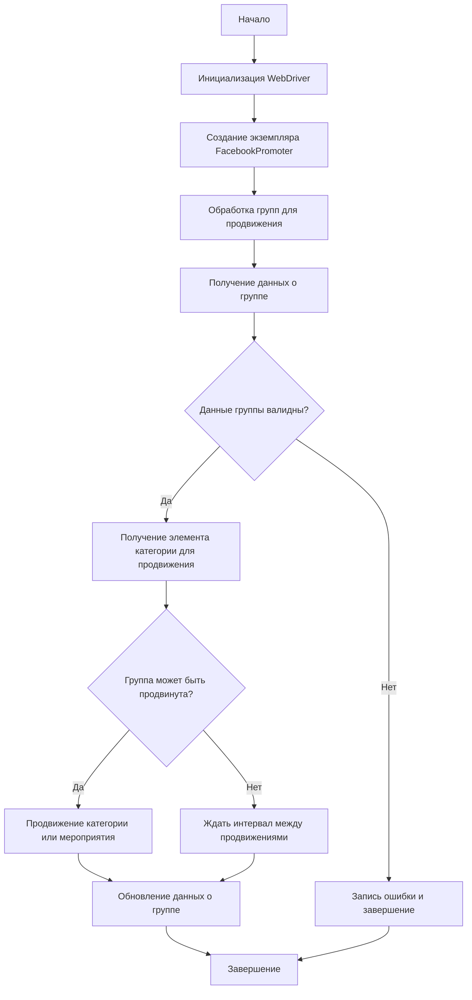

# Модуль Facebook Promoter

## Обзор

Модуль **Facebook Promoter** предназначен для автоматизации процесса продвижения товаров и мероприятий AliExpress в группах Facebook. Он управляет публикациями рекламных материалов, предотвращая их дублирование. Для автоматизации работы с веб-интерфейсом Facebook используется WebDriver.

## Подробнее

Модуль обеспечивает продвижение как отдельных категорий товаров, так и различных мероприятий в группах Facebook. Для избежания повторных публикаций модуль ведет учет уже опубликованных элементов. Настройки групп хранятся в отдельных файлах конфигурации. Также предусмотрена возможность отключения загрузки видео в рекламных публикациях.

## Классы

### `FacebookPromoter`

**Описание**: Класс `FacebookPromoter` управляет процессом продвижения товаров и мероприятий AliExpress в группах Facebook.

**Принцип работы**:

1.  Инициализируется WebDriver для управления браузером.
2.  Создается экземпляр класса `FacebookPromoter` с необходимыми параметрами, такими как WebDriver, имя промоутера и пути к файлам с данными групп.
3.  Вызывается метод `process_groups` для начала продвижения товаров или мероприятий.
4.  Внутри `process_groups` происходит итерация по группам, получение данных о группе, проверка возможности продвижения и, если возможно, продвижение категории или мероприятия.
5.  После успешного продвижения данные группы обновляются.



**Методы**:

*   `__init__(self, d: Driver, promoter: str, group_file_paths: Optional[list[str | Path] | str | Path] = None, no_video: bool = False)`: Инициализирует промоутер для Facebook с необходимыми конфигурациями.
*   `promote(self, group: SimpleNamespace, item: SimpleNamespace, is_event: bool = False, language: str = None, currency: str = None) -> bool`: Продвигает категорию или мероприятие в указанной группе Facebook.
*   `log_promotion_error(self, is_event: bool, item_name: str)`: Записывает ошибку, если продвижение не удалось.
*   `update_group_promotion_data(self, group: SimpleNamespace, item_name: str, is_event: bool = False)`: Обновляет данные группы после продвижения, добавляя продвигаемый элемент в список продвигаемых категорий или мероприятий.
*   `process_groups(self, campaign_name: str = None, events: list[SimpleNamespace] = None, is_event: bool = False, group_file_paths: list[str] = None, group_categories_to_adv: list[str] = ['sales'], language: str = None, currency: str = None)`: Обрабатывает группы для текущей кампании или продвижения мероприятия.
*   `get_category_item(self, campaign_name: str, group: SimpleNamespace, language: str, currency: str) -> SimpleNamespace`: Получает элемент категории для продвижения в зависимости от кампании и промоутера.
*   `check_interval(self, group: SimpleNamespace) -> bool`: Проверяет, прошло ли достаточно времени, чтобы снова продвигать эту группу.
*   `validate_group(self, group: SimpleNamespace) -> bool`: Проверяет данные группы, чтобы убедиться в их корректности.

#### `__init__`

```python
def __init__(self, d: Driver, promoter: str, group_file_paths: Optional[list[str | Path] | str | Path] = None, no_video: bool = False):
    """
    Инициализирует промоутер для Facebook с необходимыми конфигурациями.

    Args:
        d (Driver): Экземпляр WebDriver для автоматизации.
        promoter (str): Имя промоутера (например, "aliexpress").
        group_file_paths (Optional[list[str | Path] | str | Path]): Пути к файлам с данными групп.
        no_video (bool): Флаг для отключения видео в публикациях. По умолчанию `False`.
    """
    ...
```

**Назначение**: Инициализация экземпляра класса `FacebookPromoter`.

**Параметры**:

*   `d` (Driver): Экземпляр WebDriver, используемый для автоматизации действий в браузере.
*   `promoter` (str): Имя промоутера, например, `"aliexpress"`.
*   `group_file_paths` (Optional[list[str | Path] | str | Path]): Список путей к файлам, содержащим данные о группах Facebook, или путь к одному такому файлу. Может быть `None`.
*   `no_video` (bool): Флаг, указывающий, нужно ли отключать загрузку видео в публикациях. По умолчанию `False`.

**Как работает функция**:

1.  Сохраняет переданные аргументы в атрибуты экземпляра класса для дальнейшего использования.
2.  Если `group_file_paths` не является `None`, вызывает метод `self.load_groups()` для загрузки данных о группах из указанных файлов.
3.  Устанавливает флаг `self.no_video` в соответствии с переданным значением `no_video`.

**Примеры**:

```python
from src.webdriver.driver import Driver
from pathlib import Path

# Пример 1: Инициализация с указанием пути к файлу с данными групп
driver = Driver()
promoter = FacebookPromoter(d=driver, promoter="aliexpress", group_file_paths="groups.json")

# Пример 2: Инициализация с указанием списка путей к файлам с данными групп
group_files = [Path("groups1.json"), Path("groups2.json")]
promoter = FacebookPromoter(d=driver, promoter="aliexpress", group_file_paths=group_files, no_video=True)

# Пример 3: Инициализация без указания путей к файлам с данными групп
promoter = FacebookPromoter(d=driver, promoter="aliexpress")
```

#### `promote`

```python
def promote(self, group: SimpleNamespace, item: SimpleNamespace, is_event: bool = False, language: str = None, currency: str = None) -> bool:
    """
    Продвигает категорию или мероприятие в указанной группе Facebook.

    Args:
        group (SimpleNamespace): Данные группы.
        item (SimpleNamespace): Категория или мероприятие для продвижения.
        is_event (bool): Является ли элемент мероприятием.
        language (str): Язык публикации.
        currency (str): Валюта для продвижения.

    Returns:
        bool: Успешно ли прошло продвижение.
    """
    ...
```

**Назначение**: Осуществляет продвижение категории или мероприятия в заданной группе Facebook.

**Параметры**:

*   `group` (SimpleNamespace): Объект, содержащий данные о группе Facebook, в которой будет осуществляться продвижение.
*   `item` (SimpleNamespace): Объект, представляющий категорию товара или мероприятие, которое нужно продвигать.
*   `is_event` (bool): Флаг, указывающий, является ли продвигаемый элемент мероприятием. По умолчанию `False`.
*   `language` (str): Язык, на котором будет опубликована рекламная запись. Если `None`, используется язык по умолчанию.
*   `currency` (str): Валюта, используемая в рекламной записи. Если `None`, используется валюта по умолчанию.

**Возвращает**:

*   `bool`: `True`, если продвижение прошло успешно, и `False` в противном случае.

**Как работает функция**:

1.  Формирует URL для публикации в Facebook на основе данных группы и продвигаемого элемента.
2.  Выполняет действия по продвижению, используя WebDriver для автоматизации действий в браузере.
3.  Обрабатывает возможные исключения, возникающие в процессе продвижения, и логирует ошибки.
4.  Возвращает `True`, если продвижение выполнено успешно, и `False` в случае ошибки.

**Примеры**:

```python
from types import SimpleNamespace
from src.webdriver.driver import Driver

# Пример: Продвижение категории в группе
driver = Driver()
promoter = FacebookPromoter(d=driver, promoter="aliexpress")
group_data = SimpleNamespace(url="https://www.facebook.com/groups/testgroup", last_adv_time="2024-01-01", adv_categories=[])
item_data = SimpleNamespace(name="Test Category", url="https://aliexpress.com/category/test")
success = promoter.promote(group=group_data, item=item_data, language="en", currency="USD")
print(f"Promotion successful: {success}")

# Пример: Продвижение мероприятия в группе
event_data = SimpleNamespace(name="Test Event", url="https://aliexpress.com/event/test")
success = promoter.promote(group=group_data, item=event_data, is_event=True, language="en", currency="EUR")
print(f"Promotion successful: {success}")
```

#### `log_promotion_error`

```python
def log_promotion_error(self, is_event: bool, item_name: str):
    """
    Записывает ошибку, если продвижение не удалось.

    Args:
        is_event (bool): Является ли элемент мероприятием.
        item_name (str): Название элемента.
    """
    ...
```

**Назначение**: Записывает информацию об ошибке продвижения в лог.

**Параметры**:

*   `is_event` (bool): Указывает, является ли продвигаемый элемент мероприятием (`True`) или категорией (`False`).
*   `item_name` (str): Название элемента (мероприятия или категории), для которого не удалось выполнить продвижение.

**Как работает функция**:

1.  Формирует сообщение об ошибке, включающее тип элемента (мероприятие или категория) и его название.
2.  Записывает сформированное сообщение в лог с использованием `logger.error`.

**Примеры**:

```python
from src.webdriver.driver import Driver

# Пример 1: Логирование ошибки продвижения категории
driver = Driver()
promoter = FacebookPromoter(d=driver, promoter="aliexpress")
promoter.log_promotion_error(is_event=False, item_name="Summer Sales")

# Пример 2: Логирование ошибки продвижения мероприятия
promoter.log_promotion_error(is_event=True, item_name="Black Friday Event")
```

#### `update_group_promotion_data`

```python
def update_group_promotion_data(self, group: SimpleNamespace, item_name: str, is_event: bool = False):
    """
    Обновляет данные группы после продвижения, добавляя продвигаемый элемент в список продвигаемых категорий или мероприятий.

    Args:
        group (SimpleNamespace): Данные группы.
        item_name (str): Название продвигаемого элемента.
        is_event (bool): Является ли элемент мероприятием.
    """
    ...
```

**Назначение**: Обновляет информацию о группе после успешного продвижения, добавляя название продвигаемого элемента в список продвинутых категорий или мероприятий.

**Параметры**:

*   `group` (SimpleNamespace): Объект, содержащий данные о группе Facebook.
*   `item_name` (str): Название продвинутого элемента (категории или мероприятия).
*   `is_event` (bool): Флаг, указывающий, является ли продвинутый элемент мероприятием (`True`) или категорией (`False`). По умолчанию `False`.

**Как работает функция**:

1.  В зависимости от значения `is_event`, добавляет название продвинутого элемента в список `adv_events` (если это мероприятие) или `adv_categories` (если это категория) в данных группы.
2.  Обновляет время последнего продвижения (`last_adv_time`) в данных группы текущей датой и временем.

**Примеры**:

```python
from types import SimpleNamespace
from datetime import datetime
from src.webdriver.driver import Driver

# Пример 1: Обновление данных группы после продвижения категории
driver = Driver()
promoter = FacebookPromoter(d=driver, promoter="aliexpress")
group_data = SimpleNamespace(url="https://www.facebook.com/groups/testgroup", last_adv_time="2024-01-01", adv_categories=[], adv_events=[])
promoter.update_group_promotion_data(group=group_data, item_name="Summer Sales", is_event=False)
print(f"Updated group data: {group_data}")

# Пример 2: Обновление данных группы после продвижения мероприятия
promoter.update_group_promotion_data(group=group_data, item_name="Black Friday Event", is_event=True)
print(f"Updated group data: {group_data}")
```

#### `process_groups`

```python
def process_groups(self, campaign_name: str = None, events: list[SimpleNamespace] = None, is_event: bool = False, group_file_paths: list[str] = None, group_categories_to_adv: list[str] = ['sales'], language: str = None, currency: str = None):
    """
    Обрабатывает группы для текущей кампании или продвижения мероприятия.

    Args:
        campaign_name (str): Название кампании.
        events (list[SimpleNamespace]): Список мероприятий для продвижения.
        is_event (bool): Является ли продвижение мероприятий или категорий.
        group_file_paths (list[str]): Пути к файлам с данными групп.
        group_categories_to_adv (list[str]): Категории для продвижения.
        language (str): Язык публикации.
        currency (str): Валюта для продвижения.
    """
    ...
```

**Назначение**: Метод обрабатывает список групп Facebook для продвижения товаров или мероприятий.

**Параметры**:

*   `campaign_name` (str): Название рекламной кампании. Используется для получения элементов категорий для продвижения.
*   `events` (list[SimpleNamespace]): Список объектов `SimpleNamespace`, представляющих мероприятия для продвижения. Используется, когда `is_event` установлен в `True`.
*   `is_event` (bool): Флаг, указывающий, нужно ли продвигать мероприятия (`True`) или категории товаров (`False`). По умолчанию `False`.
*   `group_file_paths` (list[str]): Список путей к файлам, содержащим данные о группах Facebook. Если указан, данные групп будут загружены из этих файлов.
*   `group_categories_to_adv` (list[str]): Список категорий товаров для продвижения. Используется, когда `is_event` установлен в `False`. По умолчанию `['sales']`.
*   `language` (str): Язык, на котором будет производиться продвижение.
*   `currency` (str): Валюта, которая будет использоваться при продвижении.

**Как работает функция**:

1.  Загружает данные о группах из файлов, указанных в `group_file_paths`, если они предоставлены.
2.  Итерируется по списку групп.
3.  Для каждой группы проверяет, является ли она валидной и можно ли ее продвигать в данный момент времени.
4.  В зависимости от значения `is_event`, либо продвигает мероприятия из списка `events`, либо получает элементы категорий для продвижения с использованием метода `self.get_category_item`.
5.  Вызывает метод `self.promote` для фактического продвижения элемента в группе.
6.  В случае успеха обновляет данные о продвижении группы с использованием метода `self.update_group_promotion_data`.
7.  В случае ошибки логирует информацию об ошибке с использованием метода `self.log_promotion_error`.

**Примеры**:

```python
from types import SimpleNamespace
from src.webdriver.driver import Driver

# Пример 1: Продвижение категорий товаров в группах
driver = Driver()
promoter = FacebookPromoter(d=driver, promoter="aliexpress", group_file_paths=["groups.json"])
promoter.process_groups(campaign_name="Summer Sales", group_categories_to_adv=["sales", "deals"], language="en", currency="USD")

# Пример 2: Продвижение мероприятий в группах
event1 = SimpleNamespace(name="Black Friday", url="https://example.com/blackfriday")
event2 = SimpleNamespace(name="Cyber Monday", url="https://example.com/cybermonday")
promoter.process_groups(events=[event1, event2], is_event=True, language="en", currency="EUR")

# Пример 3: Продвижение с указанием конкретных файлов групп
promoter.process_groups(campaign_name="Winter Sales", group_file_paths=["groups1.json", "groups2.json"], language="fr", currency="CAD")
```

#### `get_category_item`

```python
def get_category_item(self, campaign_name: str, group: SimpleNamespace, language: str, currency: str) -> SimpleNamespace:
    """
    Получает элемент категории для продвижения в зависимости от кампании и промоутера.

    Args:
        campaign_name (str): Название кампании.
        group (SimpleNamespace): Данные группы.
        language (str): Язык для публикации.
        currency (str): Валюта для публикации.

    Returns:
        SimpleNamespace: Элемент категории для продвижения.
    """
    ...
```

**Назначение**: Получает элемент категории для продвижения в зависимости от названия кампании, данных группы, языка и валюты.

**Параметры**:

*   `campaign_name` (str): Название кампании, для которой требуется получить элемент категории.
*   `group` (SimpleNamespace): Объект, содержащий данные о группе Facebook, в которой будет производиться продвижение.
*   `language` (str): Язык, на котором будет опубликована информация о продвигаемом элементе.
*   `currency` (str): Валюта, в которой будет указана цена продвигаемого элемента.

**Возвращает**:

*   `SimpleNamespace`: Объект `SimpleNamespace`, представляющий элемент категории для продвижения. Если элемент не найден, возвращает `None`.

**Как работает функция**:

1.  Формирует запрос к API для получения элемента категории на основе переданных параметров.
2.  Выполняет HTTP-запрос к API и обрабатывает полученный ответ.
3.  Если запрос успешен и элемент категории найден, создает объект `SimpleNamespace` с данными элемента и возвращает его.
4.  В случае ошибки или отсутствия элемента возвращает `None`.

**Примеры**:

```python
from types import SimpleNamespace
from src.webdriver.driver import Driver

# Пример: Получение элемента категории для продвижения
driver = Driver()
promoter = FacebookPromoter(d=driver, promoter="aliexpress")
group_data = SimpleNamespace(url="https://www.facebook.com/groups/testgroup", last_adv_time="2024-01-01", adv_categories=[])
category_item = promoter.get_category_item(campaign_name="Summer Sales", group=group_data, language="en", currency="USD")
if category_item:
    print(f"Category item: {category_item}")
else:
    print("Category item not found")

# Пример: Получение элемента категории для другой кампании
category_item = promoter.get_category_item(campaign_name="Winter Deals", group=group_data, language="fr", currency="EUR")
if category_item:
    print(f"Category item: {category_item}")
else:
    print("Category item not found")
```

#### `check_interval`

```python
def check_interval(self, group: SimpleNamespace) -> bool:
    """
    Проверяет, прошло ли достаточно времени, чтобы снова продвигать эту группу.

    Args:
        group (SimpleNamespace): Данные группы.

    Returns:
        bool: Можно ли снова продвигать группу.
    """
    ...
```

**Назначение**: Проверяет, прошло ли достаточно времени с момента последнего продвижения в указанной группе, чтобы можно было снова выполнять продвижение.

**Параметры**:

*   `group` (SimpleNamespace): Объект, содержащий данные о группе Facebook, включая время последнего продвижения (`last_adv_time`).

**Возвращает**:

*   `bool`: `True`, если прошло достаточно времени с момента последнего продвижения и группу можно продвигать снова, и `False` в противном случае.

**Как работает функция**:

1.  Получает время последнего продвижения из данных группы (`group.last_adv_time`).
2.  Вычисляет разницу во времени между текущим моментом и временем последнего продвижения.
3.  Сравнивает вычисленную разницу с заданным интервалом между продвижениями (например, 24 часа).
4.  Возвращает `True`, если разница во времени больше или равна заданному интервалу, и `False` в противном случае.

**Примеры**:

```python
from types import SimpleNamespace
from datetime import datetime, timedelta
from src.webdriver.driver import Driver

# Пример 1: Проверка интервала для группы, которую давно не продвигали
driver = Driver()
promoter = FacebookPromoter(d=driver, promoter="aliexpress")
group_data = SimpleNamespace(url="https://www.facebook.com/groups/testgroup", last_adv_time=datetime.now() - timedelta(days=2), adv_categories=[])
can_promote = promoter.check_interval(group=group_data)
print(f"Can promote: {can_promote}")

# Пример 2: Проверка интервала для группы, которую недавно продвигали
group_data = SimpleNamespace(url="https://www.facebook.com/groups/testgroup", last_adv_time=datetime.now() - timedelta(hours=12), adv_categories=[])
can_promote = promoter.check_interval(group=group_data)
print(f"Can promote: {can_promote}")
```

#### `validate_group`

```python
def validate_group(self, group: SimpleNamespace) -> bool:
    """
    Проверяет данные группы, чтобы убедиться в их корректности.

    Args:
        group (SimpleNamespace): Данные группы.

    Returns:
        bool: Корректны ли данные группы.
    """
    ...
```

**Назначение**: Проверяет, являются ли данные группы Facebook корректными и пригодными для использования в процессе продвижения.

**Параметры**:

*   `group` (SimpleNamespace): Объект, содержащий данные о группе Facebook, которые необходимо проверить.

**Возвращает**:

*   `bool`: `True`, если данные группы корректны и могут быть использованы для продвижения, и `False` в противном случае.

**Как работает функция**:

1.  Проверяет наличие обязательных полей в данных группы, таких как `url` (URL группы) и `last_adv_time` (время последнего продвижения).
2.  Проверяет формат и допустимость значений в этих полях.
3.  Если все проверки пройдены успешно, возвращает `True`. В противном случае возвращает `False`.

**Примеры**:

```python
from types import SimpleNamespace
from datetime import datetime
from src.webdriver.driver import Driver

# Пример 1: Проверка валидных данных группы
driver = Driver()
promoter = FacebookPromoter(d=driver, promoter="aliexpress")
group_data = SimpleNamespace(url="https://www.facebook.com/groups/testgroup", last_adv_time=datetime.now(), adv_categories=[])
is_valid = promoter.validate_group(group=group_data)
print(f"Is valid: {is_valid}")

# Пример 2: Проверка невалидных данных группы (отсутствует URL)
group_data = SimpleNamespace(last_adv_time=datetime.now(), adv_categories=[])
is_valid = promoter.validate_group(group=group_data)
print(f"Is valid: {is_valid}")

# Пример 3: Проверка невалидных данных группы (некорректный формат времени)
group_data = SimpleNamespace(url="https://www.facebook.com/groups/testgroup", last_adv_time="invalid_date", adv_categories=[])
is_valid = promoter.validate_group(group=group_data)
print(f"Is valid: {is_valid}")
```

## Лицензия

Модуль является частью пакета **Facebook Promoter** и лицензируется по лицензии MIT.