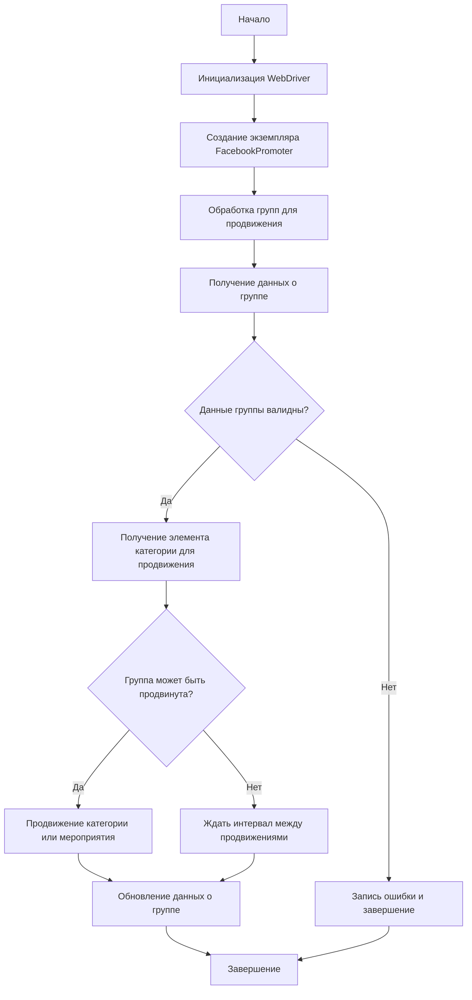

# Документация модуля Facebook Promoter

## Обзор

Модуль **Facebook Promoter** автоматизирует продвижение товаров и мероприятий AliExpress в группах Facebook. Модуль управляет публикациями рекламных материалов на Facebook, избегая дублирования. Для эффективного продвижения используется WebDriver для автоматизации браузера.

## Особенности модуля

- Продвижение категорий и мероприятий в группах Facebook.
- Избежание дублирования публикаций через отслеживание уже опубликованных элементов.
- Поддержка конфигурации данных групп через файлы.
- Возможность отключения загрузки видео в публикациях.

## Требования

- **Python** 3.x
- Необходимые библиотеки:
  - `random`
  - `datetime`
  - `pathlib`
  - `urllib.parse`
  - `types.SimpleNamespace`
  - `src` (пользовательский модуль)

## Содержание

1.  [Использование](#Использование)
2.  [Документация классов](#Документация-классов)
    *   [Класс `FacebookPromoter`](#Класс-FacebookPromoter)
        *   [Метод `__init__`](#Метод-__init__)
        *   [Метод `promote`](#Метод-promote)
        *   [Метод `log_promotion_error`](#Метод-log_promotion_error)
        *   [Метод `update_group_promotion_data`](#Метод-update_group_promotion_data)
        *   [Метод `process_groups`](#Метод-process_groups)
        *   [Метод `get_category_item`](#Метод-get_category_item)
        *   [Метод `check_interval`](#Метод-check_interval)
        *   [Метод `validate_group`](#Метод-validate_group)
3.  [Лицензия](#Лицензия)

## Использование

### Пример использования класса FacebookPromoter

```python
from src.endpoints.advertisement.facebook.promoter import FacebookPromoter
from src.webdriver.driver import Driver
from src.utils.jjson import j_loads_ns

# Настройка экземпляра WebDriver (замените на реальный WebDriver)
d = Driver()

# Создание экземпляра FacebookPromoter
promoter = FacebookPromoter(
    d=d,
    promoter="aliexpress",
    group_file_paths=["path/to/group/file1.json", "path/to/group/file2.json"]
)

# Начало продвижения товаров или мероприятий
promoter.process_groups(
    campaign_name="Campaign1",
    events=[],
    group_categories_to_adv=["sales"],
    language="en",
    currency="USD"
)
```

## Документация классов

### Класс `FacebookPromoter`

**Описание**: Этот класс управляет процессом продвижения товаров и мероприятий AliExpress в группах Facebook.



#### Метод `__init__`

```python
def __init__(self, d: Driver, promoter: str, group_file_paths: Optional[list[str | Path] | str | Path] = None, no_video: bool = False):
    """
    Args:
        d (Driver): Экземпляр WebDriver для автоматизации.
        promoter (str): Имя промоутера (например, "aliexpress").
        group_file_paths (Optional[list[str | Path] | str | Path], optional): Пути к файлам с данными групп.
        no_video (bool, optional): Флаг для отключения видео в публикациях. По умолчанию False.

    Returns:
        None

    Raises:
        Exception: Описание ситуации, в которой возникает исключение.
    """
    ...
```

**Описание**: Инициализирует промоутер для Facebook с необходимыми конфигурациями.

**Параметры**:

- `d` (Driver): Экземпляр WebDriver для автоматизации.
- `promoter` (str): Имя промоутера (например, "aliexpress").
- `group_file_paths` (Optional[list[str | Path] | str | Path], optional): Пути к файлам с данными групп.
- `no_video` (bool, optional): Флаг для отключения видео в публикациях. По умолчанию `False`.

#### Метод `promote`

```python
def promote(self, group: SimpleNamespace, item: SimpleNamespace, is_event: bool = False, language: str = None, currency: str = None) -> bool:
    """
    Args:
        group (SimpleNamespace): Данные группы.
        item (SimpleNamespace): Категория или мероприятие для продвижения.
        is_event (bool, optional): Является ли элемент мероприятием.
        language (str, optional): Язык публикации.
        currency (str, optional): Валюта для продвижения.

    Returns:
        bool: Успешно ли прошло продвижение.

    Raises:
        Exception: Описание ситуации, в которой возникает исключение.
    """
    ...
```

**Описание**: Продвигает категорию или мероприятие в указанной группе Facebook.

**Параметры**:

- `group` (SimpleNamespace): Данные группы.
- `item` (SimpleNamespace): Категория или мероприятие для продвижения.
- `is_event` (bool, optional): Является ли элемент мероприятием.
- `language` (str, optional): Язык публикации.
- `currency` (str, optional): Валюта для продвижения.

**Возвращает**:

- `bool`: Успешно ли прошло продвижение.

#### Метод `log_promotion_error`

```python
def log_promotion_error(self, is_event: bool, item_name: str):
    """
    Args:
        is_event (bool): Является ли элемент мероприятием.
        item_name (str): Название элемента.

    Returns:
        None

    Raises:
        Exception: Описание ситуации, в которой возникает исключение.
    """
    ...
```

**Описание**: Записывает ошибку, если продвижение не удалось.

**Параметры**:

- `is_event` (bool): Является ли элемент мероприятием.
- `item_name` (str): Название элемента.

#### Метод `update_group_promotion_data`

```python
def update_group_promotion_data(self, group: SimpleNamespace, item_name: str, is_event: bool = False):
    """
    Args:
        group (SimpleNamespace): Данные группы.
        item_name (str): Название продвигаемого элемента.
        is_event (bool, optional): Является ли элемент мероприятием.

    Returns:
        None

    Raises:
        Exception: Описание ситуации, в которой возникает исключение.
    """
    ...
```

**Описание**: Обновляет данные группы после продвижения, добавляя продвигаемый элемент в список продвигаемых категорий или мероприятий.

**Параметры**:

- `group` (SimpleNamespace): Данные группы.
- `item_name` (str): Название продвигаемого элемента.
- `is_event` (bool, optional): Является ли элемент мероприятием.

#### Метод `process_groups`

```python
def process_groups(self, campaign_name: str = None, events: list[SimpleNamespace] = None, is_event: bool = False, group_file_paths: list[str] = None, group_categories_to_adv: list[str] = ['sales'], language: str = None, currency: str = None):
    """
    Args:
        campaign_name (str, optional): Название кампании.
        events (list[SimpleNamespace], optional): Список мероприятий для продвижения.
        is_event (bool, optional): Является ли продвижение мероприятий или категорий.
        group_file_paths (list[str], optional): Пути к файлам с данными групп.
        group_categories_to_adv (list[str], optional): Категории для продвижения.
        language (str, optional): Язык публикации.
        currency (str, optional): Валюта для продвижения.

    Returns:
        None

    Raises:
        Exception: Описание ситуации, в которой возникает исключение.
    """
    ...
```

**Описание**: Обрабатывает группы для текущей кампании или продвижения мероприятия.

**Параметры**:

- `campaign_name` (str, optional): Название кампании.
- `events` (list[SimpleNamespace], optional): Список мероприятий для продвижения.
- `is_event` (bool, optional): Является ли продвижение мероприятий или категорий.
- `group_file_paths` (list[str], optional): Пути к файлам с данными групп.
- `group_categories_to_adv` (list[str], optional): Категории для продвижения.
- `language` (str, optional): Язык публикации.
- `currency` (str, optional): Валюта для продвижения.

#### Метод `get_category_item`

```python
def get_category_item(self, campaign_name: str, group: SimpleNamespace, language: str, currency: str) -> SimpleNamespace:
    """
    Args:
        campaign_name (str): Название кампании.
        group (SimpleNamespace): Данные группы.
        language (str): Язык для публикации.
        currency (str): Валюта для публикации.

    Returns:
        SimpleNamespace: Элемент категории для продвижения.

    Raises:
        Exception: Описание ситуации, в которой возникает исключение.
    """
    ...
```

**Описание**: Получает элемент категории для продвижения в зависимости от кампании и промоутера.

**Параметры**:

- `campaign_name` (str): Название кампании.
- `group` (SimpleNamespace): Данные группы.
- `language` (str): Язык для публикации.
- `currency` (str): Валюта для публикации.

**Возвращает**:

- `SimpleNamespace`: Элемент категории для продвижения.

#### Метод `check_interval`

```python
def check_interval(self, group: SimpleNamespace) -> bool:
    """
    Args:
        group (SimpleNamespace): Данные группы.

    Returns:
        bool: Можно ли снова продвигать группу.

    Raises:
        Exception: Описание ситуации, в которой возникает исключение.
    """
    ...
```

**Описание**: Проверяет, прошло ли достаточно времени, чтобы снова продвигать эту группу.

**Параметры**:

- `group` (SimpleNamespace): Данные группы.

**Возвращает**:

- `bool`: Можно ли снова продвигать группу.

#### Метод `validate_group`

```python
def validate_group(self, group: SimpleNamespace) -> bool:
    """
    Args:
        group (SimpleNamespace): Данные группы.

    Returns:
        bool: Корректны ли данные группы.

    Raises:
        Exception: Описание ситуации, в которой возникает исключение.
    """
    ...
```

**Описание**: Проверяет данные группы, чтобы убедиться в их корректности.

**Параметры**:

- `group` (SimpleNamespace): Данные группы.

**Возвращает**:

- `bool`: Корректны ли данные группы.

## Лицензия

Модуль является частью пакета **Facebook Promoter** и лицензируется по лицензии MIT.