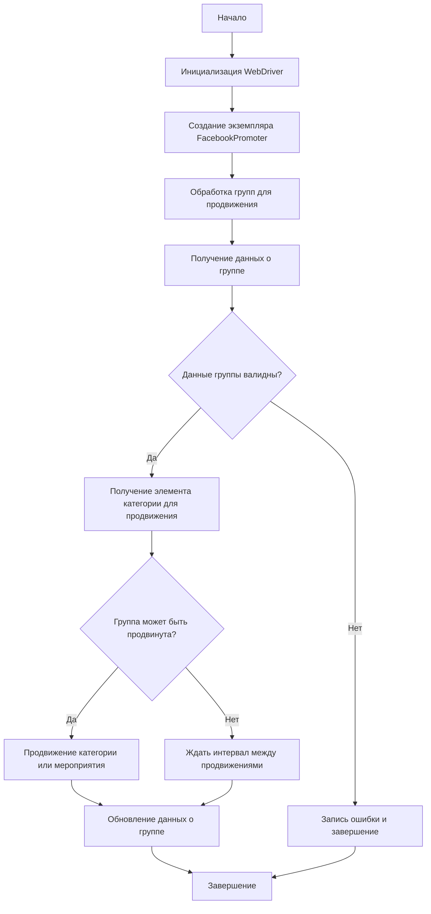

# Модуль Facebook Promoter

## Обзор

Модуль **Facebook Promoter** автоматизирует процесс продвижения товаров и мероприятий AliExpress в группах Facebook. Он управляет публикацией рекламных материалов, отслеживает уже опубликованные элементы, чтобы избежать дублирования контента. В модуле используется WebDriver для автоматизации работы браузера.

## Подробнее

Этот модуль предназначен для автоматизации маркетинговых кампаний в Facebook, особенно для продавцов AliExpress. Он позволяет продвигать товары и мероприятия, публиковать контент в различных группах Facebook и контролировать, чтобы не было повторных публикаций. Модуль поддерживает конфигурацию через JSON-файлы, что упрощает управление группами и параметрами продвижения.

## Классы

### `FacebookPromoter`

**Описание**: Класс `FacebookPromoter` управляет процессом продвижения товаров и мероприятий AliExpress в группах Facebook.

**Принцип работы**:
1.  Инициализирует WebDriver для управления браузером.
2.  Настраивает параметры промоутера, включая данные групп из файлов конфигурации.
3.  Определяет, какие категории или мероприятия нужно продвигать.
4.  Публикует контент в группах Facebook, избегая дублирования.
5.  Обновляет данные о группах после продвижения.
6.  Обрабатывает ошибки и ведет логи.



**Методы**:

-   `__init__`: Инициализирует класс `FacebookPromoter`.
-   `promote`: Продвигает элемент (категорию или мероприятие) в группе Facebook.
-   `log_promotion_error`: Записывает информацию об ошибке продвижения.
-   `update_group_promotion_data`: Обновляет данные о группе после успешного продвижения.
-   `process_groups`: Обрабатывает группы для продвижения.
-   `get_category_item`: Получает элемент категории для продвижения.
-   `check_interval`: Проверяет, прошло ли достаточно времени для повторного продвижения в группе.
-   `validate_group`: Проверяет корректность данных группы.

#### `__init__(self, d: Driver, promoter: str, group_file_paths: Optional[list[str | Path] | str | Path] = None, no_video: bool = False)`

```python
def __init__(self, d: Driver, promoter: str, group_file_paths: Optional[list[str | Path] | str | Path] = None, no_video: bool = False) -> None:
    """
    Инициализирует промоутер для Facebook с необходимыми конфигурациями.

    Args:
        d (Driver): Экземпляр WebDriver для автоматизации.
        promoter (str): Имя промоутера (например, "aliexpress").
        group_file_paths (Optional[list[str | Path] | str | Path], optional): Пути к файлам с данными групп. По умолчанию None.
        no_video (bool): Флаг для отключения видео в публикациях. По умолчанию False.
    """
```

**Назначение**: Инициализирует экземпляр класса `FacebookPromoter` с переданными параметрами.

**Параметры**:

-   `d` (Driver): Экземпляр WebDriver, используемый для управления браузером и автоматизации действий на Facebook.
-   `promoter` (str): Имя промоутера (например, "aliexpress"), которое может использоваться для идентификации источника продвигаемого контента.
-   `group_file_paths` (Optional[list[str | Path] | str | Path], optional): Путь или список путей к файлам, содержащим данные о группах Facebook, в которых будет осуществляться продвижение. По умолчанию `None`.
-   `no_video` (bool): Флаг, указывающий, следует ли отключать загрузку видео в публикациях. Если `True`, видео не будут загружаться. По умолчанию `False`.

**Как работает функция**:

1.  Инициализирует атрибуты экземпляра класса `FacebookPromoter` переданными значениями, такими как драйвер веб-браузера (`d`), имя промоутера (`promoter`), пути к файлам групп (`group_file_paths`) и флаг отключения видео (`no_video`).
2.  Если `group_file_paths` указан, загружает данные групп из указанных файлов, используя утилиту `j_loads_ns`.
3.  Если `group_file_paths` является строкой, загружает данные из одного файла. Если это список, загружает данные из каждого файла в списке.
4.  Записывает информацию об успешной инициализации в лог.

**Примеры**:

```python
from src.webdriver.driver import Driver
from pathlib import Path

# Инициализация с указанием драйвера и имени промоутера
driver = Driver()
promoter = FacebookPromoter(d=driver, promoter="aliexpress")

# Инициализация с указанием нескольких файлов групп
group_files = [Path("groups1.json"), Path("groups2.json")]
promoter = FacebookPromoter(d=driver, promoter="aliexpress", group_file_paths=group_files)

# Инициализация с отключением видео
promoter = FacebookPromoter(d=driver, promoter="aliexpress", no_video=True)
```

#### `promote(self, group: SimpleNamespace, item: SimpleNamespace, is_event: bool = False, language: str = None, currency: str = None) -> bool`

```python
def promote(self, group: SimpleNamespace, item: SimpleNamespace, is_event: bool = False, language: str = None, currency: str = None) -> bool:
    """
    Продвигает категорию или мероприятие в указанной группе Facebook.

    Args:
        group (SimpleNamespace): Данные группы.
        item (SimpleNamespace): Категория или мероприятие для продвижения.
        is_event (bool): Является ли элемент мероприятием.
        language (str): Язык публикации.
        currency (str): Валюта для продвижения.

    Returns:
        bool: Успешно ли прошло продвижение.
    """
```

**Назначение**: Продвигает категорию или мероприятие в указанной группе Facebook.

**Параметры**:

-   `group` (SimpleNamespace): Данные группы Facebook, в которой будет осуществляться продвижение.
-   `item` (SimpleNamespace): Данные о категории или мероприятии, которые нужно продвигать.
-   `is_event` (bool, optional): Флаг, указывающий, является ли продвигаемый элемент мероприятием. По умолчанию `False`.
-   `language` (str, optional): Язык, на котором будет опубликовано продвижение. По умолчанию `None`.
-   `currency` (str, optional): Валюта, используемая в продвижении. По умолчанию `None`.

**Возвращает**:

-   `bool`: `True`, если продвижение прошло успешно, и `False` в противном случае.

**Как работает функция**:

1.  Формирует сообщение для публикации на Facebook, используя данные группы, элемента и флаги `is_event`, `language` и `currency`.
2.  Выполняет действия по публикации сообщения в группе Facebook, используя WebDriver.
3.  Обрабатывает возможные исключения, такие как ошибки при выполнении локаторов или другие проблемы, возникающие в процессе продвижения.
4.  Если продвижение прошло успешно, обновляет данные группы, чтобы избежать дублирования публикаций.
5.  Логирует информацию об успешном или неуспешном продвижении.

**Примеры**:

```python
from types import SimpleNamespace
from src.webdriver.driver import Driver

# Пример данных группы и элемента
group_data = SimpleNamespace(id="123456789", name="Test Group")
item_data = SimpleNamespace(name="Awesome Product", url="https://example.com/product")

# Создание экземпляра драйвера (пример с Chrome)
driver = Driver()
promoter = FacebookPromoter(d=driver, promoter="aliexpress")

# Продвижение товара в группе
success = promoter.promote(group=group_data, item=item_data)
if success:
    print("Товар успешно продвинут")
else:
    print("Продвижение товара не удалось")

# Продвижение мероприятия в группе
event_data = SimpleNamespace(name="Summer Sale", url="https://example.com/event")
success = promoter.promote(group=group_data, item=event_data, is_event=True)
if success:
    print("Мероприятие успешно продвинуто")
else:
    print("Продвижение мероприятия не удалось")
```

#### `log_promotion_error(self, is_event: bool, item_name: str)`

```python
def log_promotion_error(self, is_event: bool, item_name: str) -> None:
    """
    Записывает ошибку, если продвижение не удалось.

    Args:
        is_event (bool): Является ли элемент мероприятием.
        item_name (str): Название элемента.
    """
```

**Назначение**: Записывает в лог информацию об ошибке, возникшей при попытке продвижения элемента (категории или мероприятия).

**Параметры**:

-   `is_event` (bool): Указывает, является ли продвигаемый элемент мероприятием (`True`) или категорией (`False`).
-   `item_name` (str): Название элемента, при продвижении которого произошла ошибка.

**Как работает функция**:

1.  Формирует сообщение об ошибке, включая тип элемента (мероприятие или категория) и его название.
2.  Записывает сообщение об ошибке в лог с использованием модуля `logger`.

**Примеры**:

```python
from src.webdriver.driver import Driver
from src.logger import logger

# Создание экземпляра драйвера (пример с Chrome)
driver = Driver()
promoter = FacebookPromoter(d=driver, promoter="aliexpress")

# Логирование ошибки продвижения товара
promoter.log_promotion_error(is_event=False, item_name="Awesome Product")
# Логирование ошибки продвижения мероприятия
promoter.log_promotion_error(is_event=True, item_name="Summer Sale")
```

#### `update_group_promotion_data(self, group: SimpleNamespace, item_name: str, is_event: bool = False)`

```python
def update_group_promotion_data(self, group: SimpleNamespace, item_name: str, is_event: bool = False) -> None:
    """
    Обновляет данные группы после продвижения, добавляя продвигаемый элемент в список продвигаемых категорий или мероприятий.

    Args:
        group (SimpleNamespace): Данные группы.
        item_name (str): Название продвигаемого элемента.
        is_event (bool): Является ли элемент мероприятием.
    """
```

**Назначение**: Обновляет данные группы после успешного продвижения элемента (категории или мероприятия).

**Параметры**:

-   `group` (SimpleNamespace): Данные группы Facebook, которые необходимо обновить.
-   `item_name` (str): Название продвигаемого элемента, которое нужно добавить в список продвинутых элементов группы.
-   `is_event` (bool, optional): Указывает, является ли продвигаемый элемент мероприятием (`True`) или категорией (`False`). По умолчанию `False`.

**Как работает функция**:

1.  Определяет, к какому списку (мероприятий или категорий) следует добавить название продвинутого элемента, основываясь на значении параметра `is_event`.
2.  Добавляет название элемента в соответствующий список в данных группы.
3.  Если список продвинутых элементов для данного типа еще не существует, создает его и добавляет элемент.

**Примеры**:

```python
from types import SimpleNamespace
from src.webdriver.driver import Driver

# Пример данных группы
group_data = SimpleNamespace(id="123456789", name="Test Group")

# Создание экземпляра драйвера (пример с Chrome)
driver = Driver()
promoter = FacebookPromoter(d=driver, promoter="aliexpress")

# Обновление данных группы после продвижения товара
promoter.update_group_promotion_data(group=group_data, item_name="Awesome Product", is_event=False)

# Обновление данных группы после продвижения мероприятия
promoter.update_group_promotion_data(group=group_data, item_name="Summer Sale", is_event=True)
```

#### `process_groups(self, campaign_name: str = None, events: list[SimpleNamespace] = None, is_event: bool = False, group_file_paths: list[str] = None, group_categories_to_adv: list[str] = ['sales'], language: str = None, currency: str = None)`

```python
def process_groups(self, campaign_name: str = None, events: list[SimpleNamespace] = None, is_event: bool = False, group_file_paths: list[str] = None, group_categories_to_adv: list[str] = ['sales'], language: str = None, currency: str = None) -> None:
    """
    Обрабатывает группы для текущей кампании или продвижения мероприятия.

    Args:
        campaign_name (str): Название кампании.
        events (list[SimpleNamespace]): Список мероприятий для продвижения.
        is_event (bool): Является ли продвижение мероприятий или категорий.
        group_file_paths (list[str]): Пути к файлам с данными групп.
        group_categories_to_adv (list[str]): Категории для продвижения.
        language (str): Язык публикации.
        currency (str): Валюта для продвижения.
    """
```

**Назначение**: Обрабатывает группы Facebook для продвижения товаров или мероприятий в рамках заданной кампании.

**Параметры**:

-   `campaign_name` (str, optional): Название кампании, в рамках которой происходит продвижение. По умолчанию `None`.
-   `events` (list[SimpleNamespace], optional): Список мероприятий для продвижения. Используется, если `is_event` установлен в `True`. По умолчанию `None`.
-   `is_event` (bool, optional): Флаг, указывающий, следует ли продвигать мероприятия (`True`) или категории (`False`). По умолчанию `False`.
-   `group_file_paths` (list[str], optional): Список путей к файлам, содержащим данные о группах Facebook. По умолчанию `None`.
-   `group_categories_to_adv` (list[str], optional): Список категорий для продвижения. По умолчанию `['sales']`.
-   `language` (str, optional): Язык, на котором будет осуществляться продвижение. По умолчанию `None`.
-   `currency` (str, optional): Валюта, используемая в продвижении. По умолчанию `None`.

**Как работает функция**:

1.  Загружает данные о группах Facebook из указанных файлов (`group_file_paths`), если они предоставлены.
2.  Итерируется по каждой группе и проверяет, можно ли ее продвигать (`self.check_interval`).
3.  Для каждой группы получает элемент (категорию или мероприятие) для продвижения (`self.get_category_item`).
4.  Продвигает элемент в группе (`self.promote`).
5.  Обновляет данные группы после продвижения (`self.update_group_promotion_data`).
6.  Логирует ошибки, если продвижение не удалось (`self.log_promotion_error`).

**Примеры**:

```python
from types import SimpleNamespace
from src.webdriver.driver import Driver
from pathlib import Path

# Создание экземпляра драйвера (пример с Chrome)
driver = Driver()
promoter = FacebookPromoter(d=driver, promoter="aliexpress")

# Пример данных мероприятия
event_data = SimpleNamespace(name="Summer Sale", url="https://example.com/event")

# Продвижение мероприятий в группах
promoter.process_groups(
    campaign_name="SummerCampaign",
    events=[event_data],
    is_event=True,
    group_file_paths=[Path("groups1.json"), Path("groups2.json")],
    language="en",
    currency="USD"
)

# Продвижение категорий в группах
promoter.process_groups(
    campaign_name="CategoryCampaign",
    is_event=False,
    group_file_paths=[Path("groups1.json")],
    group_categories_to_adv=["electronics", "clothing"],
    language="en",
    currency="USD"
)
```

#### `get_category_item(self, campaign_name: str, group: SimpleNamespace, language: str, currency: str) -> SimpleNamespace`

```python
def get_category_item(self, campaign_name: str, group: SimpleNamespace, language: str, currency: str) -> SimpleNamespace:
    """
    Получает элемент категории для продвижения в зависимости от кампании и промоутера.

    Args:
        campaign_name (str): Название кампании.
        group (SimpleNamespace): Данные группы.
        language (str): Язык для публикации.
        currency (str): Валюта для публикации.

    Returns:
        SimpleNamespace: Элемент категории для продвижения.
    """
```

**Назначение**: Получает элемент категории для продвижения в зависимости от названия кампании, данных группы, языка и валюты.

**Параметры**:

-   `campaign_name` (str): Название кампании, для которой нужно получить элемент категории.
-   `group` (SimpleNamespace): Данные группы Facebook, в которой будет осуществляться продвижение.
-   `language` (str): Язык, на котором будет опубликовано продвижение.
-   `currency` (str): Валюта, используемая в продвижении.

**Возвращает**:

-   `SimpleNamespace`: Элемент категории для продвижения, содержащий информацию о названии, URL и других параметрах.

**Как работает функция**:

1.  Формирует URL для получения элемента категории, используя название кампании, ID группы, язык и валюту.
2.  Выполняет HTTP-запрос к API промоутера для получения данных об элементе категории.
3.  Преобразует полученные данные в объект `SimpleNamespace` и возвращает его.
4.  В случае ошибки логирует информацию об ошибке и возвращает `None`.

**Примеры**:

```python
from types import SimpleNamespace
from src.webdriver.driver import Driver

# Создание экземпляра драйвера (пример с Chrome)
driver = Driver()
promoter = FacebookPromoter(d=driver, promoter="aliexpress")

# Пример данных группы
group_data = SimpleNamespace(id="123456789", name="Test Group")

# Получение элемента категории для продвижения
category_item = promoter.get_category_item(
    campaign_name="SummerCampaign",
    group=group_data,
    language="en",
    currency="USD"
)

if category_item:
    print(f"Получен элемент категории: {category_item.name}")
else:
    print("Не удалось получить элемент категории")
```

#### `check_interval(self, group: SimpleNamespace) -> bool`

```python
def check_interval(self, group: SimpleNamespace) -> bool:
    """
    Проверяет, прошло ли достаточно времени, чтобы снова продвигать эту группу.

    Args:
        group (SimpleNamespace): Данные группы.

    Returns:
        bool: Можно ли снова продвигать группу.
    """
```

**Назначение**: Проверяет, прошло ли достаточно времени с момента последнего продвижения в группе, чтобы можно было снова продвигать контент.

**Параметры**:

-   `group` (SimpleNamespace): Данные группы Facebook, содержащие информацию о последнем времени продвижения.

**Возвращает**:

-   `bool`: `True`, если прошло достаточно времени для повторного продвижения, и `False` в противном случае.

**Как работает функция**:

1.  Получает время последнего продвижения из данных группы.
2.  Вычисляет разницу между текущим временем и временем последнего продвижения.
3.  Сравнивает полученную разницу с минимальным интервалом между продвижениями, установленным в конфигурации.
4.  Возвращает `True`, если разница больше или равна минимальному интервалу, и `False` в противном случае.

**Примеры**:

```python
from types import SimpleNamespace
from datetime import datetime, timedelta
from src.webdriver.driver import Driver

# Создание экземпляра драйвера (пример с Chrome)
driver = Driver()
promoter = FacebookPromoter(d=driver, promoter="aliexpress")

# Пример данных группы (последнее продвижение было 2 часа назад)
last_promotion_time = datetime.now() - timedelta(hours=2)
group_data = SimpleNamespace(id="123456789", name="Test Group", last_promotion_time=last_promotion_time)

# Проверка интервала для продвижения
can_promote = promoter.check_interval(group=group_data)

if can_promote:
    print("Можно продвигать группу снова")
else:
    print("Еще не прошло достаточно времени для повторного продвижения")
```

#### `validate_group(self, group: SimpleNamespace) -> bool`

```python
def validate_group(self, group: SimpleNamespace) -> bool:
    """
    Проверяет данные группы, чтобы убедиться в их корректности.

    Args:
        group (SimpleNamespace): Данные группы.

    Returns:
        bool: Корректны ли данные группы.
    """
```

**Назначение**: Проверяет данные группы Facebook на корректность, чтобы убедиться, что все необходимые поля присутствуют и имеют правильный формат.

**Параметры**:

-   `group` (SimpleNamespace): Данные группы Facebook, которые необходимо проверить.

**Возвращает**:

-   `bool`: `True`, если данные группы корректны, и `False` в противном случае.

**Как работает функция**:

1.  Проверяет наличие обязательных полей, таких как `id` и `name`, в данных группы.
2.  Проверяет, что ID группы является числом.
3.  Возвращает `True`, если все проверки пройдены успешно, и `False` в противном случае.
4.  Логирует информацию об ошибках, если данные группы не проходят проверку.

**Примеры**:

```python
from types import SimpleNamespace
from src.webdriver.driver import Driver

# Создание экземпляра драйвера (пример с Chrome)
driver = Driver()
promoter = FacebookPromoter(d=driver, promoter="aliexpress")

# Пример корректных данных группы
group_data = SimpleNamespace(id="123456789", name="Test Group")
is_valid = promoter.validate_group(group=group_data)
if is_valid:
    print("Данные группы корректны")
else:
    print("Данные группы не корректны")

# Пример некорректных данных группы (отсутствует ID)
group_data = SimpleNamespace(name="Test Group")
is_valid = promoter.validate_group(group=group_data)
if is_valid:
    print("Данные группы корректны")
else:
    print("Данные группы не корректны")
```

## Лицензия

Модуль является частью пакета **Facebook Promoter** и лицензируется по лицензии MIT.