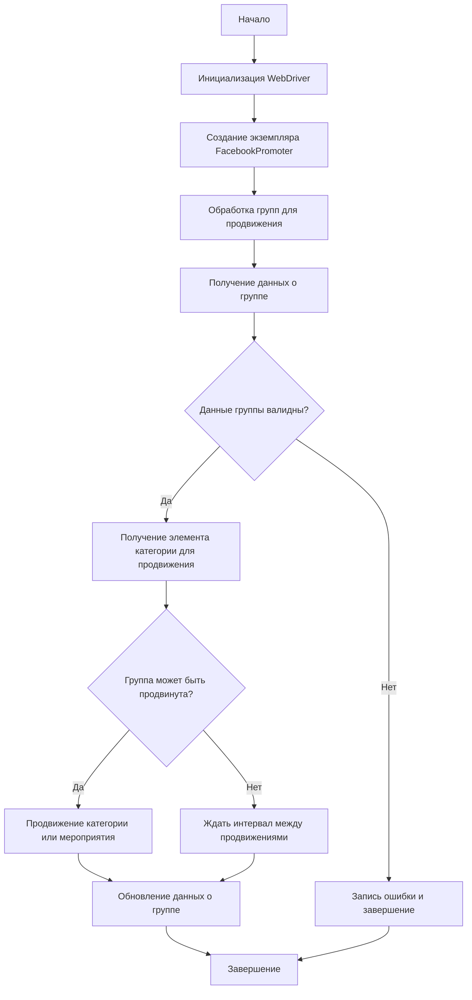

# Документация модуля Facebook Promoter

## Обзор

Модуль **Facebook Promoter** автоматизирует продвижение товаров и мероприятий AliExpress в группах Facebook. Модуль управляет публикациями рекламных материалов на Facebook, избегая дублирования. Для эффективного продвижения используется WebDriver для автоматизации браузера.

## Оглавление

* [Обзор](#обзор)
* [Особенности модуля](#особенности-модуля)
* [Требования](#требования)
* [Использование](#использование)
* [Документация классов](#документация-классов)
    * [Класс `FacebookPromoter`](#класс-facebookpromoter)
        * [Метод `__init__`](#метод-init)
        * [Метод `promote`](#метод-promote)
        * [Метод `log_promotion_error`](#метод-log_promotion_error)
        * [Метод `update_group_promotion_data`](#метод-update_group_promotion_data)
        * [Метод `process_groups`](#метод-process_groups)
        * [Метод `get_category_item`](#метод-get_category_item)
        * [Метод `check_interval`](#метод-check_interval)
        * [Метод `validate_group`](#метод-validate_group)
* [Лицензия](#лицензия)


## Особенности модуля

- Продвижение категорий и мероприятий в группах Facebook.
- Избежание дублирования публикаций через отслеживание уже опубликованных элементов.
- Поддержка конфигурации данных групп через файлы.
- Возможность отключения загрузки видео в публикациях.

## Требования

- **Python** 3.x
- Необходимые библиотеки:
  - `random`
  - `datetime`
  - `pathlib`
  - `urllib.parse`
  - `types.SimpleNamespace`
  - `src` (пользовательский модуль)

## Использование

### Пример использования класса FacebookPromoter

```python
from src.endpoints.advertisement.facebook.promoter import FacebookPromoter
from src.webdriver.driver import Driver
from src.utils.jjson import j_loads_ns

# Настройка экземпляра WebDriver (замените на реальный WebDriver)
d = Driver()

# Создание экземпляра FacebookPromoter
promoter = FacebookPromoter(
    d=d,
    promoter="aliexpress",
    group_file_paths=["path/to/group/file1.json", "path/to/group/file2.json"]
)

# Начало продвижения товаров или мероприятий
promoter.process_groups(
    campaign_name="Campaign1",
    events=[],
    group_categories_to_adv=["sales"],
    language="en",
    currency="USD"
)
```

## Документация классов

### Класс `FacebookPromoter`

Этот класс управляет процессом продвижения товаров и мероприятий AliExpress в группах Facebook.



#### Метод `__init__`

Инициализирует промоутер для Facebook с необходимыми конфигурациями.

```python
def __init__(self, d: Driver, promoter: str, group_file_paths: Optional[list[str | Path] | str | Path] = None, no_video: bool = False):
    """
    Инициализирует промоутер для Facebook с необходимыми конфигурациями.

    Args:
        d (Driver): Экземпляр WebDriver для автоматизации.
        promoter (str): Имя промоутера (например, "aliexpress").
        group_file_paths (Optional[list[str | Path] | str | Path], optional): Пути к файлам с данными групп. Defaults to None.
        no_video (bool): Флаг для отключения видео в публикациях. По умолчанию `False`.
    """
    pass
```

*(И так далее для других методов, добавив необходимые подробности из input_code)*
```
```
## Лицензия

Этот модуль является частью пакета **Facebook Promoter** и лицензируется по лицензии MIT.