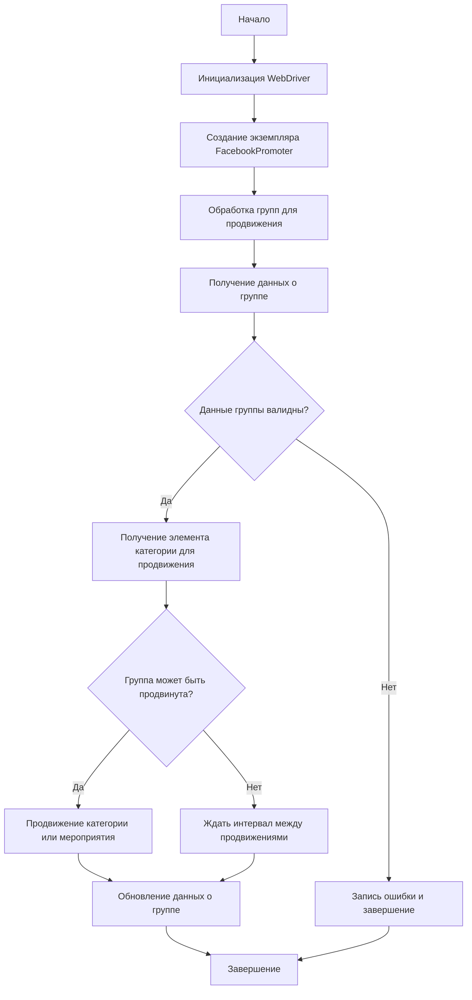

# Модуль Facebook Promoter

## Обзор

Модуль **Facebook Promoter** автоматизирует продвижение товаров и мероприятий AliExpress в группах Facebook. Модуль управляет публикациями рекламных материалов на Facebook, избегая дублирования. Для эффективного продвижения используется WebDriver для автоматизации браузера.

## Оглавление

- [Обзор](#обзор)
- [Особенности модуля](#особенности-модуля)
- [Требования](#требования)
- [Использование](#использование)
    - [Пример использования класса FacebookPromoter](#пример-использования-класса-facebookpromoter)
- [Документация классов](#документация-классов)
    - [Класс `FacebookPromoter`](#класс-facebookpromoter)
        - [Методы](#методы)
            - [`__init__`](#__init__)
            - [`promote`](#promote)
            - [`log_promotion_error`](#log_promotion_error)
            - [`update_group_promotion_data`](#update_group_promotion_data)
            - [`process_groups`](#process_groups)
            - [`get_category_item`](#get_category_item)
            - [`check_interval`](#check_interval)
            - [`validate_group`](#validate_group)
- [Лицензия](#лицензия)

## Особенности модуля

- Продвижение категорий и мероприятий в группах Facebook.
- Избегание дублирования публикаций через отслеживание уже опубликованных элементов.
- Поддержка конфигурации данных групп через файлы.
- Возможность отключения загрузки видео в публикациях.

## Требования

- **Python** 3.x
- Необходимые библиотеки:
  - `random`
  - `datetime`
  - `pathlib`
  - `urllib.parse`
  - `types.SimpleNamespace`
  - `src` (пользовательский модуль)

## Использование

### Пример использования класса FacebookPromoter

```python
from src.endpoints.advertisement.facebook.promoter import FacebookPromoter
from src.webdriver.driver import Driver
from src.utils.jjson import j_loads_ns

# Настройка экземпляра WebDriver (замените на реальный WebDriver)
d = Driver()

# Создание экземпляра FacebookPromoter
promoter = FacebookPromoter(
    d=d, 
    promoter="aliexpress", 
    group_file_paths=["path/to/group/file1.json", "path/to/group/file2.json"]
)

# Начало продвижения товаров или мероприятий
promoter.process_groups(
    campaign_name="Campaign1",
    events=[], 
    group_categories_to_adv=["sales"],
    language="en",
    currency="USD"
)
```

## Документация классов

### Класс `FacebookPromoter`

Этот класс управляет процессом продвижения товаров и мероприятий AliExpress в группах Facebook.



#### Методы

##### `__init__(self, d: Driver, promoter: str, group_file_paths: Optional[list[str | Path] | str | Path] = None, no_video: bool = False)`

Инициализирует промоутер для Facebook с необходимыми конфигурациями.

**Параметры:**
- `d` (Driver): Экземпляр WebDriver для автоматизации.
- `promoter` (str): Имя промоутера (например, "aliexpress").
- `group_file_paths` (Optional[list[str | Path] | str | Path], optional): Пути к файлам с данными групп. По умолчанию `None`.
- `no_video` (bool, optional): Флаг для отключения видео в публикациях. По умолчанию `False`.

##### `promote(self, group: SimpleNamespace, item: SimpleNamespace, is_event: bool = False, language: str = None, currency: str = None) -> bool`

Продвигает категорию или мероприятие в указанной группе Facebook.

**Параметры:**
- `group` (SimpleNamespace): Данные группы.
- `item` (SimpleNamespace): Категория или мероприятие для продвижения.
- `is_event` (bool, optional): Является ли элемент мероприятием. По умолчанию `False`.
- `language` (str, optional): Язык публикации. По умолчанию `None`.
- `currency` (str, optional): Валюта для продвижения. По умолчанию `None`.

**Возвращает:**
- `bool`: `True`, если продвижение прошло успешно, `False` в противном случае.

##### `log_promotion_error(self, is_event: bool, item_name: str)`

Записывает ошибку, если продвижение не удалось.

**Параметры:**
- `is_event` (bool): Является ли элемент мероприятием.
- `item_name` (str): Название элемента.

##### `update_group_promotion_data(self, group: SimpleNamespace, item_name: str, is_event: bool = False)`

Обновляет данные группы после продвижения, добавляя продвигаемый элемент в список продвигаемых категорий или мероприятий.

**Параметры:**
- `group` (SimpleNamespace): Данные группы.
- `item_name` (str): Название продвигаемого элемента.
- `is_event` (bool, optional): Является ли элемент мероприятием. По умолчанию `False`.

##### `process_groups(self, campaign_name: str = None, events: list[SimpleNamespace] = None, is_event: bool = False, group_file_paths: list[str] = None, group_categories_to_adv: list[str] = ['sales'], language: str = None, currency: str = None)`

Обрабатывает группы для текущей кампании или продвижения мероприятия.

**Параметры:**
- `campaign_name` (str, optional): Название кампании. По умолчанию `None`.
- `events` (list[SimpleNamespace], optional): Список мероприятий для продвижения. По умолчанию `None`.
- `is_event` (bool, optional): Является ли продвижение мероприятий или категорий. По умолчанию `False`.
- `group_file_paths` (list[str], optional): Пути к файлам с данными групп. По умолчанию `None`.
- `group_categories_to_adv` (list[str], optional): Категории для продвижения. По умолчанию `['sales']`.
- `language` (str, optional): Язык публикации. По умолчанию `None`.
- `currency` (str, optional): Валюта для продвижения. По умолчанию `None`.

##### `get_category_item(self, campaign_name: str, group: SimpleNamespace, language: str, currency: str) -> SimpleNamespace`

Получает элемент категории для продвижения в зависимости от кампании и промоутера.

**Параметры:**
- `campaign_name` (str): Название кампании.
- `group` (SimpleNamespace): Данные группы.
- `language` (str): Язык для публикации.
- `currency` (str): Валюта для публикации.

**Возвращает:**
- `SimpleNamespace`: Элемент категории для продвижения.

##### `check_interval(self, group: SimpleNamespace) -> bool`

Проверяет, прошло ли достаточно времени, чтобы снова продвигать эту группу.

**Параметры:**
- `group` (SimpleNamespace): Данные группы.

**Возвращает:**
- `bool`: `True`, если группу можно снова продвигать, `False` в противном случае.

##### `validate_group(self, group: SimpleNamespace) -> bool`

Проверяет данные группы, чтобы убедиться в их корректности.

**Параметры:**
- `group` (SimpleNamespace): Данные группы.

**Возвращает:**
- `bool`: `True`, если данные группы корректны, `False` в противном случае.

## Лицензия

Этот модуль является частью пакета **Facebook Promoter** и лицензируется по лицензии MIT.