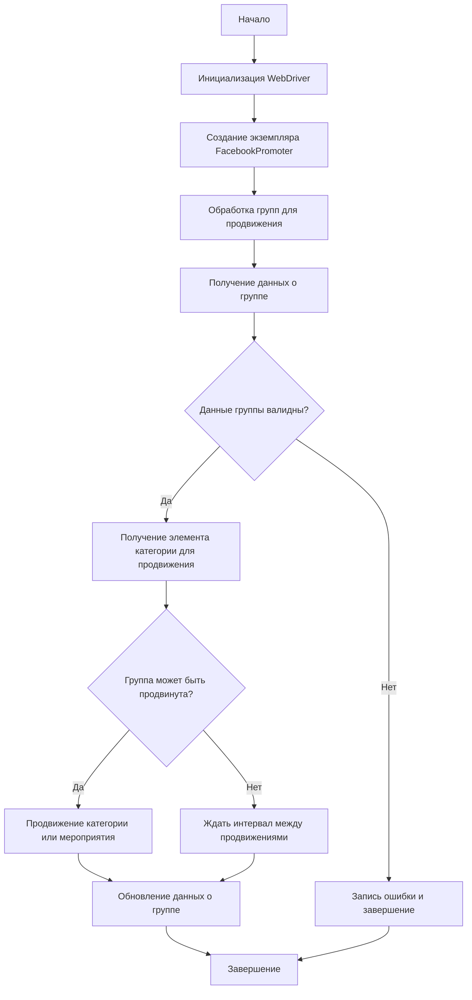

# Документация модуля Facebook Promoter

## Обзор

Модуль **Facebook Promoter** автоматизирует продвижение товаров и мероприятий AliExpress в группах Facebook. Модуль управляет публикациями рекламных материалов на Facebook, избегая дублирования. Для эффективного продвижения используется WebDriver для автоматизации браузера.

## Оглавление

- [Особенности модуля](#особенности-модуля)
- [Требования](#требования)
- [Использование](#использование)
    - [Пример использования класса FacebookPromoter](#пример-использования-класса-facebookpromoter)
- [Документация классов](#документация-классов)
    - [Класс `FacebookPromoter`](#класс-facebookpromoter)
        - [Методы](#методы)
            - [`__init__`](#__init__self-d-driver-promoter-str-group_file_paths-optionalliststr--path--str--path-none-no_video-bool-false)
            - [`promote`](#promoteself-group-simplenamespace-item-simplenamespace-is_event-bool-false-language-str-none-currency-str-none--bool)
            - [`log_promotion_error`](#log_promotion_errorself-is_event-bool-item_name-str)
            - [`update_group_promotion_data`](#update_group_promotion_dataself-group-simplenamespace-item_name-str-is_event-bool-false)
            - [`process_groups`](#process_groupsself-campaign_name-str-none-events-listsimplenamespace-none-is_event-bool-false-group_file_paths-liststr-none-group_categories_to_adv-liststr-sales-language-str-none-currency-str-none)
            - [`get_category_item`](#get_category_itemself-campaign_name-str-group-simplenamespace-language-str-currency-str--simplenamespace)
            - [`check_interval`](#check_intervalself-group-simplenamespace--bool)
            - [`validate_group`](#validate_groupself-group-simplenamespace--bool)
- [Лицензия](#лицензия)

## Особенности модуля

- Продвижение категорий и мероприятий в группах Facebook.
- Избежание дублирования публикаций через отслеживание уже опубликованных элементов.
- Поддержка конфигурации данных групп через файлы.
- Возможность отключения загрузки видео в публикациях.

## Требования

- **Python** 3.x
- Необходимые библиотеки:
  - `random`
  - `datetime`
  - `pathlib`
  - `urllib.parse`
  - `types.SimpleNamespace`
  - `src` (пользовательский модуль)

## Использование

### Пример использования класса FacebookPromoter

```python
from src.endpoints.advertisement.facebook.promoter import FacebookPromoter
from src.webdriver.driver import Driver
from src.utils.jjson import j_loads_ns

# Настройка экземпляра WebDriver (замените на реальный WebDriver)
d = Driver()

# Создание экземпляра FacebookPromoter
promoter = FacebookPromoter(
    d=d, 
    promoter="aliexpress", 
    group_file_paths=["path/to/group/file1.json", "path/to/group/file2.json"]
)

# Начало продвижения товаров или мероприятий
promoter.process_groups(
    campaign_name="Campaign1",
    events=[], 
    group_categories_to_adv=["sales"],
    language="en",
    currency="USD"
)
```

## Документация классов

### Класс `FacebookPromoter`

Этот класс управляет процессом продвижения товаров и мероприятий AliExpress в группах Facebook.



#### Методы

##### `__init__(self, d: Driver, promoter: str, group_file_paths: Optional[list[str | Path] | str | Path] = None, no_video: bool = False)`

```python
def __init__(self, d: Driver, promoter: str, group_file_paths: Optional[list[str | Path] | str | Path] = None, no_video: bool = False) -> None:
    """Инициализирует промоутер для Facebook с необходимыми конфигурациями.

    Args:
        d (Driver): Экземпляр WebDriver для автоматизации.
        promoter (str): Имя промоутера (например, "aliexpress").
        group_file_paths (Optional[list[str | Path] | str | Path]): Пути к файлам с данными групп.
        no_video (bool): Флаг для отключения видео в публикациях. По умолчанию `False`.
    """
```

**Назначение**: Инициализирует экземпляр класса `FacebookPromoter`.

**Как работает метод**:
Метод инициализирует промоутер для Facebook, устанавливая необходимые конфигурации. Он принимает экземпляр WebDriver, имя промоутера, пути к файлам с данными групп и флаг для отключения видео в публикациях.

**Параметры**:
- `d` (Driver): Экземпляр WebDriver, используемый для автоматизации действий в браузере.
- `promoter` (str): Имя промоутера, например, `"aliexpress"`. Указывает, от имени какого промоутера будет осуществляться продвижение.
- `group_file_paths` (Optional[list[str | Path] | str | Path], optional): Пути к файлам, содержащим данные о группах Facebook, в которых будет производиться продвижение. Может быть списком путей или одним путем. По умолчанию `None`.
- `no_video` (bool, optional): Флаг, указывающий, следует ли отключать загрузку видео при публикации. Если `True`, видео не будут загружаться. По умолчанию `False`.

##### `promote(self, group: SimpleNamespace, item: SimpleNamespace, is_event: bool = False, language: str = None, currency: str = None) -> bool`

```python
def promote(self, group: SimpleNamespace, item: SimpleNamespace, is_event: bool = False, language: str = None, currency: str = None) -> bool:
    """Продвигает категорию или мероприятие в указанной группе Facebook.

    Args:
        group (SimpleNamespace): Данные группы.
        item (SimpleNamespace): Категория или мероприятие для продвижения.
        is_event (bool): Является ли элемент мероприятием.
        language (str): Язык публикации.
        currency (str): Валюта для продвижения.

    Returns:
        bool: Успешно ли прошло продвижение.
    """
```

**Назначение**: Продвигает указанный элемент (категорию или мероприятие) в заданной группе Facebook.

**Как работает метод**:
Метод выполняет фактическое продвижение элемента в группе Facebook. Он принимает данные группы, информацию об элементе для продвижения, флаг, указывающий, является ли элемент мероприятием, язык публикации и валюту. Внутри метода происходят действия по созданию публикации в группе Facebook с использованием предоставленных данных.

**Параметры**:
- `group` (SimpleNamespace): Данные группы Facebook, в которой будет производиться продвижение. Содержит информацию, необходимую для доступа к группе и публикации в ней.
- `item` (SimpleNamespace): Информация о категории или мероприятии, которое нужно продвигать. Содержит данные, которые будут использоваться для создания рекламной публикации.
- `is_event` (bool, optional): Флаг, указывающий, является ли продвигаемый элемент мероприятием. По умолчанию `False`.
- `language` (str, optional): Язык, на котором будет выполнена публикация. По умолчанию `None`.
- `currency` (str, optional): Валюта, используемая в публикации. По умолчанию `None`.

**Возвращает**:
- `bool`: `True`, если продвижение прошло успешно, и `False` в противном случае.

##### `log_promotion_error(self, is_event: bool, item_name: str)`

```python
def log_promotion_error(self, is_event: bool, item_name: str) -> None:
    """Записывает ошибку, если продвижение не удалось.

    Args:
        is_event (bool): Является ли элемент мероприятием.
        item_name (str): Название элемента.
    """
```

**Назначение**: Записывает информацию об ошибке продвижения в лог.

**Как работает метод**:
Метод записывает в лог информацию об ошибке, возникшей при попытке продвижения элемента. Он принимает флаг, указывающий, является ли элемент мероприятием, и название элемента.

**Параметры**:
- `is_event` (bool): Флаг, указывающий, является ли элемент мероприятием.
- `item_name` (str): Название элемента, при продвижении которого произошла ошибка.

##### `update_group_promotion_data(self, group: SimpleNamespace, item_name: str, is_event: bool = False)`

```python
def update_group_promotion_data(self, group: SimpleNamespace, item_name: str, is_event: bool = False) -> None:
    """Обновляет данные группы после продвижения, добавляя продвигаемый элемент в список продвигаемых категорий или мероприятий.

    Args:
        group (SimpleNamespace): Данные группы.
        item_name (str): Название продвигаемого элемента.
        is_event (bool): Является ли элемент мероприятием.
    """
```

**Назначение**: Обновляет данные о группе после успешного продвижения элемента.

**Как работает метод**:
Метод обновляет информацию о группе, добавляя название продвинутого элемента в список уже продвинутых элементов. Это позволяет избежать повторной публикации одного и того же элемента в одной и той же группе. Метод принимает данные группы, название элемента и флаг, указывающий, является ли элемент мероприятием.

**Параметры**:
- `group` (SimpleNamespace): Данные группы, которые необходимо обновить.
- `item_name` (str): Название продвинутого элемента, которое будет добавлено в список продвинутых элементов группы.
- `is_event` (bool, optional): Флаг, указывающий, является ли элемент мероприятием. По умолчанию `False`.

##### `process_groups(self, campaign_name: str = None, events: list[SimpleNamespace] = None, is_event: bool = False, group_file_paths: list[str] = None, group_categories_to_adv: list[str] = ['sales'], language: str = None, currency: str = None)`

```python
def process_groups(self, campaign_name: str = None, events: list[SimpleNamespace] = None, is_event: bool = False, group_file_paths: list[str] = None, group_categories_to_adv: list[str] = ['sales'], language: str = None, currency: str = None) -> None:
    """Обрабатывает группы для текущей кампании или продвижения мероприятия.

    Args:
        campaign_name (str): Название кампании.
        events (list[SimpleNamespace]): Список мероприятий для продвижения.
        is_event (bool): Является ли продвижение мероприятий или категорий.
        group_file_paths (list[str]): Пути к файлам с данными групп.
        group_categories_to_adv (list[str]): Категории для продвижения.
        language (str): Язык публикации.
        currency (str): Валюта для продвижения.
    """
```

**Назначение**: Метод обрабатывает список групп для продвижения элементов (категорий или мероприятий) в Facebook.

**Как работает метод**:
Метод проходит по списку групп, проверяет возможность продвижения в каждой группе и, если продвижение возможно, выполняет его. Он принимает название кампании, список мероприятий, флаг, указывающий, является ли продвижение мероприятий или категорий, пути к файлам с данными групп, список категорий для продвижения, язык публикации и валюту.

**Параметры**:
- `campaign_name` (str, optional): Название кампании. Используется для определения элементов, которые будут продвигаться. По умолчанию `None`.
- `events` (list[SimpleNamespace], optional): Список мероприятий для продвижения. Используется, если `is_event` установлен в `True`. По умолчанию `None`.
- `is_event` (bool, optional): Флаг, указывающий, следует ли продвигать мероприятия вместо категорий. По умолчанию `False`.
- `group_file_paths` (list[str], optional): Список путей к файлам, содержащим данные о группах Facebook, в которых будет производиться продвижение. По умолчанию `None`.
- `group_categories_to_adv` (list[str], optional): Список категорий, которые будут продвигаться. По умолчанию `['sales']`.
- `language` (str, optional): Язык, на котором будет выполнена публикация. По умолчанию `None`.
- `currency` (str, optional): Валюта, используемая в публикации. По умолчанию `None`.

##### `get_category_item(self, campaign_name: str, group: SimpleNamespace, language: str, currency: str) -> SimpleNamespace`

```python
def get_category_item(self, campaign_name: str, group: SimpleNamespace, language: str, currency: str) -> SimpleNamespace:
    """Получает элемент категории для продвижения в зависимости от кампании и промоутера.

    Args:
        campaign_name (str): Название кампании.
        group (SimpleNamespace): Данные группы.
        language (str): Язык для публикации.
        currency (str): Валюта для публикации.

    Returns:
        SimpleNamespace: Элемент категории для продвижения.
    """
```

**Назначение**: Получает элемент категории для продвижения на основе названия кампании, данных группы, языка и валюты.

**Как работает метод**:
Метод определяет, какой элемент категории следует продвигать в данной группе, учитывая название кампании, данные группы, язык публикации и валюту. Он возвращает объект `SimpleNamespace`, содержащий информацию об элементе, который будет продвигаться.

**Параметры**:
- `campaign_name` (str): Название кампании, в рамках которой выполняется продвижение.
- `group` (SimpleNamespace): Данные группы Facebook, в которой будет производиться продвижение.
- `language` (str): Язык, на котором будет выполнена публикация.
- `currency` (str): Валюта, используемая в публикации.

**Возвращает**:
- `SimpleNamespace`: Объект, содержащий информацию об элементе категории, который будет продвигаться.

##### `check_interval(self, group: SimpleNamespace) -> bool`

```python
def check_interval(self, group: SimpleNamespace) -> bool:
    """Проверяет, прошло ли достаточно времени, чтобы снова продвигать эту группу.

    Args:
        group (SimpleNamespace): Данные группы.

    Returns:
        bool: Можно ли снова продвигать группу.
    """
```

**Назначение**: Проверяет, прошло ли достаточно времени с момента последнего продвижения в данной группе.

**Как работает метод**:
Метод проверяет, можно ли снова продвигать контент в указанной группе Facebook, учитывая временной интервал, установленный между продвижениями. Если с момента последнего продвижения прошло достаточно времени, метод возвращает `True`, иначе - `False`.

**Параметры**:
- `group` (SimpleNamespace): Данные группы Facebook, содержащие информацию о времени последнего продвижения.

**Возвращает**:
- `bool`: `True`, если можно снова продвигать контент в группе, и `False` в противном случае.

##### `validate_group(self, group: SimpleNamespace) -> bool`

```python
def validate_group(self, group: SimpleNamespace) -> bool:
    """Проверяет данные группы, чтобы убедиться в их корректности.

    Args:
        group (SimpleNamespace): Данные группы.

    Returns:
        bool: Корректны ли данные группы.
    """
```

**Назначение**: Проверяет корректность данных группы Facebook перед выполнением продвижения.

**Как работает метод**:
Метод проверяет, являются ли данные группы Facebook корректными и достаточными для выполнения продвижения. Если данные группы проходят все проверки, метод возвращает `True`, иначе - `False`.

**Параметры**:
- `group` (SimpleNamespace): Данные группы Facebook, которые необходимо проверить.

**Возвращает**:
- `bool`: `True`, если данные группы корректны, и `False` в противном случае.

## Лицензия

Модуль является частью пакета **Facebook Promoter** и лицензируется по лицензии MIT.