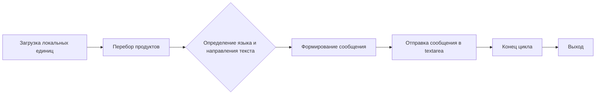
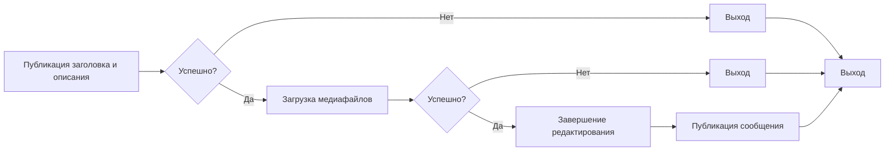

# Модуль публикации сообщений в Facebook

## Обзор

Модуль `post_message.py` предназначен для автоматизации процесса публикации сообщений в Facebook, включая добавление заголовка, описания и медиафайлов. Он использует Selenium WebDriver для взаимодействия с веб-интерфейсом Facebook.

## Подробней

Модуль содержит функции для выполнения следующих задач:

-   Публикация заголовка и описания сообщения.
-   Загрузка медиафайлов (изображений и видео).
-   Обновление подписей к загруженным медиафайлам.
-   Фактическая публикация сообщения.

Этот модуль является частью более крупной системы автоматизации рекламы в Facebook, разработанной в проекте `hypotez`. Он предоставляет интерфейс для программного управления процессом публикации сообщений, что позволяет автоматизировать маркетинговые кампании и снизить потребность в ручном вмешательстве.

## Функции

### `post_title`

```python
def post_title(d: Driver, message: SimpleNamespace | str) -> bool:
    """ Sends the title and description of a campaign to the post message box.

    Args:
        d (Driver): The driver instance used for interacting with the webpage.
        category (SimpleNamespace): The category containing the title and description to be sent.

    Returns:
        bool: `True` if the title and description were sent successfully, otherwise `None`.

    Examples:
        >>> driver = Driver(...)
        >>> category = SimpleNamespace(title="Campaign Title", description="Campaign Description")
        >>> post_title(driver, category)
        True
    """
```

**Назначение**: Отправляет заголовок и описание кампании в поле сообщения.

**Параметры**:

*   `d` (Driver): Инстанс драйвера, используемый для взаимодействия с веб-страницей.
*   `message` (SimpleNamespace | str): Объект SimpleNamespace или строка, содержащая заголовок и описание для отправки.

**Возвращает**:

*   `bool`: `True`, если заголовок и описание были успешно отправлены, иначе `None`.

**Как работает функция**:

1.  Прокручивает страницу назад.
2.  Открывает поле "добавить сообщение".
3.  Добавляет сообщение в поле.

```mermaid
graph LR
    A[Прокрутка страницы назад] --> B{Успешно?};
    B -- Нет --> G[Логирование ошибки и выход];
    B -- Да --> C[Открытие поля "добавить сообщение"];
    C --> D{Успешно?};
    D -- Нет --> H[Логирование ошибки и выход];
    D -- Да --> E[Добавление сообщения в поле];
    E --> F{Успешно?};
    F -- Нет --> I[Логирование ошибки и выход];
    F -- Да --> J[Возврат True];
    G --> J
    H --> J
    I --> J
```

**Примеры**:

```python
driver = Driver(Chrome)
message = SimpleNamespace(title="Заголовок кампании", description="Описание кампании")
result = post_title(driver, message)
print(result)
# Вывод: True или None в случае неудачи
```

### `upload_media`

```python
def upload_media(d: Driver, media: SimpleNamespace | List[SimpleNamespace] | str | list[str],   no_video: bool = False, without_captions:bool = False) -> bool:
    """ Uploads media files to the images section and updates captions.

    Args:
        d (Driver): The driver instance used for interacting with the webpage.
        products (List[SimpleNamespace]): List of products containing media file paths.

    Returns:
        bool: `True` if media files were uploaded successfully, otherwise `None`.

    Raises:
        Exception: If there is an error during media upload or caption update.

    Examples:
        >>> driver = Driver(...)
        >>> products = [SimpleNamespace(local_image_path=\'path/to/image.jpg\', ...)]
        >>> upload_media(driver, products)
        True
    """
```

**Назначение**: Загружает медиафайлы и обновляет подписи.

**Параметры**:

*   `d` (Driver): Инстанс драйвера, используемый для взаимодействия с веб-страницей.
*   `media` (SimpleNamespace | List[SimpleNamespace] | str | list[str]): Список продуктов, содержащих пути к медиафайлам.
*   `no_video` (bool, optional): Флаг, указывающий, следует ли игнорировать видеофайлы. По умолчанию `False`.
*    `without_captions` (bool, optional): Флаг, указывающий, нужно ли загружать изображение без подписей. По умолчанию `False`.

**Возвращает**:

*   `bool`: `True`, если медиафайлы были успешно загружены, иначе `None`.

**Вызывает исключения**:

*   `Exception`: Если возникает ошибка во время загрузки медиафайлов или обновления подписей.

**Как работает функция**:

1.  Открывает форму "добавить медиа".
2.  Убеждается, что `products` является списком.
3.  Перебирает продукты и загружает медиафайлы.
4.  Обновляет подписи для загруженных медиафайлов.

```mermaid
graph LR
    A[Открытие формы "добавить медиа"] --> B{Успешно?};
    B -- Нет --> I[Выход];
    B -- Да --> C[Преобразование media в список];
    C --> D[Перебор элементов media_list];
    D --> E{Определение media_path};
    E --> F[Загрузка медиафайла];
    F --> G{Успешно?};
    G -- Нет --> J[Логирование ошибки и выход];
    G -- Да --> H[Обновление подписей];
    H --> I[Возврат значения];
     J --> I
```

**Примеры**:

```python
driver = Driver(Chrome)
products = [SimpleNamespace(local_image_path='path/to/image.jpg', local_video_path = 'path/to/video.mp4')]
result = upload_media(driver, products)
print(result)
# Вывод: True или None в случае неудачи
```

### `update_images_captions`

```python
def update_images_captions(d: Driver, media: List[SimpleNamespace], textarea_list: List[WebElement]) -> None:
    """ Adds descriptions to uploaded media files.

    Args:
        d (Driver): The driver instance used for interacting with the webpage.
        products (List[SimpleNamespace]): List of products with details to update.
        textarea_list (List[WebElement]): List of textareas where captions are added.

    Raises:
        Exception: If there\'s an error updating the media captions.
    """
```

**Назначение**: Добавляет описания к загруженным медиафайлам.

**Параметры**:

*   `d` (Driver): Инстанс драйвера, используемый для взаимодействия с веб-страницей.
*   `media` (List[SimpleNamespace]): Список продуктов с деталями для обновления.
*   `textarea_list` (List[WebElement]): Список текстовых полей, в которые добавляются подписи.

**Как работает функция**:

1.  Загружает локальные единицы из `translations.json`.
2.  Определяет внутреннюю функцию `handle_product`, которая обновляет подписи для одного продукта.
3.  Перебирает продукты и вызывает `handle_product` для каждого из них.

**Внутренние функции**:

*   `handle_product`:

    ```python
    def handle_product(product: SimpleNamespace, textarea_list: List[WebElement], i: int) -> None:
        """ Handles the update of media captions for a single product.

        Args:
            product (SimpleNamespace): The product to update.
            textarea_list (List[WebElement]): List of textareas where captions are added.
            i (int): Index of the product in the list.
        """
    ```

    **Назначение**: Обрабатывает обновление подписей для одного продукта.

    **Параметры**:

    *   `product` (SimpleNamespace): Продукт для обновления.
    *   `textarea_list` (List[WebElement]): Список текстовых полей, в которые добавляются подписи.
    *   `i` (int): Индекс продукта в списке.

    **Как работает функция**:

    1.  Определяет язык и направление текста.
    2.  Формирует сообщение с деталями продукта.
    3.  Отправляет сообщение в текстовое поле.



**Примеры**:

```python
driver = Driver(Chrome)
media = [SimpleNamespace(product_title='Название продукта', description='Описание продукта', language='ru')]
textarea_list = driver.find_elements(By.TAG_NAME, 'textarea')
update_images_captions(driver, media, textarea_list)
```

### `publish`

```python
def publish(d:Driver, attempts = 5) -> bool:
    """"""
```

**Назначение**: Осуществляет публикацию сообщения после его подготовки.

**Параметры**:

*   `d` (Driver): Инстанс драйвера, используемый для взаимодействия с веб-страницей.
*   `attempts` (int, optional): Количество попыток для публикации сообщения. По умолчанию 5.

**Возвращает**:

*   `bool`: `True`, если публикация прошла успешно, иначе `None`.

**Как работает функция**:

1.  Выполняет попытки нажать кнопку "Завершить редактирование" и "Опубликовать".
2.  В случае неудачи пытается закрыть всплывающие окна.
3.  В случае успеха ожидает освобождения поля ввода.

### `promote_post`

```python
def promote_post(d: Driver, category: SimpleNamespace, products: List[SimpleNamespace], no_video: bool = False) -> bool:
    """ Manages the process of promoting a post with a title, description, and media files.

    Args:
        d (Driver): The driver instance used for interacting with the webpage.
        category (SimpleNamespace): The category details used for the post title and description.
        products (List[SimpleNamespace]): List of products containing media and details to be posted.

    Examples:
        >>> driver = Driver(...)
        >>> category = SimpleNamespace(title="Campaign Title", description="Campaign Description")
        >>> products = [SimpleNamespace(local_image_path=\'path/to/image.jpg\', ...)]
        >>> promote_post(driver, category, products)
    """
```

**Назначение**: Управляет процессом продвижения сообщения с заголовком, описанием и медиафайлами.

**Параметры**:

*   `d` (Driver): Инстанс драйвера, используемый для взаимодействия с веб-страницей.
*   `category` (SimpleNamespace): Детали категории, используемые для заголовка и описания сообщения.
*   `products` (List[SimpleNamespace]): Список продуктов, содержащих медиа и детали для публикации.
*    `no_video` (bool, optional): Флаг, указывающий, следует ли игнорировать видеофайлы. По умолчанию `False`.

**Как работает функция**:

1.  Публикует заголовок и описание.
2.  Загружает медиафайлы.
3.  Выполняет завершение редактирования.
4.  Публикует сообщение.



**Примеры**:

```python
driver = Driver(Chrome)
category = SimpleNamespace(title="Заголовок кампании", description="Описание кампании")
products = [SimpleNamespace(local_image_path='path/to/image.jpg')]
result = promote_post(driver, category, products)
print(result)
# Вывод: True или None в случае неудачи
```

### `post_message`

```python
def post_message(d: Driver, message: SimpleNamespace,  no_video: bool = False,  images:Optional[str | list[str]] = None, without_captions:bool = False) -> bool:
    """ Manages the process of promoting a post with a title, description, and media files.

    Args:
        d (Driver): The driver instance used for interacting with the webpage.
        message (SimpleNamespace): The message details used for the post title and description.
        products (List[SimpleNamespace]): List of products containing media and details to be posted.

    Examples:
        >>> driver = Driver(...)
        >>> category = SimpleNamespace(title="Campaign Title", description="Campaign Description")
        >>> products = [SimpleNamespace(local_image_path=\'path/to/image.jpg\', ...)]
        >>> promote_post(driver, category, products)
    """
```

**Назначение**: Управляет процессом продвижения сообщения с заголовком, описанием и медиафайлами.

**Параметры**:

*   `d` (Driver): Инстанс драйвера, используемый для взаимодействия с веб-страницей.
*   `message` (SimpleNamespace): Детали сообщения, используемые для заголовка и описания сообщения.
*    `no_video` (bool, optional): Флаг, указывающий, следует ли игнорировать видеофайлы. По умолчанию `False`.
*   `images` (Optional[str  |  list[str]], optional): Список изображений для загрузки. По умолчанию `None`.
*   `without_captions` (bool, optional): Флаг, указывающий, нужно ли загружать изображение без подписей. По умолчанию `False`.

**Как работает функция**:

1.  Публикует заголовок и описание.
2.  Загружает медиафайлы.
3.  Выполняет завершение редактирования.
4.  Публикует сообщение.


**Примеры**:

```python
driver = Driver(Chrome)
message = SimpleNamespace(title="Заголовок кампании", description="Описание кампании", products=[SimpleNamespace(local_image_path='path/to/image.jpg')])
result = post_message(driver, message)
print(result)
# Вывод: True или None в случае неудачи