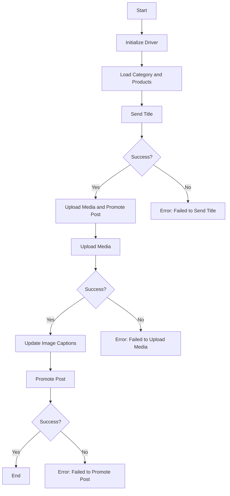

# Модуль: src.endpoints.advertisement.facebook.post_message_async

## Обзор

Этот скрипт является частью директории `hypotez/src/endpoints/advertisement/facebook/scenarios` и предназначен для автоматизации процесса публикации сообщений в Facebook. Скрипт взаимодействует со страницей Facebook, используя локаторы для выполнения различных действий, таких как отправка сообщений, загрузка медиафайлов и обновление подписей.

## Подробнее

Этот модуль автоматизирует процесс публикации рекламных сообщений в Facebook, включая отправку заголовка и описания, загрузку медиафайлов и их продвижение. Он разработан для работы в асинхронном режиме и использует веб-драйвер для взаимодействия с Facebook.

## Структура модуля

Модуль состоит из нескольких функций, каждая из которых отвечает за определенный этап процесса публикации. Основные этапы включают отправку заголовка и описания, загрузку медиафайлов, обновление подписей и продвижение поста.



### Легенда

1.  **Start**: Начало выполнения скрипта.
2.  **InitDriver**: Создание экземпляра класса `Driver`.
3.  **LoadCategoryAndProducts**: Загрузка данных категории и продукта.
4.  **SendTitle**: Вызов функции `post_title` для отправки заголовка.
5.  **CheckTitleSuccess**: Проверка успешной отправки заголовка.

    *   **Yes**: Переход к загрузке медиа и продвижению поста.
    *   **No**: Вывод ошибки "Failed to send title".
6.  **UploadMediaAndPromotePost**: Вызов функции `promote_post`.
7.  **UploadMedia**: Вызов функции `upload_media` для загрузки медиафайлов.
8.  **CheckMediaSuccess**: Проверка успешной загрузки медиафайлов.

    *   **Yes**: Переход к обновлению подписей изображений.
    *   **No**: Вывод ошибки "Failed to upload media".
9.  **UpdateCaptions**: Вызов функции `update_images_captions` для обновления подписей.
10. **PromotePost**: Завершение процесса продвижения поста.
11. **CheckPromoteSuccess**: Проверка успешного продвижения поста.

    *   **Yes**: Окончание выполнения скрипта.
    *   **No**: Вывод ошибки "Failed to promote post".

## Функции

### `post_title`

```python
def post_title(d: Driver, category: SimpleNamespace) -> bool:
    """Отправляет заголовок и описание кампании в поле сообщения Facebook.

    Args:
        d (Driver): Экземпляр `Driver`, используемый для взаимодействия с веб-страницей.
        category (SimpleNamespace): Объект, содержащий заголовок и описание для отправки.

    Returns:
        bool: `True`, если заголовок и описание были успешно отправлены, иначе `None`.

    Как работает функция:
    1. Функция получает заголовок и описание из объекта `category`.
    2. Использует драйвер для поиска и заполнения полей ввода заголовка и описания на странице Facebook.
    3. Проверяет успешность отправки и возвращает соответствующее логическое значение.

    A (Получение заголовка и описания)
    ↓
    B (Поиск и заполнение полей ввода)
    ↓
    C (Проверка успешности отправки)
    ↓
    D (Возврат результата)

    Примеры:
    >>> from types import SimpleNamespace
    >>> category = SimpleNamespace(title="Заголовок", description="Описание")
    >>> driver = Driver(Chrome)
    >>> post_title(driver, category)
    True
    """
    ...
```

**Параметры**:

*   `d` (Driver): Экземпляр `Driver`, используемый для взаимодействия с веб-страницей.
*   `category` (SimpleNamespace): Объект, содержащий заголовок и описание для отправки.

**Возвращает**:

*   `bool`: `True`, если заголовок и описание были успешно отправлены, иначе `None`.

**Как работает функция**:

1.  Функция получает заголовок и описание из объекта `category`.
2.  Использует драйвер для поиска и заполнения полей ввода заголовка и описания на странице Facebook.
3.  Проверяет успешность отправки и возвращает соответствующее логическое значение.

```text
   A (Получение заголовка и описания)
   ↓
   B (Поиск и заполнение полей ввода)
   ↓
   C (Проверка успешности отправки)
   ↓
   D (Возврат результата)
```

**Примеры**:

```python
from types import SimpleNamespace
category = SimpleNamespace(title="Заголовок", description="Описание")
driver = Driver(Chrome)
post_title(driver, category)
True
```

### `upload_media`

```python
def upload_media(d: Driver, products: List[SimpleNamespace], no_video: bool = False) -> bool:
    """Загружает медиафайлы в пост Facebook и обновляет их подписи.

    Args:
        d (Driver): Экземпляр `Driver`, используемый для взаимодействия с веб-страницей.
        products (List[SimpleNamespace]): Список продуктов, содержащих пути к медиафайлам.
        no_video (bool, optional): Флаг, указывающий, следует ли пропускать загрузку видео. По умолчанию `False`.

    Returns:
        bool: `True`, если медиафайлы были успешно загружены, иначе `None`.

    Как работает функция:
    1. Функция перебирает список продуктов и загружает медиафайлы (изображения и видео) на страницу Facebook.
    2. Если `no_video` установлен в `True`, загрузка видео пропускается.
    3. Функция возвращает `True`, если все медиафайлы были успешно загружены, иначе `None`.

    A (Перебор списка продуктов)
    │
    B (Загрузка медиафайлов) - C (Проверка флага no_video)
    │
    D (Возврат результата)

    Примеры:
    >>> from types import SimpleNamespace
    >>> products = [SimpleNamespace(local_image_path='path/to/image.jpg'), SimpleNamespace(local_video_path='path/to/video.mp4')]
    >>> driver = Driver(Chrome)
    >>> upload_media(driver, products)
    True
    """
    ...
```

**Параметры**:

*   `d` (Driver): Экземпляр `Driver`, используемый для взаимодействия с веб-страницей.
*   `products` (List[SimpleNamespace]): Список продуктов, содержащих пути к медиафайлам.
*   `no_video` (bool, optional): Флаг, указывающий, следует ли пропускать загрузку видео. По умолчанию `False`.

**Возвращает**:

*   `bool`: `True`, если медиафайлы были успешно загружены, иначе `None`.

**Как работает функция**:

1.  Функция перебирает список продуктов и загружает медиафайлы (изображения и видео) на страницу Facebook.
2.  Если `no_video` установлен в `True`, загрузка видео пропускается.
3.  Функция возвращает `True`, если все медиафайлы были успешно загружены, иначе `None`.

```text
   A (Перебор списка продуктов)
   │
   B (Загрузка медиафайлов) - C (Проверка флага no_video)
   │
   D (Возврат результата)
```

**Примеры**:

```python
from types import SimpleNamespace
products = [SimpleNamespace(local_image_path='path/to/image.jpg'), SimpleNamespace(local_video_path='path/to/video.mp4')]
driver = Driver(Chrome)
upload_media(driver, products)
True
```

### `update_images_captions`

```python
def update_images_captions(d: Driver, products: List[SimpleNamespace], textarea_list: List[WebElement]) -> None:
    """Асинхронно добавляет описания к загруженным медиафайлам.

    Args:
        d (Driver): Экземпляр `Driver`, используемый для взаимодействия с веб-страницей.
        products (List[SimpleNamespace]): Список продуктов с деталями для обновления.
        textarea_list (List[WebElement]): Список текстовых полей, в которые добавляются подписи.

    Как работает функция:
    1. Функция асинхронно перебирает список продуктов и обновляет подписи для каждого медиафайла.
    2. Использует `textarea_list` для поиска текстовых полей, соответствующих каждому медиафайлу.
    3. Обновляет подписи, используя информацию из списка продуктов.

    A (Перебор списка продуктов)
    ↓
    B (Поиск текстовых полей)
    ↓
    C (Обновление подписей)

    Примеры:
    >>> from types import SimpleNamespace
    >>> from selenium.webdriver.remote.webelement import WebElement
    >>> products = [SimpleNamespace(description='Описание 1'), SimpleNamespace(description='Описание 2')]
    >>> textarea_list = [WebElement(), WebElement()]
    >>> driver = Driver(Chrome)
    >>> update_images_captions(driver, products, textarea_list)
    """
    ...
```

**Параметры**:

*   `d` (Driver): Экземпляр `Driver`, используемый для взаимодействия с веб-страницей.
*   `products` (List[SimpleNamespace]): Список продуктов с деталями для обновления.
*   `textarea_list` (List[WebElement]): Список текстовых полей, в которые добавляются подписи.

**Как работает функция**:

1.  Функция асинхронно перебирает список продуктов и обновляет подписи для каждого медиафайла.
2.  Использует `textarea_list` для поиска текстовых полей, соответствующих каждому медиафайлу.
3.  Обновляет подписи, используя информацию из списка продуктов.

```text
   A (Перебор списка продуктов)
   ↓
   B (Поиск текстовых полей)
   ↓
   C (Обновление подписей)
```

**Примеры**:

```python
from types import SimpleNamespace
from selenium.webdriver.remote.webelement import WebElement
products = [SimpleNamespace(description='Описание 1'), SimpleNamespace(description='Описание 2')]
textarea_list = [WebElement(), WebElement()]
driver = Driver(Chrome)
update_images_captions(driver, products, textarea_list)
```

### `promote_post`

```python
def promote_post(d: Driver, category: SimpleNamespace, products: List[SimpleNamespace], no_video: bool = False) -> bool:
    """Управляет процессом продвижения поста с заголовком, описанием и медиафайлами.

    Args:
        d (Driver): Экземпляр `Driver`, используемый для взаимодействия с веб-страницей.
        category (SimpleNamespace): Детали категории, используемые для заголовка и описания поста.
        products (List[SimpleNamespace]): Список продуктов, содержащих медиа и детали для публикации.
        no_video (bool, optional): Флаг, указывающий, следует ли пропускать загрузку видео. По умолчанию `False`.

    Returns:
        bool: `True`, если пост был успешно продвинут, иначе `None`.

    Как работает функция:
    1. Функция вызывает `post_title` для отправки заголовка и описания.
    2. Вызывает `upload_media` для загрузки медиафайлов.
    3. Вызывает `update_images_captions` для обновления подписей.
    4. Завершает процесс продвижения поста.

    A (Вызов post_title)
    ↓
    B (Вызов upload_media)
    ↓
    C (Вызов update_images_captions)
    ↓
    D (Завершение продвижения поста)

    Примеры:
    >>> from types import SimpleNamespace
    >>> category = SimpleNamespace(title="Заголовок", description="Описание")
    >>> products = [SimpleNamespace(local_image_path='path/to/image.jpg')]
    >>> driver = Driver(Chrome)
    >>> promote_post(driver, category, products)
    True
    """
    ...
```

**Параметры**:

*   `d` (Driver): Экземпляр `Driver`, используемый для взаимодействия с веб-страницей.
*   `category` (SimpleNamespace): Детали категории, используемые для заголовка и описания поста.
*   `products` (List[SimpleNamespace]): Список продуктов, содержащих медиа и детали для публикации.
*   `no_video` (bool, optional): Флаг, указывающий, следует ли пропускать загрузку видео. По умолчанию `False`.

**Возвращает**:

*   `bool`: `True`, если пост был успешно продвинут, иначе `None`.

**Как работает функция**:

1.  Функция вызывает `post_title` для отправки заголовка и описания.
2.  Вызывает `upload_media` для загрузки медиафайлов.
3.  Вызывает `update_images_captions` для обновления подписей.
4.  Завершает процесс продвижения поста.

```text
   A (Вызов post_title)
   ↓
   B (Вызов upload_media)
   ↓
   C (Вызов update_images_captions)
   ↓
   D (Завершение продвижения поста)
```

**Примеры**:

```python
from types import SimpleNamespace
category = SimpleNamespace(title="Заголовок", description="Описание")
products = [SimpleNamespace(local_image_path='path/to/image.jpg')]
driver = Driver(Chrome)
promote_post(driver, category, products)
True
```

## Использование

Для использования этого скрипта выполните следующие шаги:

1.  **Инициализация драйвера**: Создайте экземпляр класса `Driver`.
2.  **Загрузка локаторов**: Загрузите локаторы из JSON-файла.
3.  **Вызов функций**: Используйте предоставленные функции для отправки заголовка, загрузки медиа и продвижения поста.

### Пример

```python
from src.webdriver.driver import Driver
from types import SimpleNamespace

# Инициализация драйвера
driver = Driver(...)

# Загрузка категории и продуктов
category = SimpleNamespace(title="Заголовок кампании", description="Описание кампании")
products = [SimpleNamespace(local_image_path='path/to/image.jpg', ...)]

# Отправка заголовка
post_title(driver, category)

# Загрузка медиа и продвижение поста
await promote_post(driver, category, products)
```

## Зависимости

*   `selenium`: Для автоматизации веб-интерфейса.
*   `asyncio`: Для асинхронных операций.
*   `pathlib`: Для обработки путей к файлам.
*   `types`: Для создания простых пространств имен.
*   `typing`: Для аннотаций типов.

## Обработка ошибок

Скрипт включает надежную обработку ошибок для обеспечения продолжения выполнения даже в случае, если определенные элементы не найдены или возникли проблемы с веб-страницей. Это особенно полезно для обработки динамических или нестабильных веб-страниц.

## Вклад

Приветствуются вклады в этот скрипт. Убедитесь, что любые изменения хорошо документированы и включают соответствующие тесты.

## Лицензия

Этот скрипт лицензирован в соответствии с лицензией MIT. Подробности см. в файле `LICENSE`.