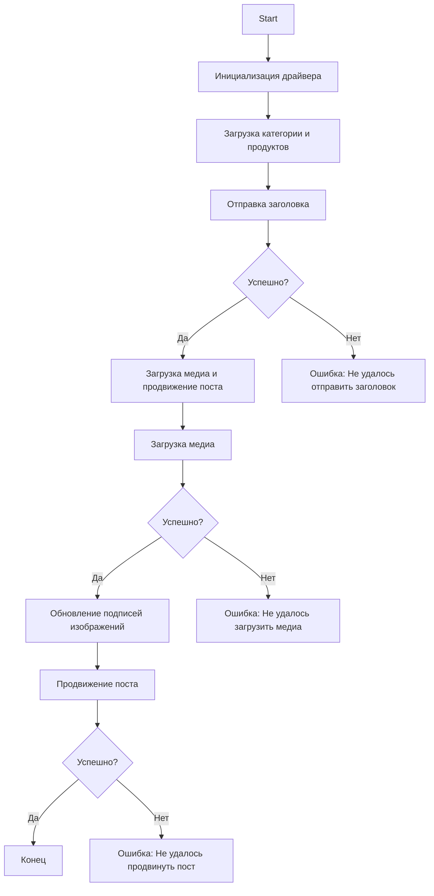

# Документация модуля `post_message_async`

## Обзор

Этот скрипт, расположенный в директории `hypotez/src/endpoints/advertisement/facebook/scenarios`, предназначен для автоматизации процесса публикации сообщений в Facebook. Скрипт взаимодействует со страницей Facebook, используя локаторы для выполнения различных действий, таких как отправка сообщений, загрузка медиафайлов и обновление подписей.

## Подробней

Этот модуль автоматизирует процесс продвижения постов в Facebook, включая отправку заголовков и описаний, загрузку медиафайлов и обновление подписей. Он использует веб-драйвер для взаимодействия с интерфейсом Facebook и предназначен для работы в асинхронном режиме. Это позволяет эффективно управлять процессом продвижения постов, обеспечивая надежную обработку ошибок и динамическую адаптацию к изменениям на веб-странице.

## Структура модуля

Представлена диаграмма Mermaid, отображающая структуру работы скрипта.



### Легенда

1.  **Start**: Начало выполнения скрипта.
2.  **InitDriver**: Создание экземпляра класса `Driver`.
3.  **LoadCategoryAndProducts**: Загрузка данных о категории и продуктах.
4.  **SendTitle**: Вызов функции `post_title` для отправки заголовка.
5.  **CheckTitleSuccess**: Проверка успешности отправки заголовка.

    *   **Да**: Переход к загрузке медиа и продвижению поста.
    *   **Нет**: Вывод ошибки "Не удалось отправить заголовок".
6.  **UploadMediaAndPromotePost**: Вызов функции `promote_post`.
7.  **UploadMedia**: Вызов функции `upload_media` для загрузки медиафайлов.
8.  **CheckMediaSuccess**: Проверка успешности загрузки медиа.

    *   **Да**: Переход к обновлению подписей изображений.
    *   **Нет**: Вывод ошибки "Не удалось загрузить медиа".
9.  **UpdateCaptions**: Вызов функции `update_images_captions` для обновления подписей.
10. **PromotePost**: Завершение процесса продвижения поста.
11. **CheckPromoteSuccess**: Проверка успешности продвижения поста.

    *   **Да**: Завершение выполнения скрипта.
    *   **Нет**: Вывод ошибки "Не удалось продвинуть пост".

## Функции

### `post_title`

```python
def post_title(d: Driver, category: SimpleNamespace) -> bool:
    """
    Отправляет заголовок и описание кампании в поле сообщения Facebook.

    Args:
        d (Driver): Экземпляр класса `Driver` для взаимодействия с веб-страницей.
        category (SimpleNamespace): Объект, содержащий заголовок и описание для отправки.

    Returns:
        bool: `True`, если заголовок и описание успешно отправлены, иначе `None`.

    """
```

**Назначение**: Отправка заголовка и описания кампании в поле сообщения Facebook.

**Параметры**:

*   `d` (Driver): Экземпляр класса `Driver`, используемый для взаимодействия с веб-страницей.
*   `category` (SimpleNamespace): Категория, содержащая заголовок и описание для отправки.

**Возвращает**:

*   `bool`: `True`, если заголовок и описание были успешно отправлены, иначе `None`.

**Как работает функция**:

1.  Извлекает заголовок и описание из объекта `category`.
2.  Использует `driver.execute_locator` для поиска и заполнения поля заголовка.
3.  Проверяет успешность отправки заголовка и описания.

### `upload_media`

```python
def upload_media(d: Driver, products: List[SimpleNamespace], no_video: bool = False) -> bool:
    """
    Загружает медиафайлы в пост Facebook и обновляет их подписи.

    Args:
        d (Driver): Экземпляр класса `Driver` для взаимодействия с веб-страницей.
        products (List[SimpleNamespace]): Список продуктов, содержащих пути к медиафайлам.
        no_video (bool, optional): Флаг, указывающий, следует ли пропускать загрузку видео. По умолчанию `False`.

    Returns:
        bool: `True`, если медиафайлы были успешно загружены, иначе `None`.

    """
```

**Назначение**: Загрузка медиафайлов в пост Facebook и обновление их подписей.

**Параметры**:

*   `d` (Driver): Экземпляр класса `Driver`, используемый для взаимодействия с веб-страницей.
*   `products` (List[SimpleNamespace]): Список продуктов, содержащих пути к медиафайлам.
*   `no_video` (bool, optional): Флаг, указывающий, следует ли пропускать загрузку видео. По умолчанию `False`.

**Возвращает**:

*   `bool`: `True`, если медиафайлы были успешно загружены, иначе `None`.

**Как работает функция**:

1.  Перебирает список продуктов и загружает медиафайлы (изображения и видео) для каждого продукта.
2.  Использует `driver.execute_locator` для поиска элементов загрузки и выполнения действий.
3.  Проверяет успешность загрузки каждого медиафайла.

### `update_images_captions`

```python
def update_images_captions(d: Driver, products: List[SimpleNamespace], textarea_list: List[WebElement]) -> None:
    """
    Асинхронно добавляет описания к загруженным медиафайлам.

    Args:
        d (Driver): Экземпляр класса `Driver` для взаимодействия с веб-страницей.
        products (List[SimpleNamespace]): Список продуктов с деталями для обновления.
        textarea_list (List[WebElement]): Список текстовых областей, куда добавляются подписи.

    """
```

**Назначение**: Асинхронное добавление описаний к загруженным медиафайлам.

**Параметры**:

*   `d` (Driver): Экземпляр класса `Driver`, используемый для взаимодействия с веб-страницей.
*   `products` (List[SimpleNamespace]): Список продуктов с деталями для обновления.
*   `textarea_list` (List[WebElement]): Список текстовых областей, куда добавляются подписи.

**Как работает функция**:

1.  Перебирает список продуктов и добавляет описания к соответствующим текстовым областям.
2.  Использует `driver.execute_locator` для поиска и заполнения текстовых областей.

### `promote_post`

```python
def promote_post(d: Driver, category: SimpleNamespace, products: List[SimpleNamespace], no_video: bool = False) -> bool:
    """
    Управляет процессом продвижения поста с заголовком, описанием и медиафайлами.

    Args:
        d (Driver): Экземпляр класса `Driver` для взаимодействия с веб-страницей.
        category (SimpleNamespace): Детали категории, используемые для заголовка и описания поста.
        products (List[SimpleNamespace]): Список продуктов, содержащих медиа и детали для публикации.
        no_video (bool, optional): Флаг, указывающий, следует ли пропускать загрузку видео. По умолчанию `False`.

    Returns:
        bool: `True`, если пост был успешно продвинут, иначе `None`.

    """
```

**Назначение**: Управление процессом продвижения поста с заголовком, описанием и медиафайлами.

**Параметры**:

*   `d` (Driver): Экземпляр класса `Driver`, используемый для взаимодействия с веб-страницей.
*   `category` (SimpleNamespace): Детали категории, используемые для заголовка и описания поста.
*   `products` (List[SimpleNamespace]): Список продуктов, содержащих медиа и детали для публикации.
*   `no_video` (bool, optional): Флаг, указывающий, следует ли пропускать загрузку видео. По умолчанию `False`.

**Возвращает**:

*   `bool`: `True`, если пост был успешно продвинут, иначе `None`.

**Как работает функция**:

1.  Вызывает функции `post_title`, `upload_media` и `update_images_captions` для выполнения соответствующих задач.
2.  Управляет процессом продвижения поста, обрабатывая возможные ошибки.

## Примеры

Чтобы использовать этот скрипт, выполните следующие шаги:

1.  **Инициализация драйвера**: Создайте экземпляр класса `Driver`.
2.  **Загрузка локаторов**: Загрузите локаторы из JSON-файла.
3.  **Вызов функций**: Используйте предоставленные функции для отправки заголовка, загрузки медиа и продвижения поста.

#### Пример

```python
from src.webdriver.driver import Driver
from types import SimpleNamespace

# Инициализация драйвера
driver = Driver(...)

# Загрузка категории и продуктов
category = SimpleNamespace(title="Заголовок кампании", description="Описание кампании")
products = [SimpleNamespace(local_image_path='path/to/image.jpg', ...)]

# Отправка заголовка
post_title(driver, category)

# Загрузка медиа и продвижение поста
await promote_post(driver, category, products)
```

## Зависимости

*   `selenium`: Для автоматизации веб-интерфейса.
*   `asyncio`: Для асинхронных операций.
*   `pathlib`: Для работы с путями к файлам.
*   `types`: Для создания простых пространств имен.
*   `typing`: Для аннотаций типов.

## Обработка ошибок

Скрипт включает надежную обработку ошибок, чтобы обеспечить продолжение выполнения даже в случае, если определенные элементы не найдены или возникли проблемы с веб-страницей. Это особенно полезно для работы с динамическими или нестабильными веб-страницами.

## Лицензия

Этот скрипт распространяется под лицензией MIT. Подробности см. в файле `LICENSE`.