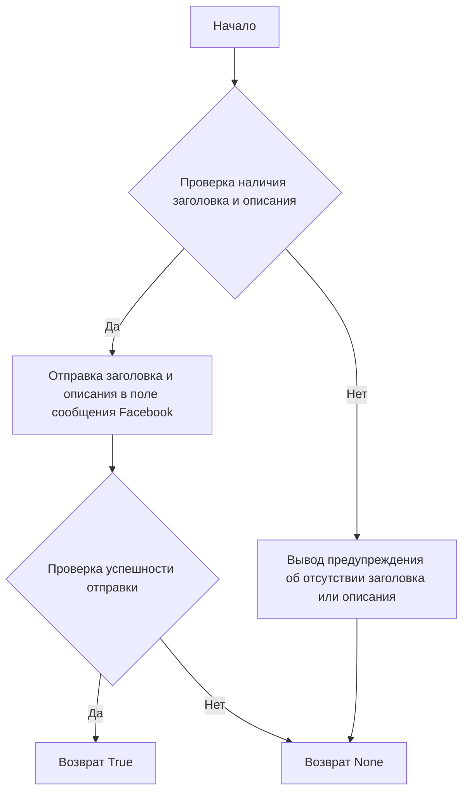
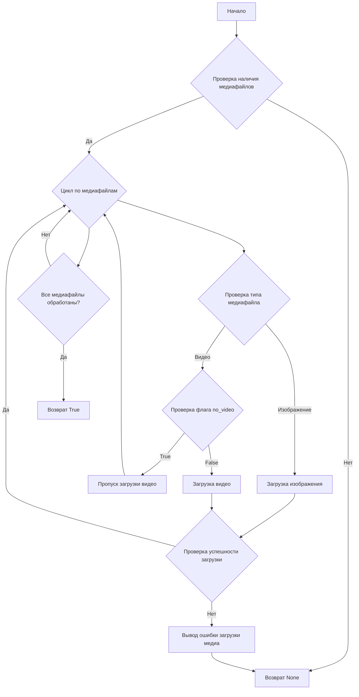
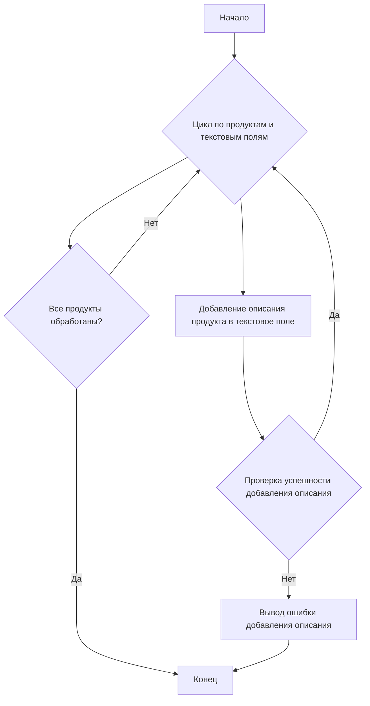

# Документация модуля `src.endpoints.advertisement.facebook.post_message_async`

## Обзор

Этот скрипт является частью директории `hypotez/src/endpoints/advertisement/facebook/scenarios` и предназначен для автоматизации процесса публикации сообщений в Facebook. Скрипт взаимодействует со страницей Facebook, используя локаторы для выполнения различных действий, таких как отправка сообщений, загрузка медиафайлов и обновление подписей.

## Подробнее

Этот модуль автоматизирует процесс продвижения постов в Facebook, включая отправку заголовка и описания, загрузку медиафайлов и обновление подписей. Он использует библиотеку `selenium` для взаимодействия с веб-страницей Facebook и выполняет асинхронные операции для повышения эффективности.

## Структура модуля


### Легенда

1. **Начало**: Начало выполнения скрипта.
2. **Инициализация драйвера**: Создание экземпляра класса `Driver`.
3. **Загрузка категории и продуктов**: Загрузка данных о категории и продуктах.
4. **Отправка заголовка**: Вызов функции `post_title` для отправки заголовка.
5. **Успешно? (Отправка заголовка)**: Проверка, успешно ли отправлен заголовок.
   - **Да**: Переход к загрузке медиа и продвижению поста.
   - **Нет**: Вывод ошибки "Не удалось отправить заголовок".
6. **Загрузка медиа и продвижение поста**: Вызов функции `promote_post`.
7. **Загрузка медиа**: Вызов функции `upload_media` для загрузки медиафайлов.
8. **Успешно? (Загрузка медиа)**: Проверка, успешно ли загружены медиафайлы.
   - **Да**: Переход к обновлению подписей изображений.
   - **Нет**: Вывод ошибки "Не удалось загрузить медиа".
9. **Обновление подписей изображений**: Вызов функции `update_images_captions` для обновления подписей.
10. **Продвижение поста**: Завершение процесса продвижения поста.
11. **Успешно? (Продвижение поста)**: Проверка, успешно ли продвинут пост.
    - **Да**: Завершение выполнения скрипта.
    - **Нет**: Вывод ошибки "Не удалось продвинуть пост".

## Функции

### `post_title`

```python
def post_title(d: Driver, category: SimpleNamespace) -> bool:
    """
    Отправляет заголовок и описание кампании в поле сообщения Facebook.

    Args:
        d (Driver): Экземпляр класса `Driver`, используемый для взаимодействия с веб-страницей.
        category (SimpleNamespace): Категория, содержащая заголовок и описание для отправки.

    Returns:
        bool: `True`, если заголовок и описание были успешно отправлены, в противном случае `None`.

    Как работает функция:
    1. Функция принимает экземпляр драйвера и объект SimpleNamespace, содержащий заголовок и описание.
    2. Отправляет заголовок и описание в поле сообщения Facebook, используя локаторы.
    3. Возвращает `True`, если заголовок и описание были успешно отправлены, в противном случае `None`.
    """
```



**Примеры**:

```python
from src.webdriver.driver import Driver
from types import SimpleNamespace

# Инициализация драйвера
driver = Driver(...)

# Загрузка категории
category = SimpleNamespace(title="Заголовок кампании", description="Описание кампании")

# Отправка заголовка
post_title(driver, category)
```

### `upload_media`

```python
def upload_media(d: Driver, products: List[SimpleNamespace], no_video: bool = False) -> bool:
    """
    Загружает медиафайлы в пост Facebook и обновляет их подписи.

    Args:
        d (Driver): Экземпляр класса `Driver`, используемый для взаимодействия с веб-страницей.
        products (List[SimpleNamespace]): Список продуктов, содержащих пути к медиафайлам.
        no_video (bool): Флаг, указывающий, следует ли пропускать загрузку видео.

    Returns:
        bool: `True`, если медиафайлы были успешно загружены, в противном случае `None`.

    Как работает функция:
    1. Функция принимает экземпляр драйвера, список объектов SimpleNamespace, содержащих пути к медиафайлам, и флаг `no_video`.
    2. Загружает медиафайлы в пост Facebook, используя локаторы.
    3. Обновляет подписи медиафайлов.
    4. Возвращает `True`, если медиафайлы были успешно загружены, в противном случае `None`.
    """
```



**Примеры**:

```python
from src.webdriver.driver import Driver
from types import SimpleNamespace

# Инициализация драйвера
driver = Driver(...)

# Загрузка списка продуктов
products = [SimpleNamespace(local_image_path='path/to/image.jpg', local_video_path='path/to/video.mp4')]

# Загрузка медиафайлов
upload_media(driver, products, no_video=True)
```

### `update_images_captions`

```python
def update_images_captions(d: Driver, products: List[SimpleNamespace], textarea_list: List[WebElement]) -> None:
    """
    Асинхронно добавляет описания к загруженным медиафайлам.

    Args:
        d (Driver): Экземпляр класса `Driver`, используемый для взаимодействия с веб-страницей.
        products (List[SimpleNamespace]): Список продуктов с деталями для обновления.
        textarea_list (List[WebElement]): Список текстовых полей, в которые добавляются подписи.

    Как работает функция:
    1. Функция принимает экземпляр драйвера, список объектов SimpleNamespace с деталями продуктов и список текстовых полей.
    2. Асинхронно добавляет описания к загруженным медиафайлам, используя предоставленные текстовые поля.
    """
```



**Примеры**:

```python
from src.webdriver.driver import Driver
from selenium.webdriver.remote.webelement import WebElement
from types import SimpleNamespace

# Инициализация драйвера
driver = Driver(...)

# Загрузка списка продуктов и текстовых полей
products = [SimpleNamespace(description='Описание продукта')]
textarea_list = [WebElement(...)]

# Обновление подписей изображений
update_images_captions(driver, products, textarea_list)
```

### `promote_post`

```python
def promote_post(d: Driver, category: SimpleNamespace, products: List[SimpleNamespace], no_video: bool = False) -> bool:
    """
    Управляет процессом продвижения поста с заголовком, описанием и медиафайлами.

    Args:
        d (Driver): Экземпляр класса `Driver`, используемый для взаимодействия с веб-страницей.
        category (SimpleNamespace): Детали категории, используемые для заголовка и описания поста.
        products (List[SimpleNamespace]): Список продуктов, содержащих медиа и детали для публикации.
        no_video (bool): Флаг, указывающий, следует ли пропускать загрузку видео.

    Returns:
        bool: `True`, если пост был успешно продвинут, в противном случае `None`.

    Как работает функция:
    1. Функция принимает экземпляр драйвера, объект SimpleNamespace с деталями категории, список объектов SimpleNamespace с продуктами и флаг `no_video`.
    2. Вызывает функции `post_title`, `upload_media` и `update_images_captions` для продвижения поста.
    3. Возвращает `True`, если пост был успешно продвинут, в противном случае `None`.
    """
```

```mermaid
graph TD
    A[Начало] --> B[Отправка заголовка и описания (post_title)]
    B --> C{Проверка успешности отправки заголовка}
    C -- Да --> D[Загрузка медиафайлов (upload_media)]
    C -- Нет --> E[Вывод ошибки отправки заголовка]
    D --> F{Проверка успешности загрузки медиа}
    F -- Да --> G[Обновление подписей изображений (update_images_captions)]
    F -- Нет --> H[Вывод ошибки загрузки медиа]
    G --> I[Продвижение поста]
    I --> J{Проверка успешности продвижения поста}
    J -- Да --> K[Возврат True]
    J -- Нет --> L[Вывод ошибки продвижения поста]
    E --> L
    H --> L
```

**Примеры**:

```python
from src.webdriver.driver import Driver
from types import SimpleNamespace

# Инициализация драйвера
driver = Driver(...)

# Загрузка категории и списка продуктов
category = SimpleNamespace(title='Заголовок кампании', description='Описание кампании')
products = [SimpleNamespace(local_image_path='path/to/image.jpg')]

# Продвижение поста
promote_post(driver, category, products, no_video=True)
```

## Использование

Чтобы использовать этот скрипт, выполните следующие шаги:

1. **Инициализация драйвера**: Создайте экземпляр класса `Driver`.
2. **Загрузка локаторов**: Загрузите локаторы из JSON-файла.
3. **Вызов функций**: Используйте предоставленные функции для отправки заголовка, загрузки медиа и продвижения поста.

## Пример

```python
from src.webdriver.driver import Driver
from types import SimpleNamespace

# Инициализация драйвера
driver = Driver(...)

# Загрузка категории и продуктов
category = SimpleNamespace(title="Заголовок кампании", description="Описание кампании")
products = [SimpleNamespace(local_image_path='path/to/image.jpg', ...)]

# Отправка заголовка
post_title(driver, category)

# Загрузка медиа и продвижение поста
promote_post(driver, category, products)
```

## Зависимости

- `selenium`: Для автоматизации веб-интерфейса.
- `asyncio`: Для асинхронных операций.
- `pathlib`: Для работы с путями к файлам.
- `types`: Для создания простых пространств имен.
- `typing`: Для аннотаций типов.

## Обработка ошибок

Скрипт включает надежную обработку ошибок, чтобы обеспечить продолжение выполнения, даже если определенные элементы не найдены или если есть проблемы с веб-страницей. Это особенно полезно для обработки динамических или нестабильных веб-страниц.

## Вклад

Вклад в этот скрипт приветствуется. Пожалуйста, убедитесь, что любые изменения хорошо документированы и включают соответствующие тесты.

## Лицензия

Этот скрипт лицензирован в соответствии с лицензией MIT. Подробности см. в файле `LICENSE`.