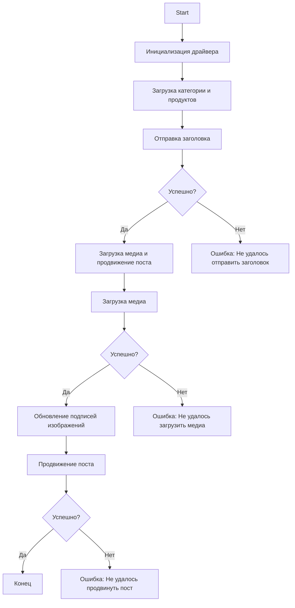

# Документация модуля `src.endpoints.advertisement.facebook.post_message_async`

## Обзор

Этот модуль является частью проекта `hypotez` и расположен в директории `hypotez/src/endpoints/advertisement/facebook/scenarios`. Он предназначен для автоматизации процесса отправки сообщений в Facebook. Скрипт взаимодействует со страницей Facebook, используя локаторы для выполнения различных действий, таких как отправка сообщений, загрузка медиафайлов и обновление подписей.

## Подробнее

Модуль автоматизирует процесс продвижения постов в Facebook, включая отправку заголовка и описания, загрузку медиафайлов (изображений и видео) и обновление подписей к ним. Это позволяет автоматизировать маркетинговые кампании и упростить взаимодействие с аудиторией в Facebook.

## Основные возможности

1.  **Отправка заголовка и описания**: Отправляет заголовок и описание кампании в поле сообщения Facebook.
2.  **Загрузка медиафайлов**: Загружает медиафайлы (изображения и видео) в пост Facebook и обновляет их подписи.
3.  **Продвижение поста**: Управляет всем процессом продвижения поста с заголовком, описанием и медиафайлами.

## Структура модуля



## Описание этапов

1.  **Start**: Начало выполнения скрипта.
2.  **InitDriver**: Создание экземпляра класса `Driver`.
3.  **LoadCategoryAndProducts**: Загрузка данных о категории и продуктах.
4.  **SendTitle**: Вызов функции `post_title` для отправки заголовка.
5.  **CheckTitleSuccess**: Проверка успешной отправки заголовка.
    *   **Да**: Переход к загрузке медиа и продвижению поста.
    *   **Нет**: Вывод ошибки "Failed to send title".
6.  **UploadMediaAndPromotePost**: Вызов функции `promote_post`.
7.  **UploadMedia**: Вызов функции `upload_media` для загрузки медиафайлов.
8.  **CheckMediaSuccess**: Проверка успешной загрузки медиа.
    *   **Да**: Переход к обновлению подписей изображений.
    *   **Нет**: Вывод ошибки "Failed to upload media".
9.  **UpdateCaptions**: Вызов функции `update_images_captions` для обновления подписей.
10. **PromotePost**: Завершение процесса продвижения поста.
11. **CheckPromoteSuccess**: Проверка успешного продвижения поста.
    *   **Да**: Завершение выполнения скрипта.
    *   **Нет**: Вывод ошибки "Failed to promote post".

## Функции

### `post_title(d: Driver, category: SimpleNamespace) -> bool`

**Назначение**: Отправляет заголовок и описание кампании в поле сообщения Facebook.

**Как работает функция**: Функция `post_title` использует драйвер `d` для взаимодействия с веб-страницей Facebook. Она находит элементы ввода для заголовка и описания, а затем отправляет соответствующие данные из объекта `category`. Функция возвращает `True`, если заголовок и описание были успешно отправлены, и `None` в случае неудачи.

**Параметры**:

*   `d` (Driver): Экземпляр класса `Driver`, используемый для взаимодействия с веб-страницей.
*   `category` (SimpleNamespace): Объект, содержащий заголовок и описание для отправки.

**Возвращает**:

*   `bool`: `True`, если заголовок и описание были успешно отправлены, иначе `None`.

### `upload_media(d: Driver, products: List[SimpleNamespace], no_video: bool = False) -> bool`

**Назначение**: Загружает медиафайлы в пост Facebook и обновляет их подписи.

**Как работает функция**: Функция `upload_media` использует драйвер `d` для загрузки медиафайлов (изображений и видео) в пост Facebook. Она перебирает список продуктов `products`, находит соответствующие элементы на странице и загружает файлы. Параметр `no_video` позволяет пропустить загрузку видео. Функция возвращает `True`, если медиафайлы были успешно загружены, и `None` в случае неудачи.

**Параметры**:

*   `d` (Driver): Экземпляр класса `Driver`, используемый для взаимодействия с веб-страницей.
*   `products` (List[SimpleNamespace]): Список продуктов, содержащих пути к медиафайлам.
*   `no_video` (bool, optional): Флаг, указывающий, следует ли пропускать загрузку видео. По умолчанию `False`.

**Возвращает**:

*   `bool`: `True`, если медиафайлы были успешно загружены, иначе `None`.

### `update_images_captions(d: Driver, products: List[SimpleNamespace], textarea_list: List[WebElement]) -> None`

**Назначение**: Асинхронно добавляет описания к загруженным медиафайлам.

**Как работает функция**: Функция `update_images_captions` использует драйвер `d` для добавления описаний к загруженным медиафайлам. Она перебирает список продуктов `products` и список текстовых полей `textarea_list`, добавляя соответствующие описания в текстовые поля.

**Параметры**:

*   `d` (Driver): Экземпляр класса `Driver`, используемый для взаимодействия с веб-страницей.
*   `products` (List[SimpleNamespace]): Список продуктов с деталями для обновления.
*   `textarea_list` (List[WebElement]): Список текстовых полей, в которые добавляются подписи.

**Возвращает**:

*   `None`: Функция ничего не возвращает.

### `promote_post(d: Driver, category: SimpleNamespace, products: List[SimpleNamespace], no_video: bool = False) -> bool`

**Назначение**: Управляет процессом продвижения поста с заголовком, описанием и медиафайлами.

**Как работает функция**: Функция `promote_post` координирует процесс продвижения поста в Facebook. Она вызывает функции `post_title` для отправки заголовка и описания, `upload_media` для загрузки медиафайлов и `update_images_captions` для обновления подписей. Параметр `no_video` позволяет пропустить загрузку видео. Функция возвращает `True`, если пост был успешно продвинут, и `None` в случае неудачи.

**Параметры**:

*   `d` (Driver): Экземпляр класса `Driver`, используемый для взаимодействия с веб-страницей.
*   `category` (SimpleNamespace): Детали категории, используемые для заголовка и описания поста.
*   `products` (List[SimpleNamespace]): Список продуктов, содержащих медиа и детали для публикации.
*   `no_video` (bool, optional): Флаг, указывающий, следует ли пропускать загрузку видео. По умолчанию `False`.

**Возвращает**:

*   `bool`: `True`, если пост был успешно продвинут, иначе `None`.

## Использование

Чтобы использовать этот скрипт, выполните следующие шаги:

1.  **Инициализация драйвера**: Создайте экземпляр класса `Driver`.
2.  **Загрузка локаторов**: Загрузите локаторы из JSON-файла.
3.  **Вызов функций**: Используйте предоставленные функции для отправки заголовка, загрузки медиа и продвижения поста.

### Пример

```python
from src.webdriver.driver import Driver
from types import SimpleNamespace

# Инициализация драйвера
driver = Driver(...)

# Загрузка категории и продуктов
category = SimpleNamespace(title="Заголовок кампании", description="Описание кампании")
products = [SimpleNamespace(local_image_path='path/to/image.jpg', ...)]

# Отправка заголовка
post_title(driver, category)

# Загрузка медиа и продвижение поста
await promote_post(driver, category, products)
```

## Зависимости

*   `selenium`: Для автоматизации веб-страниц.
*   `asyncio`: Для асинхронных операций.
*   `pathlib`: Для работы с путями к файлам.
*   `types`: Для создания простых пространств имен.
*   `typing`: Для аннотаций типов.

## Обработка ошибок

Скрипт включает надежную обработку ошибок, чтобы обеспечить продолжение выполнения даже в случае, если определенные элементы не найдены или возникли проблемы с веб-страницей. Это особенно полезно для работы с динамическими или нестабильными веб-страницами.

## Вклад

Приветствуются вклады в этот скрипт. Пожалуйста, убедитесь, что любые изменения хорошо документированы и включают соответствующие тесты.

## Лицензия

Этот скрипт распространяется под лицензией MIT. Подробности см. в файле `LICENSE`.