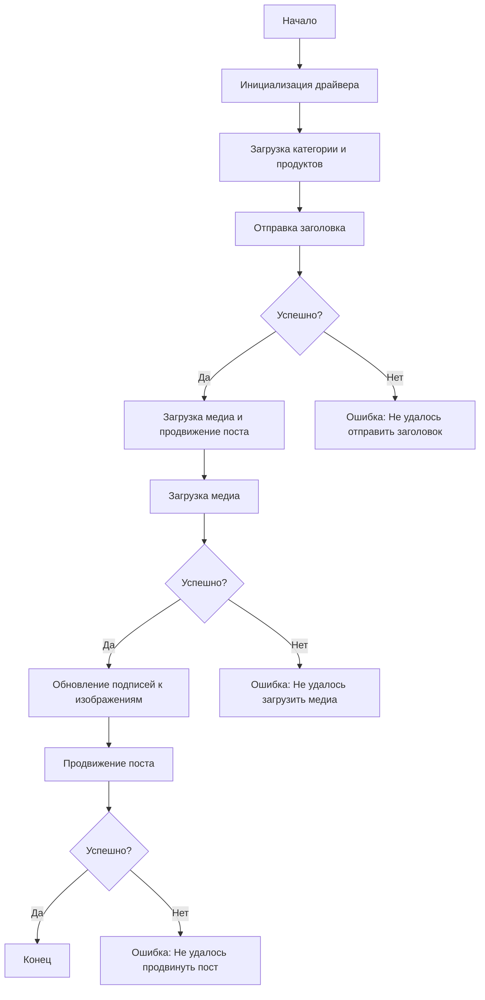

# Асинхронный сценарий публикации сообщения в Facebook

## Обзор

Этот скрипт, расположенный в директории `hypotez/src/endpoints/advertisement/facebook/scenarios`, предназначен для автоматизации процесса публикации сообщений в Facebook. Скрипт взаимодействует со страницей Facebook, используя локаторы для выполнения различных действий, таких как отправка сообщений, загрузка медиафайлов и обновление подписей.

## Ключевые особенности

1.  **Отправка заголовка и описания**: Отправляет заголовок и описание кампании в поле сообщения Facebook.
2.  **Загрузка медиафайлов**: Загружает медиафайлы (изображения и видео) в публикацию Facebook и обновляет их подписи.
3.  **Продвижение публикации**: Управляет всем процессом продвижения публикации с заголовком, описанием и медиафайлами.

## Структура модуля



## Легенда

1.  **Начало**: Начало выполнения скрипта.
2.  **Инициализация драйвера**: Создание экземпляра класса `Driver`.
3.  **Загрузка категории и продуктов**: Загрузка данных о категории и продуктах.
4.  **Отправка заголовка**: Вызов функции `post_title` для отправки заголовка.
5.  **Проверка успешности отправки заголовка**: Проверка, был ли заголовок успешно отправлен.
    *   **Да**: Перейти к загрузке медиа и продвижению поста.
    *   **Нет**: Вывод ошибки "Не удалось отправить заголовок".
6.  **Загрузка медиа и продвижение поста**: Вызов функции `promote_post`.
7.  **Загрузка медиа**: Вызов функции `upload_media` для загрузки медиафайлов.
8.  **Проверка успешности загрузки медиа**: Проверка, были ли медиафайлы успешно загружены.
    *   **Да**: Перейти к обновлению подписей к изображениям.
    *   **Нет**: Вывод ошибки "Не удалось загрузить медиа".
9.  **Обновление подписей к изображениям**: Вызов функции `update_images_captions` для обновления подписей.
10. **Продвижение поста**: Завершение процесса продвижения поста.
11. **Проверка успешности продвижения поста**: Проверка, был ли пост успешно продвинут.
    *   **Да**: Завершение выполнения скрипта.
    *   **Нет**: Вывод ошибки "Не удалось продвинуть пост".

## Функции

### `post_title`

**Описание**: Отправляет заголовок и описание кампании в поле сообщения Facebook.

**Параметры**:

*   `d` (`Driver`): Экземпляр класса `Driver`, используемый для взаимодействия с веб-страницей.
*   `category` (`SimpleNamespace`): Категория, содержащая заголовок и описание для отправки.

**Возвращает**:
    - `bool`: `True`, если заголовок и описание были успешно отправлены, в противном случае `None`.

### `upload_media`

**Описание**: Загружает медиафайлы в публикацию Facebook и обновляет их подписи.

**Параметры**:

*   `d` (`Driver`): Экземпляр класса `Driver`, используемый для взаимодействия с веб-страницей.
*   `products` (`List[SimpleNamespace]`): Список продуктов, содержащих пути к медиафайлам.
*   `no_video` (`bool`, optional): Флаг, указывающий, следует ли пропускать загрузку видео. По умолчанию `False`.

**Возвращает**:
    - `bool`: `True`, если медиафайлы были успешно загружены, в противном случае `None`.

### `update_images_captions`

**Описание**: Асинхронно добавляет описания к загруженным медиафайлам.

**Параметры**:

*   `d` (`Driver`): Экземпляр класса `Driver`, используемый для взаимодействия с веб-страницей.
*   `products` (`List[SimpleNamespace]`): Список продуктов с данными для обновления.
*   `textarea_list` (`List[WebElement]`): Список текстовых полей, в которые добавляются подписи.

**Возвращает**:
    - `None`: Функция ничего не возвращает.

### `promote_post`

**Описание**: Управляет процессом продвижения публикации с заголовком, описанием и медиафайлами.

**Параметры**:

*   `d` (`Driver`): Экземпляр класса `Driver`, используемый для взаимодействия с веб-страницей.
*   `category` (`SimpleNamespace`): Детали категории, используемые для заголовка и описания публикации.
*   `products` (`List[SimpleNamespace]`): Список продуктов, содержащих медиа и данные для публикации.
*   `no_video` (`bool`, optional): Флаг, указывающий, следует ли пропускать загрузку видео. По умолчанию `False`.

**Возвращает**:
    - `bool`: `True`, если пост был успешно продвинут, в противном случае `None`.

## Использование

Чтобы использовать этот скрипт, выполните следующие шаги:

1.  **Инициализируйте драйвер**: Создайте экземпляр класса `Driver`.
2.  **Загрузите локаторы**: Загрузите локаторы из JSON-файла.
3.  **Вызовите функции**: Используйте предоставленные функции для отправки заголовка, загрузки медиа и продвижения поста.

## Пример

```python
from src.webdriver.driver import Driver
from types import SimpleNamespace

# Инициализация драйвера
driver = Driver(...)

# Загрузка категории и продуктов
category = SimpleNamespace(title="Заголовок кампании", description="Описание кампании")
products = [SimpleNamespace(local_saved_image='путь/к/изображению.jpg', ...)]

# Отправка заголовка
post_title(driver, category)

# Загрузка медиа и продвижение поста
await promote_post(driver, category, products)
```

## Зависимости

*   `selenium`: Для автоматизации веб-страниц.
*   `asyncio`: Для асинхронных операций.
*   `pathlib`: Для работы с путями к файлам.
*   `types`: Для создания простых пространств имен.
*   `typing`: Для аннотаций типов.

## Обработка ошибок

Скрипт включает надежную обработку ошибок, чтобы гарантировать продолжение выполнения, даже если определенные элементы не найдены или есть проблемы с веб-страницей. Это особенно полезно для работы с динамическими или нестабильными веб-страницами.

## Вклад

Приветствуются вклады в этот скрипт. Пожалуйста, убедитесь, что любые изменения хорошо задокументированы и включают соответствующие тесты.

## Лицензия

Этот скрипт распространяется под лицензией MIT. Подробности смотрите в файле `LICENSE`.