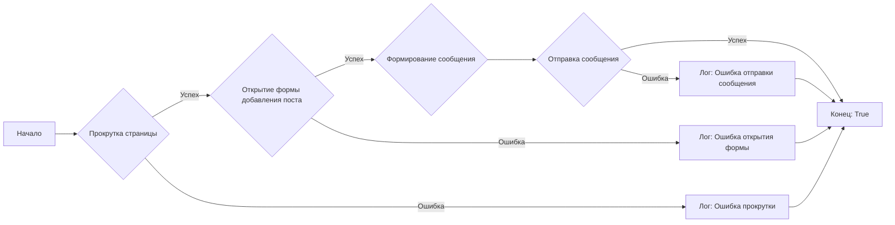
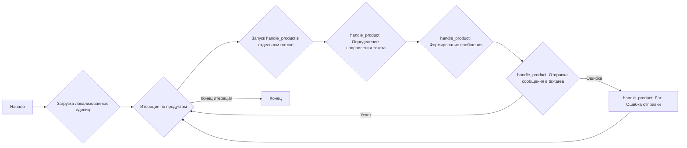

# Модуль: `post_message_async.py`

## Обзор

Модуль `post_message_async.py` предназначен для автоматизации процесса публикации рекламных сообщений в Facebook, включая добавление заголовка, описания и медиафайлов (изображений или видео). Он содержит функции для загрузки медиафайлов, обновления подписей к изображениям и публикации поста.

## Подробней

Этот модуль является частью системы автоматизации для размещения рекламы в Facebook. Он использует библиотеку `selenium` для взаимодействия с веб-интерфейсом Facebook и модуль `asyncio` для асинхронного выполнения задач. Код предназначен для работы с данными о рекламных кампаниях и продуктах, полученными из `aliexpress`.

## Функции

### `post_title`

```python
def post_title(d: Driver, category: SimpleNamespace) -> bool:
    """ Sends the title and description of a campaign to the post message box.

    Args:
        d (Driver): The driver instance used for interacting with the webpage.
        category (SimpleNamespace): The category containing the title and description to be sent.

    Returns:
        bool: `True` if the title and description were sent successfully, otherwise `None`.

    Examples:
        >>> driver = Driver(...)
        >>> category = SimpleNamespace(title="Campaign Title", description="Campaign Description")
        >>> post_title(driver, category)
        True
    """
    ...
```

**Назначение**: Отправляет заголовок и описание рекламной кампании в поле для ввода сообщения.

**Параметры**:
- `d` (Driver): Экземпляр драйвера, используемый для взаимодействия с веб-страницей.
- `category` (SimpleNamespace): Объект, содержащий заголовок (`title`) и описание (`description`) кампании.

**Возвращает**:
- `bool`: `True`, если заголовок и описание успешно отправлены, иначе `None`.

**Как работает функция**:

1. **Прокрутка страницы**: Прокручивает страницу назад.
2. **Открытие формы добавления поста**: Открывает форму для добавления нового поста.
3. **Формирование сообщения**: Формирует сообщение, объединяя заголовок и описание категории.
4. **Отправка сообщения**: Отправляет сообщение в поле для ввода текста.
5. **Логирование ошибок**: В случае неудачи при прокрутке, открытии формы или отправке сообщения, функция записывает сообщение об ошибке в лог.



**Примеры**:

```python
driver = Driver(Firefox)  # пример создания драйвера
category = SimpleNamespace(title="Заголовок кампании", description="Описание кампании")
result = post_title(driver, category)
print(result)  # Выведет True или None в случае ошибки
```

### `upload_media`

```python
async def upload_media(d: Driver, products: List[SimpleNamespace], no_video:bool = False) -> bool:
    """ Uploads media files to the images section and updates captions.

    Args:
        d (Driver): The driver instance used for interacting with the webpage.
        products (List[SimpleNamespace]): List of products containing media file paths.

    Returns:
        bool: `True` if media files were uploaded successfully, otherwise `None`.

    Raises:
        Exception: If there is an error during media upload or caption update.

    Examples:
        >>> driver = Driver(...)
        >>> products = [SimpleNamespace(local_image_path='path/to/image.jpg', ...)]
        >>> await upload_media(driver, products)
        True
    """
    ...
```

**Назначение**: Загружает медиафайлы (изображения или видео) в раздел изображений и обновляет подписи к ним.

**Параметры**:
- `d` (Driver): Экземпляр драйвера, используемый для взаимодействия с веб-страницей.
- `products` (List[SimpleNamespace]): Список продуктов, содержащих пути к медиафайлам.
- `no_video` (bool): Если `True`, загружает только изображения, иначе пытается загрузить видео, если оно доступно. По умолчанию `False`.

**Возвращает**:
- `bool`: `True`, если медиафайлы успешно загружены, иначе `None`.

**Вызывает исключения**:
- `Exception`: Если возникает ошибка при загрузке медиафайла или обновлении подписи.

**Как работает функция**:

1. **Открытие формы добавления медиа**: Открывает форму для добавления фото или видео.
2. **Подготовка списка продуктов**: Преобразует `products` в список, если это не список.
3. **Итерация по продуктам**: Перебирает продукты в списке.
4. **Выбор медиафайла**: Определяет, какой медиафайл загружать (видео или изображение) в зависимости от наличия видео и значения `no_video`.
5. **Загрузка медиафайла**: Загружает медиафайл, используя локатор `foto_video_input`.
6. **Обновление подписей**: После загрузки всех медиафайлов, нажимает кнопку редактирования загруженных медиафайлов и асинхронно обновляет подписи к изображениям.
7. **Логирование ошибок**: В случае неудачи при открытии формы, загрузке файла или обновлении подписи, функция записывает сообщение об ошибке в лог.

```mermaid
graph LR
A[Начало] --> B{Открыть форму добавления медиа};
B -- Успех --> C{Преобразование products в список};
B -- Ошибка --> I[Конец: None];
C --> D{Итерация по продуктам};
D --> E{Выбор медиафайла (видео или изображение)};
E --> F{Загрузка медиафайла};
F -- Успех --> D;
F -- Ошибка --> H[Лог: Ошибка загрузки изображения];
D -- Конец итерации --> G{Нажатие кнопки редактирования};
G -- Успех --> J{Обновление подписей};
G -- Ошибка --> K[Лог: Ошибка редактирования];
J --> L[Конец: True];
H --> I;
K --> I
```

**Примеры**:

```python
driver = Driver(Firefox)  # пример создания драйвера
products = [SimpleNamespace(local_image_path='path/to/image.jpg', product_title='Title', original_price='100', sale_price='50', discount='50%', evaluate_rate='5', promotion_link='link', tags='tags', language='ru')]
result = await upload_media(driver, products)
print(result)  # Выведет True или None в случае ошибки
```

### `update_images_captions`

```python
async def update_images_captions(d: Driver, products: List[SimpleNamespace], textarea_list: List[WebElement]) -> None:
    """ Adds descriptions to uploaded media files asynchronously.

    Args:
        d (Driver): The driver instance used for interacting with the webpage.
        products (List[SimpleNamespace]): List of products with details to update.
        textarea_list (List[WebElement]): List of textareas where captions are added.

    Raises:
        Exception: If there\'s an error updating the media captions.
    """
    ...
```

**Назначение**: Асинхронно добавляет описания к загруженным медиафайлам.

**Параметры**:
- `d` (Driver): Экземпляр драйвера, используемый для взаимодействия с веб-страницей.
- `products` (List[SimpleNamespace]): Список продуктов с деталями для обновления.
- `textarea_list` (List[WebElement]): Список элементов textarea, в которые добавляются подписи.

**Вызывает исключения**:
- `Exception`: Если возникает ошибка при обновлении подписи к медиафайлу.

**Внутренние функции**:

#### `handle_product`

```python
def handle_product(product: SimpleNamespace, textarea_list: List[WebElement], i: int) -> None:
    """ Handles the update of media captions for a single product synchronously.

    Args:
        product (SimpleNamespace): The product to update.
        textarea_list (List[WebElement]): List of textareas where captions are added.
        i (int): Index of the product in the list.
    """
    ...
```

**Назначение**: Обновляет подпись к медиафайлу для одного продукта синхронно.

**Параметры**:
- `product` (SimpleNamespace): Продукт, для которого нужно обновить подпись.
- `textarea_list` (List[WebElement]): Список элементов textarea, в которые добавляются подписи.
- `i` (int): Индекс продукта в списке.

**Как работает функция**:

1. **Определение направления текста**: Определяет направление текста (слева направо или справа налево) на основе языка продукта.
2. **Формирование сообщения**: Формирует сообщение, объединяя детали продукта (название, цены, скидки и т.д.) в зависимости от направления текста.
3. **Отправка сообщения в textarea**: Отправляет сформированное сообщение в соответствующий элемент `textarea`.
4. **Логирование ошибок**: В случае ошибки при формировании сообщения или отправке текста в `textarea`, функция записывает сообщение об ошибке в лог.

**Как работает функция `update_images_captions`**:

1. **Загрузка локализованных единиц**: Загружает локализованные текстовые единицы из файла `translations.json`.
2. **Итерация по продуктам**: Перебирает продукты в списке.
3. **Асинхронное обновление подписей**: Для каждого продукта запускает функцию `handle_product` в отдельном потоке для асинхронного обновления подписи.



**Примеры**:

```python
driver = Driver(Firefox)  # пример создания драйвера
products = [SimpleNamespace(product_title='Title', original_price='100', sale_price='50', discount='50%', evaluate_rate='5', promotion_link='link', tags='tags', language='ru')]
textarea_list = driver.execute_locator(locator.edit_image_properties_textarea)
await update_images_captions(driver, products, textarea_list)
```

### `promote_post`

```python
async def promote_post(d: Driver, category: SimpleNamespace, products: List[SimpleNamespace], no_video:bool = False) -> bool:
    """ Manages the process of promoting a post with a title, description, and media files.

    Args:
        d (Driver): The driver instance used for interacting with the webpage.
        category (SimpleNamespace): The category details used for the post title and description.
        products (List[SimpleNamespace]): List of products containing media and details to be posted.

    Examples:
        >>> driver = Driver(...)
        >>> category = SimpleNamespace(title="Campaign Title", description="Campaign Description")
        >>> products = [SimpleNamespace(local_image_path='path/to/image.jpg', ...)]
        >>> await promote_post(driver, category, products)
    """
    ...
```

**Назначение**: Управляет процессом продвижения поста с заголовком, описанием и медиафайлами.

**Параметры**:
- `d` (Driver): Экземпляр драйвера, используемый для взаимодействия с веб-страницей.
- `category` (SimpleNamespace): Детали категории, используемые для заголовка и описания поста.
- `products` (List[SimpleNamespace]): Список продуктов, содержащих медиафайлы и детали для публикации.
- `no_video` (bool): Если `True`, загружает только изображения, иначе пытается загрузить видео, если оно доступно. По умолчанию `False`.

**Как работает функция**:

1. **Публикация заголовка и описания**: Вызывает функцию `post_title` для добавления заголовка и описания.
2. **Загрузка медиафайлов**: Вызывает функцию `upload_media` для загрузки медиафайлов.
3. **Завершение редактирования**: Нажимает кнопку завершения редактирования.
4. **Публикация поста**: Нажимает кнопку публикации.

```mermaid
graph LR
A[Начало] --> B{Публикация заголовка и описания (post_title)};
B -- Успех --> C{Загрузка медиафайлов (upload_media)};
B -- Ошибка --> G[Конец: None];
C -- Успех --> D{Нажатие кнопки завершения редактирования};
C -- Ошибка --> G;
D -- Успех --> E{Нажатие кнопки публикации};
D -- Ошибка --> G;
E -- Успех --> F[Конец: True];
E -- Ошибка --> G;
```

**Примеры**:

```python
driver = Driver(Firefox)  # пример создания драйвера
category = SimpleNamespace(title="Заголовок кампании", description="Описание кампании")
products = [SimpleNamespace(local_image_path='path/to/image.jpg', product_title='Title', original_price='100', sale_price='50', discount='50%', evaluate_rate='5', promotion_link='link', tags='tags', language='ru')]
result = await promote_post(driver, category, products)
print(result)  # Выведет True или None в случае ошибки