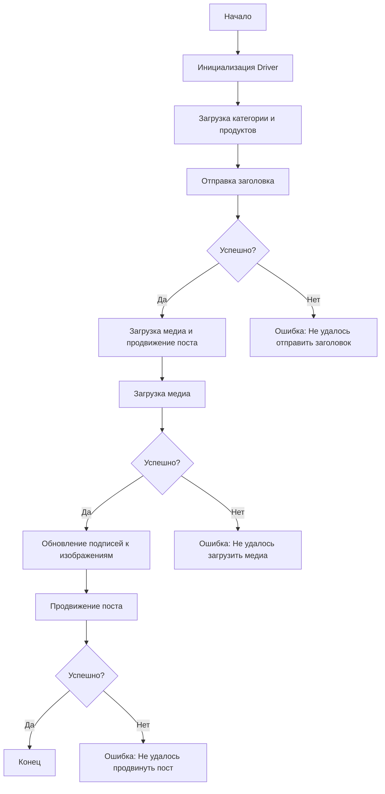

# Сценарий асинхронной публикации сообщения на Facebook

## Обзор

Этот скрипт предназначен для автоматизации процесса публикации сообщений на Facebook. Он взаимодействует со страницей Facebook, используя локаторы, чтобы отправлять сообщения, загружать медиафайлы и обновлять подписи. Скрипт находится в директории `hypotez/src/endpoints/advertisement/facebook/scenarios`.

## Оглавление

- [Сценарий асинхронной публикации сообщения на Facebook](#сценарий-асинхронной-публикации-сообщения-на-facebook)
- [Обзор](#обзор)
- [Основные возможности](#основные-возможности)
- [Структура модуля](#структура-модуля)
- [Функции](#функции)
    - [`post_title`](#post_title)
    - [`upload_media`](#upload_media)
    - [`update_images_captions`](#update_images_captions)
    - [`promote_post`](#promote_post)
- [Использование](#использование)
- [Пример](#пример)
- [Зависимости](#зависимости)
- [Обработка ошибок](#обработка-ошибок)
- [Вклад](#вклад)
- [Лицензия](#лицензия)


## Основные возможности

1. **Отправка заголовка и описания**: Отправляет заголовок и описание кампании в поле сообщения на Facebook.
2. **Загрузка медиафайлов**: Загружает медиафайлы (изображения и видео) на пост Facebook и обновляет их подписи.
3. **Продвижение поста**: Управляет всем процессом продвижения поста с заголовком, описанием и медиафайлами.

## Структура модуля



## Функции

### `post_title`

**Описание**: Отправляет заголовок и описание кампании в поле сообщения на Facebook.

**Параметры**:
- `d: Driver`: Экземпляр `Driver` для взаимодействия с веб-страницей.
- `category: SimpleNamespace`: Категория, содержащая заголовок и описание для отправки.

**Возвращает**:
- `bool`: `True`, если заголовок и описание были успешно отправлены, иначе `None`.

**Вызывает исключения**:
- `Exception`: Возможные исключения при взаимодействии с веб-страницей.


### `upload_media`

**Описание**: Загружает медиафайлы на пост Facebook и обновляет их подписи.

**Параметры**:
- `d: Driver`: Экземпляр `Driver` для взаимодействия с веб-страницей.
- `products: List[SimpleNamespace]`: Список продуктов, содержащих пути к медиафайлам.
- `no_video: bool = False`: Флаг, указывающий, следует ли пропустить загрузку видео.

**Возвращает**:
- `bool`: `True`, если медиафайлы были успешно загружены, иначе `None`.

**Вызывает исключения**:
- `Exception`: Возможные исключения при взаимодействии с веб-страницей или загрузке медиа.


### `update_images_captions`

**Описание**: Асинхронно добавляет описания к загруженным медиафайлам.

**Параметры**:
- `d: Driver`: Экземпляр `Driver` для взаимодействия с веб-страницей.
- `products: List[SimpleNamespace]`: Список продуктов с деталями для обновления.
- `textarea_list: List[WebElement]`: Список текстовых полей, куда добавляются подписи.

**Возвращает**:
- `None`

**Вызывает исключения**:
- `Exception`: Возможные исключения при взаимодействии с веб-страницей или работе с текстовыми полями.


### `promote_post`

**Описание**: Управляет процессом продвижения поста с заголовком, описанием и медиафайлами.

**Параметры**:
- `d: Driver`: Экземпляр `Driver` для взаимодействия с веб-страницей.
- `category: SimpleNamespace`: Детали категории, используемые для заголовка и описания поста.
- `products: List[SimpleNamespace]`: Список продуктов, содержащих медиа и детали для публикации.
- `no_video: bool = False`: Флаг, указывающий, следует ли пропустить загрузку видео.

**Возвращает**:
- `bool`: `True`, если пост был успешно продвинут, иначе `None`.

**Вызывает исключения**:
- `Exception`: Возможные исключения при взаимодействии с веб-страницей или выполнении других операций.


## Использование

Для использования этого скрипта необходимо инициализировать экземпляр класса `Driver`, загрузить локаторы, а затем использовать функции для отправки заголовка, загрузки медиа и продвижения поста.


## Пример

```python
from src.webdriver.driver import Driver
from types import SimpleNamespace

# Инициализация Driver
driver = Driver(...)

# Загрузка категории и продуктов
category = SimpleNamespace(title="Заголовок кампании", description="Описание кампании")
products = [SimpleNamespace(local_saved_image='путь/к/изображению.jpg', ...)]

# Отправка заголовка
post_title(driver, category)

# Загрузка медиа и продвижение поста
await promote_post(driver, category, products)
```

## Зависимости

- `selenium`
- `asyncio`
- `pathlib`
- `types`
- `typing`


## Обработка ошибок

Скрипт включает надежную обработку исключений, чтобы обеспечить продолжение выполнения при проблемах с веб-страницей.


## Вклад

Любые улучшения и исправления приветствуются.


## Лицензия

Этот скрипт лицензирован под MIT License. Подробности смотрите в файле `LICENSE`.